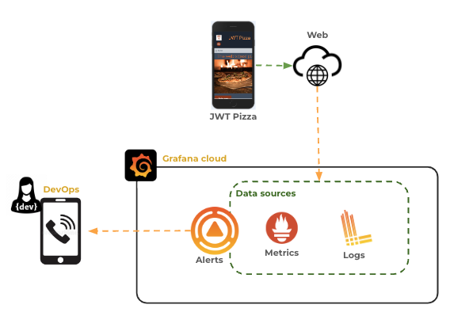
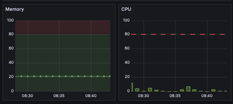
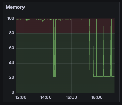

# Alerting

A critical piece of any observability architecture is the automatic notification of a problem that needs human intervention. Without an alert, a problem may persist for hours, days, or even months before it is resolved. Counterintuitively, The more observability data you acquire and store, the more likely it is that a problem will be missed by manual review of a metric dashboard.

An effective alerting system consists of the following parts:

1. Critical metrics identification
1. Alert rule definition
1. Notification infrastructure
1. On call staff
1. Escalation procedure

## Defining alerts

Before you can enable actionable alerts you need to identify the metrics that are signify a problem in the system. Some metrics are obvious, such as running out of memory or storage space. Other metrics require you to spend time reviewing code, architecture, and reported values of existing metrics.

Keep a prioritized list of metrics that you believe have a direct impact on the system, and then review their historical values to see if they correlate with significant incidents. When an incident does occur, review the metrics and find the key indicators that would have led to a prompt resolution.

### Common critical alerts

- **Security**: Increased authentication attempts, abnormal traffic from an individual user, access from concurrent geo-locations, common vulnerability requests, and traffic increases during off hours.
- **Resource exhaustion**: CPU, storage, memory, bandwidth capacity is nearing critical levels.
- **Request latency**: Slow response times for customer requests.
- **Excessive load**: Usage increases that exceed the elastic properties of the system.

### Defining thresholds

For each critical metric that you define, you need to define the threshold at which the metric needs attention. For example, with a metric such as CPU you never want it to get close to 100%. Your system should be automatically alerting and adjusting the compute capacity when it consistently falls into the 80% range.

With some metrics, such as request latency, you need to carefully consider outliers. If your request latency averages at 50ms you might consider that as successful. However, if you inspect the 99.9th percentile you might discover that those requests are taking 30,000ms. That means that 1 in 1000 requests are prohibitively expensive. Even then you might not consider this a problem until you realize that in order to render a web page you must make dozens of endpoint requests. If one in ten page renderings hit the slow endpoint then that means 10% of your customers are having an extremely poor experience.

## Alert Rules

Once you have identified the critical metrics you are ready to define your alerting rules. Rules can be triggered by anything, but usually they are triggered either by metrics or logs. A rule usually has the following fields.

| Field       | Description                                                                                                    | Example            |
| ----------- | -------------------------------------------------------------------------------------------------------------- | ------------------ |
| **Name**    | A clear, unique, descriptive name                                                                              | Available storage  |
| **Metric**  | The metric, or metrics, the rule examines                                                                      | Server disk space  |
| **Trigger** | The metric threshold that causes the rule to trigger. A trigger will often combine a threshold and a duration. | <10% for 5 minutes |
| **Level**   | The level of alert it triggers. Critical, Warning, or Informational.                                           | Warning            |

### Metrics-based alerts

These are alerts that are triggered based on the values of metrics.
Within this category, we can have alerts triggered by state conditions or metric thresholds. The state conditions are things like a container being down, or the number of instances being less than a certain number. The metric thresholds are things like the available memory being less than 5% for more than 5 minutes.

### Logs-based alerts

These are alerts that are triggered based on the contents of logs. For example, if the logs contain the word "error" more than 10 times in a minute, then an alert is triggered.

The following show an attacker attempting to prob our Pizza Service for known security holes. They have bypassed the DNS name of the service and have obtained the public IP address directly. In this cause you might trigger an information alert if the probe traffic exceeds an certain level, or if the same source IP address is later used in a legitimate request.

## Handling alerts

When a alert is triggered the appropriate response must be initiated. The [Google SRE handbook](https://sre.google/sre-book/practical-alerting/) gives a basic structure for handling alerts.

- **Critical** alerts are sent to the On-Call team, a team who is scheduled to be available for immediately response. This team has the access and capabilities required to resolve or escalate the incident.
- **Sub-critical** alerts are inserted into a ticketing system for team members to handle during normal working hours.
- **Informational** alerts are retained for review when convenient. This is commonly reviewed as a aggregated digest in a monthly operational meeting.

Once an alert has triggered and the appropriate party notified, the alerting system will require an acknowledgement. If no acknowledgement is given then the system will escalate the alert to additional parties until an acknowledgement is received.

Once the incident is resolved the handling party will close the incident with the alerting system. This prevents the system from any further escalation.
