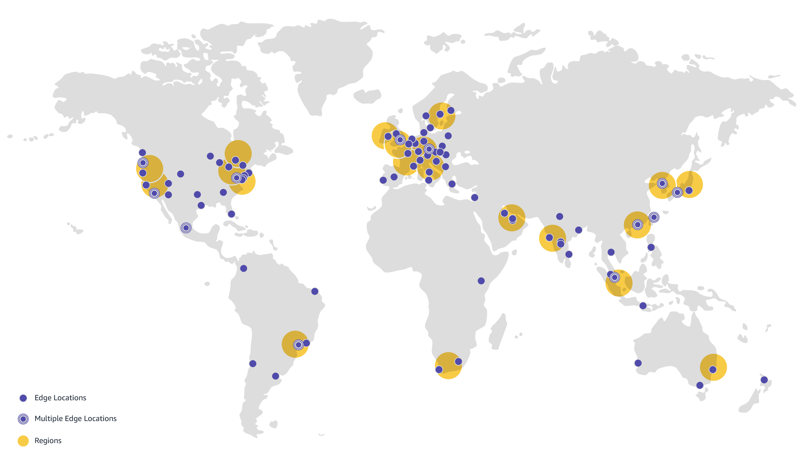
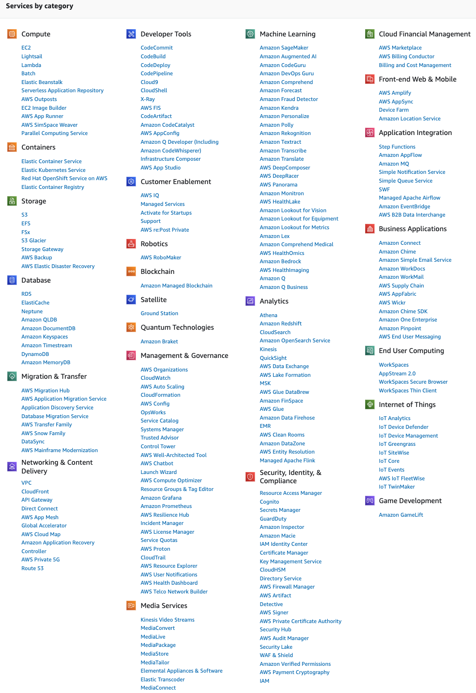
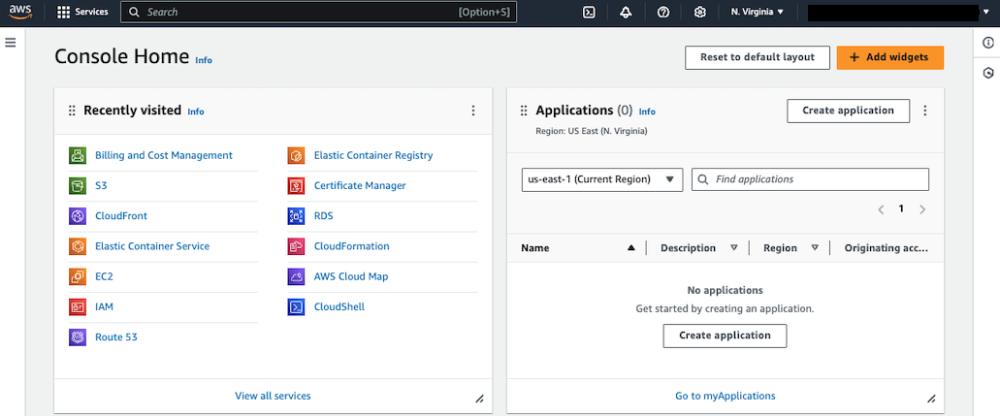
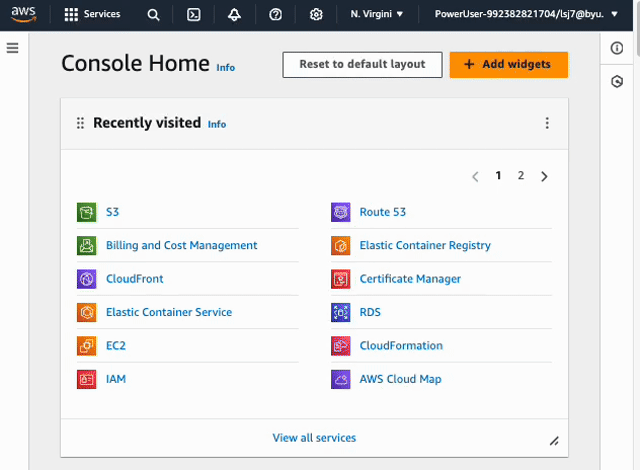
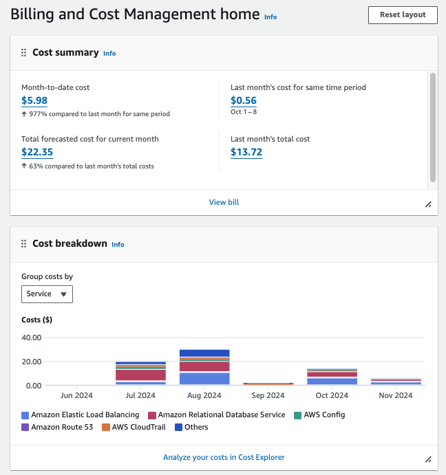

# Intro to AWS

🔑 **Key points**

- Take some time to get familiar with the AWS browser console and services.

---

Amazon Web Services (AWS) is the dominate leader is the cloud infrastructure space. AWS pioneered cloud computing when it realized that it had a lot of advanced computing infrastructure that was being used to support the Amazon shopping site and would be very attractive to other companies that didn't want to build and manage their own data centers.

## Global reach

When AWS first launched in 2006 it was hosted in one regional area located in the US state of Virginia. That region contained three independent data centers that were located a few miles from each other. As of 2024, AWS has 33 regional centers with an expected total of 123 data centers deployed by the end of 2026. Additionally, there are over 600 edge locations that enable accelerated network access and caching. This global coverage allows you to easily deploy an application that is available to every corner of the planet.

> [!IMPORTANT]
> You must do all of your work in AWS using the US-EAST-1 (N. Virginia) region. Some services, for example CloudFront using the Certificate Manager, requires the use of US-EAST-1 and that will make your life a little easier to do everything in Virginia until you become more comfortable with AWS.

## Services

In 2006 AWS deployed with three major services: Storage (S3), Virtual compute servers (EC2), and a message queueing service (SQS). That simple initial offering has grown to over 200 service spanning compute, storage, databases, analytics, networking, AI, image processing, authentication, infrastructure management, and security.

The sheer amount of services can make AWS feel complex and imposing. The key to learning how to use AWS is to start small. For the work in this course you will only use the following services:

| Service             | Use for this course                                   |
| ------------------- | ----------------------------------------------------- |
| S3                  | Storage of frontend files                             |
| EC2                 | Load balancing backend requests                       |
| Certificate Manager | Generating Web Certificates for HTTPS access          |
| ECR                 | Docker container registry                             |
| ECS                 | Docker container deployment                           |
| Fargate             | Elastic management of Docker containers hosted by ECS |
| Route 53            | DNS hosting                                           |
| CloudFront          | Content delivery network for frontend                 |
| IAM                 | Security and access policies                          |
| VPC                 | Virtual private network access                        |

You should to take some time to read about, and get familiar, with what each of these services offer and how they work. One of the great things about Cloud Computing is that you can experiment without any significant long term impact or expense. You can simply start something up, play with it for a while, and then tear it down.

## AWS Dashboard

Once you have created your AWS account you can access the AWS browser console. Of particular interest is the **Search** control that allows you to type the name of any service and navigate to it and the **region** control that allows you to specify where you want to deploy your services. Make sure the region is set to **N. Virginia** for all your work in this course.

For example, if I wanted to use the S3 service to upload my frontend files to the storage service S3, I would first make sure I was in the N. Virginia region and then search for **S3**. That will open to the console display for that service and allow me to interact with the storage buckets defined there, or create new buckets.

## Billing

When you created your account you provided your credit card. You will be charged for any services that you use. That means that you need to understand what the pricing is for each service. Many services offer free tier usage withing certain limits, or for the first 12 months of your AWS account. Beyond that you will be billed monthly for your usage.

Make sure you monitor you billing by selecting the **Billing and cost management** interface from the user menu on the AWS browser console. This will give you detailed information about your current costs as well as a forecast for the future. An important role of a DevOps engineer is to understand the costs that result from the architectural choices that you make. This course is a good time to learn these skills before you start incurring bills in the thousands or millions of dollars.

