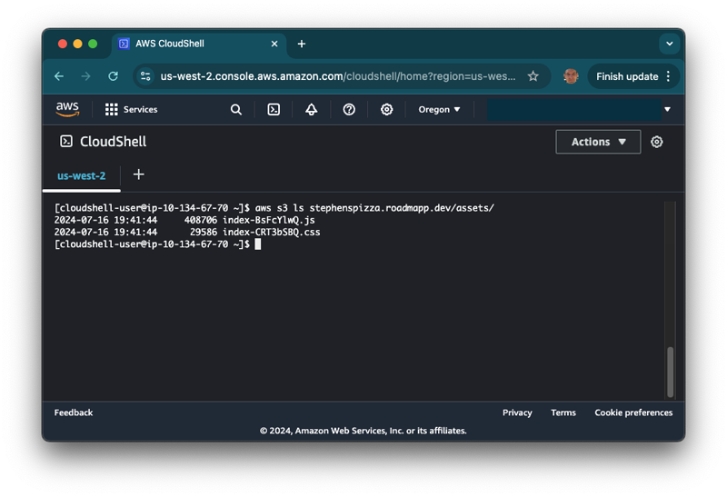
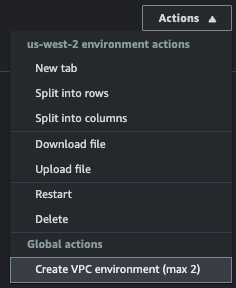
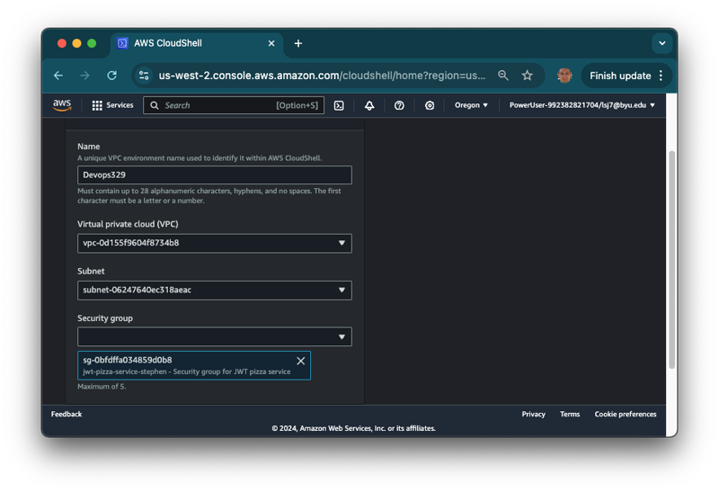
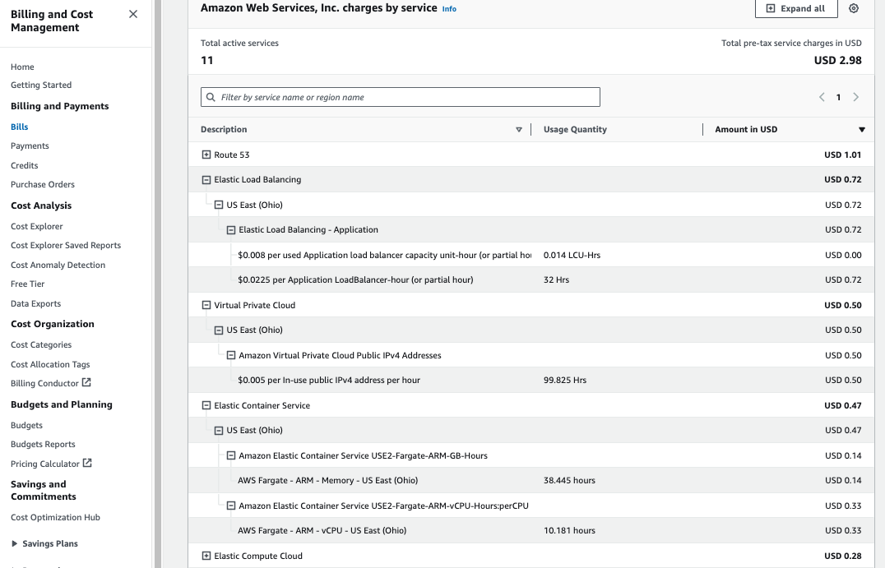

# AWS Account

🔑 **Key points**

- You are required to have an AWS account.
- Set up the AWS CLI and get familiar with CloudShell.
- You are required to lease a DNS hostname.
- Make sure you are acquainted with your AWS bill.

---

Before we get started with anything else, you need to create an account with Amazon Web Services (AWS). Do this as soon as possible as you will need it for much of the work in this course, and it might take some time to authorize your account.

There are lots of other great vendors out there, but AWS is by far the leader in the space, so it is good for you to get experience with them. Follow these instructions on how to [create an account with AWS](https://aws.amazon.com/premiumsupport/knowledge-center/create-and-activate-aws-account/). When you create your account make sure you remember your account ID so that you can use it when you log in to the AWS browser console.

## Accessing your account

For several assignments, you need to execute commands against your AWS account resources. If you are running those commands from your development environment then you need to use the AWS Command Line Interface (CLI) along with a IAM user secret key and access key. Alternatively, if you just need to execute commands independently from the development environment you can open up the AWS Browser Console and create a shell session with the `AWS CloudShell` service.

### Root user best practices

However you access your account, you want to protect it from unintended access. It is **highly** suggested that you review the AWS [Root user best practices](https://docs.aws.amazon.com/IAM/latest/UserGuide/root-user-best-practices.html) documentation. This includes topics such as:

- Not using your root credentials for daily use
- Using a strong root user password
- Establishing MFA
- Practices for creating and managing access keys

### Using AWS CloudShell

AWS has a very powerful CLI program for interacting with AWS services. If you want to use the CLI, then the easiest way to do that is to use the AWS CloudShell Service to open up a console window inside of the AWS browser console. The shell already has the CLI and other tools preinstalled so that you don't have to do any additional configuration. You can even assign rights to a shell session that allows you to do things like access your MySQL instance for administrative purposes. To use CloudShell, follow these steps.

1. Open the AWS console in your browser.
1. Navigate to the `CloudShell` service.

Some services require IAM rights, network locality, or security authorization to access. You can associate your shell session with a specific VPC, subnet, and security group by creating a VPC environment.

1. Click on the `Actions` button and press `Create VPC environment`.

   

1. Provide a name for the environment along with the VPC, subnet, and security group that you want your shell to execute under.

   

You are not required to use the CLI or CloudShell for this course, but it is a very helpful tool and it is well worth the time to experiment with it.

## Lease a DNS domain

If you do not own a DNS hostname you will need to go lease one. We will use this for all of your DevOps deployment tasks. You can lease a domain from AWS using Route53 or use a different DNS provider. However, using Route 53 will make your **life much easier** when you go to create DNS records. You will want to start this process immediately since it might take a while to complete the process. If you choose to use Route53 then you want to make sure you chose a TLD that isn't expensive. For example, the `.click` domain TLD is usually only $3 a year.

## What is this going to cost you?

There is no cost to create an account with AWS; you only pay for what you use. In many cases, they will give you a significant starting credit, and [some services are free](https://aws.amazon.com/free) for a short period of time or monthly usage. The services we are going to use include the following:

| Service                 | Purpose                       | Estimated Cost (subject to change)                                                                                      |
| ----------------------- | ----------------------------- | ----------------------------------------------------------------------------------------------------------------------- |
| **EC2**                 | Server                        | t3.nano $0.0052 an hour ($3.50/month), t3.micro $0.0104 an hour ($7.00/month), t3.small $0.0208 an hour ($14.00/month). |
| **Public IP Address**   | Public internet access        | $0.005 per In-use public IPv4 address per hour. ($4/month)                                                              |
| **Route 53**            | Domain name                   | $3/year for `click` TLD. More for others.                                                                               |
| **Route 53**            | DNS records                   | $0.50/month for each hosted zone.                                                                                       |
| **RDS**                 | Database                      | $12/month for a MySQL db.t4g.micro instance. $3/month for storage.                                                      |
| **CloudFront**          | Content delivery network      | Free: 1 TB data transfer/month, 10,000,000 HTTPS Requests/month. After that $0.085/TB transfer, $0.0100/10k requests.   |
| **S3**                  | Static frontend files         | Free: 5GB standard storage, 20,000 GET Requests; 2,000 PUT, COPY, POST, or LIST Requests, 100 GB data transfer/month.   |
| **ECR**                 | Docker image repository       | Free: 500 MB/month. After that $0.10/GB.                                                                                |
| **ECS EC2**             | Docker container service      | ECS is free. You only pay for the EC2 instance.                                                                         |
| **ECS Fargate**         | Docker container service      | ECS is free. Fargate: ARM vCPU/hour $0.03238, $0.00356 1 GB/hour. With a 0.25 vCPU 0.011551/hr. ($0.30/hour, $9/month)  |
| **EC2 ALB**             | Load balancing                | $18/month.                                                                                                              |
| **Certificate Manager** | Web certificate               | Free.                                                                                                                   |
| **CloudFormation**      | Generate automation templates | Free.                                                                                                                   |
|                         |                               | **Estimated monthly cost: `$15` for MySQL, `$10` for Fargate, `$18` for ALB, `$4` for IP Address**                      |
|                         |                               | **Estimated course cost: `$50 - $120`**                                                                                 |

## Stopping your resources

You can reduce your monthly bill significantly if you stop your resources when you are not using them. The downside of this approach is that you will need to make sure your system is available when you are doing development work and also when passing off assignments. That will take time and might cause significant frustration if not done correctly. Using automation can greatly help reduce the time required to manually configure your architecture between uses.

## Billing Management

An important part of developer operations is to understand how the architecture choices you make impact the cost of doing business. You should carefully consider every service that you deploy and how much that will cost you. You then want to set up processes to both monitor and alert on those expenditures to make sure they match the anticipated amounts.

AWS provides extensive reporting tools for billing and cost exploration. These tools are available form on the AWS browser console under the `Billing and Cost Management` service. You are highly encouraged to spend time understanding everything that is provided there.

Below is an example billing report that shows the charges for load balancing, IPv4 address allocation, and Fargate.

### Billing alerts

By default, AWS will create _Free Tier alerts_ for you. These will email you whenever you come within a certain percentage threshold of your allocated free tier resource.

Additionally, you can create your own billing alerts that will notify you for other cases. For example, you can create an alert whenever you spend more than $10 in a 30-day period.

To learn more about billing alerts refer to the [AWS documentation](https://docs.aws.amazon.com/AmazonCloudWatch/latest/monitoring/monitor_estimated_charges_with_cloudwatch.html) on this subject.

## ☑ Assignment

1. Create your AWS [account](https://aws.amazon.com/premiumsupport/knowledge-center/create-and-activate-aws-account/)
1. Create a browser bookmark for your AWS browser console page that contains your account ID. That way you will be able to access your account quickly.
1. Lease a DNS hostname if you don't already own one.

Once you are done, go over to Canvas and submit that you have completed this.
