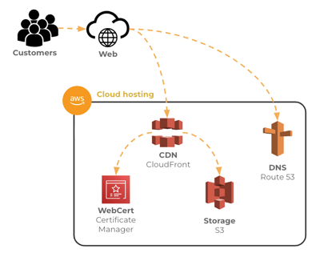
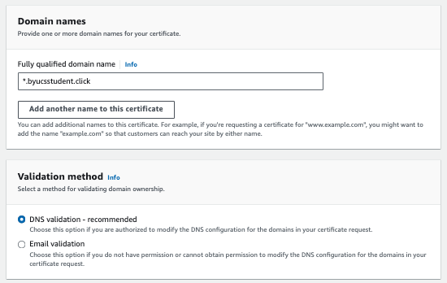
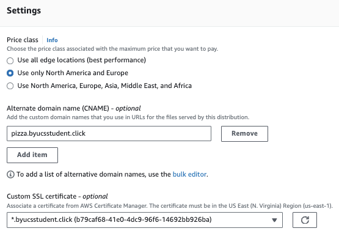
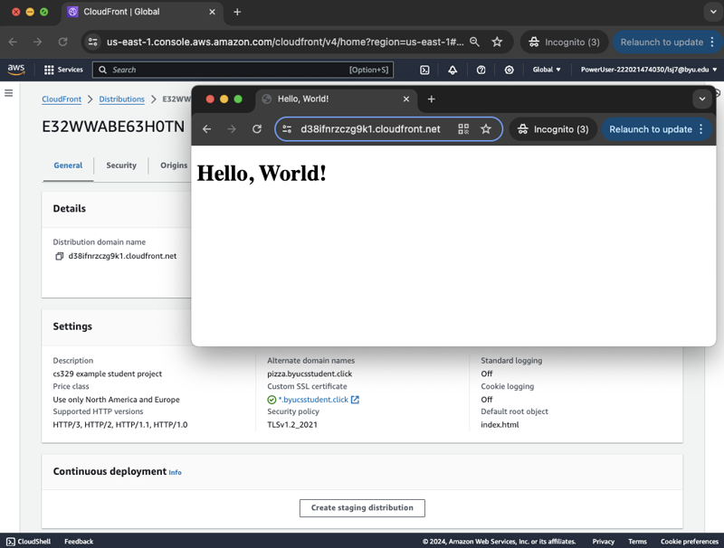
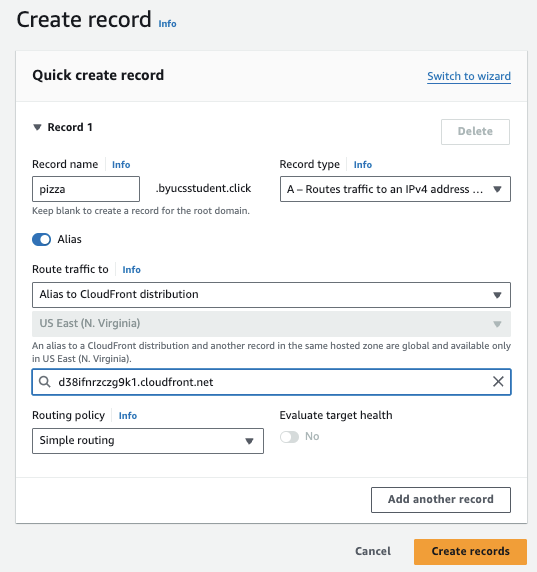

# AWS CloudFront

🔑 **Key points**

- CloudFront is a content delivery network (CDN).
- You can associate an S3 bucket as the origin of a CloudFront distribution.
- You can associate a Route 53 DNS record and hostname with your CloudFront distribution.

---

Previously we deployed the JWT Pizza static frontend content over the content delivery network (CDN) that GitHub Pages provides. However, GitHub Pages has some significant limitations that disqualify it for large scale production usage. These [limitations](https://docs.github.com/en/pages/getting-started-with-github-pages/about-github-pages#limits-on-use-of-github-pages) include the following:

- Published GitHub Pages sites may be no larger than 1 GB.
- GitHub Pages deployments will time out if they take longer than 10 minutes.
- GitHub Pages sites have a soft bandwidth limit of 100 GB per month.
- GitHub Pages sites have a soft limit of 10 builds per hour.

For these reasons we want to move to a CDN that provides the services and scale necessary for a production system. There are many great CDN services available. These include Akamai, Cloudflare, Fastly, and AWS CloudFront. We are going to use CloudFront because of the additional cloud services that they provide and also because of their generous free tier that will make it basically free for our usage.

In order to fully utilize CloudFront as a CDN we need to configure several AWS services. These include the following:

- **CloudFront** - CDN to globally distribute the frontend content.
- **S3** - File service storing the static frontend content.
- **Certificate Manager** - Web certificate generation used to represent the frontend content over HTTPS.
- **Route 53** - DNS service to route traffic to the CDN.



## S3 static content bucket

The first step we need to take is to create an S3 bucket to host the static files associated with the JWT Pizza frontend. Follow these steps to set up your S3 bucket.

1. Open the AWS browser console and navigate to the S3 service.
1. Click on the `Create bucket` button.
1. Select the `General configuration` option and name it the name of your JWT Pizza website. For the purposes of this instruction we will use the hostname `pizza.csbyustudent.click`. If you are following along with this instruction than you should use a unique bucket name such as your DNS hostname with a pizza prefix (e.g. pizza.yourhostname).
1. Leave all the other settings with their default, including _Block all public access_. Press the `Create bucket` button.
1. Create a file named `index.html` in VS Code and insert a basic _Hello World_ page.
   ```html
   <h1>Hello World!</h1>
   ```
1. Click on the newly created bucket to open it up.
1. Drag the `index.html` file into the bucket and press the `Upload` button.
   > 

For this tutorial, the _Hello World_ page will serve as a representation of all the frontend static content.

## Create a custom SSL certificate

You want your static content to be securely hosted. AWS offers a free service for managing SSL certificates when they are used for AWS services such as CloudFront.

1. Open the AWS browser console and navigate to the AWS Certificate Manager service.

   ⚠️ **Note** that you must be in the **North America Virginia** region when creating this certificate in order for it to work with CloudFront.

1. Click on `Request a certificate`.
1. Select `Request a public certificate` and press `Next`.
1. Enter a wildcard subdomain for your fully qualified domain name and use `DNS validation`. Your domain name should look like:

   ```txt
   *.yourdomainnamehere
   ```

   For example:

   > 

   Press `Request` and give a bit of time to generate.

1. When it displays with the status of `Pending validation` press on the `Create records in Route 53` to automatically add the required DNS validation record if this domain is hosted in Route 53, or choose the option to export the `CSV` file to obtain the entries that you need to add your DNS registry for the domain.

Make sure the certificate is validated before you try and set up CloudFront.

## CloudFront CDN hosting

With the bucket in place you can now create your CloudFront distribution that will serve as the CDN for your S3 bucket content. Take the following steps.

1. Open the AWS browser console and navigate to the CloudFront service.
1. Press the `Create distribution` button.
1. For the `Origin domain` start typing the name of the bucket you create. The S3 bucket should appear.
   > 
1. In the name edit box, change the name so that it is just your DNS name for simplicity.
1. Under `Origin access` change from `public`, because our S3 bucket is not public, to **Origin access control settings**. Create a new OAC if you don't already have one, and press `Create`. The OAC allows CloudFront to request private files from S3. This will display a message saying that you need to update the S3 bucket policy. We will do this step later.
1. Skip down to `Default cache behavior`
   1. Under `Viewer protocol policy` specify **Redirect HTTP to HTTPS**
   1. Under `Allowed HTTP methods` specify **GET, HEAD, OPTIONS**.
   1. Under `Cache key and origin requests` choose the **CachingOptimized** cache policy.
   1. Under the `Web Application Firewall (WAF)` choose the option to **Do not enable security protections**. This is an additional paid service that you don't need at this time.
1. Skip down to `Settings`
   1. Under `Price class` specify **Use only North America and Europe**. Unless of course you want your JWT Pizza to be optimized for access in Asia. (Realize that there may be additional charges for choosing this option.)
   1. Under `Alternate domain name` press **add item** and type your DNS name (e.g. pizza.byucsstudent.click).
   1. Chose the certificate that you created in the previous section.
      > 
   1. Set **index.html** as the `Default root object` so that it will be used when the root domain is specified.
   1. Provide a description for the distribution such as `JWT Pizza`.
1. Press `Create distribution`.

### Associate the security policy with your S3 bucket

After creating your distribution this will display your newly created policy with a warning that you need to set the provided security policy on your S3 bucket.


1.  Copy the newly created policy by pressing the `Copy policy` button.
1.  Click the link to `Go to S3 bucket permissions`.
1.  Click on the bucket and then `permissions`.
1.  For the `Bucket policy` box press `edit` and then paste the policy. This allows CloudFront to access the bucket.

If you forget to copy the policy then you can use this template policy and insert the proper AWS properties.

```json
{
  "Version": "2012-10-17",
  "Statement": {
    "Sid": "AllowCloudFrontServicePrincipalReadOnly",
    "Effect": "Allow",
    "Principal": {
      "Service": "cloudfront.amazonaws.com"
    },
    "Action": "s3:GetObject",
    "Resource": "arn:aws:s3:::<S3 bucket name>/*",
    "Condition": {
      "StringEquals": {
        "AWS:SourceArn": "arn:aws:cloudfront::<AWS account ID>:distribution/<CloudFront distribution ID>"
      }
    }
  }
}
```

### View the hosted content

You should now be able to access the S3 files through CloudFront. Navigate back to the CloudFront console and view the distribution you just created. It will take a little while for it to deploy around the globe, but when the `deploying` state goes away, you should be able to access the placeholder index.html file using the `Distribution domain name` name found on the `General` tab of the distribution. This should be a URL with the `cloudfront.net` root domain. For example:

```sh
https://d38ifnrzczg9k1.cloudfront.net
```



## Route 53

The last step for configuring the CDN, is to create a DNS record so that you can access the CDN using your domain name rather than the generated one for the distribution. This instruction assumes you are using Route 53 to host you domain name. If you are using a different DNS service, such as namecheap, then consult the documentation for that service.

1. Open the AWS browser console and navigate to the Route 53 service.
1. Select the hosted zone for your hostname.
1. Create a new record.
1. Give the name `pizza` for the subdomain.
1. Set the record type to an `A` record.
1. Move the slider to mark it as an `Alias`. This tells Route 53 that it can do some internal routing between its services rather than doing normal DNS routing.
1. Route traffic to `Alias to CloudFront Distribution`.
1. Select the destination dropdown. If you set the `Alternate domain name` to be this domain name when you set up CloudFront, the CloudFront distribution name should appear. If not then go back and check that setting for your distribution.
1. Press the `Create records` button.



Alternatively, you can create a CNAME record from your domain to the CloudFront distribution. If you are using an alternate domain name provider you will need to do this.

After a short while the DNS record should propagate, and you should be able to see the record pointing to CloudFront instead of GitHub with a console command like `dig` or `nslookup`. At that point your browser should also show the `Hello World` page.

## Final result

Once the DNS record has updated you should be able to use the subdomain you created to display the static content hosted by the CDN.


