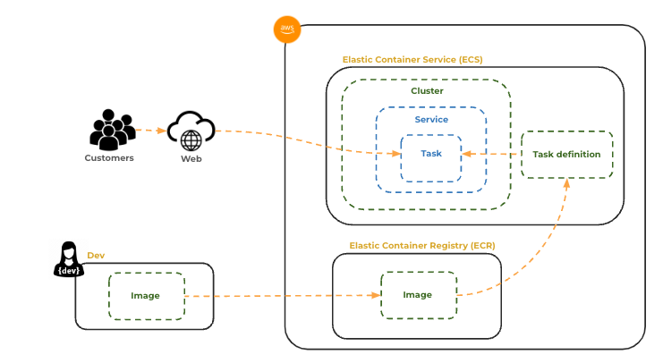
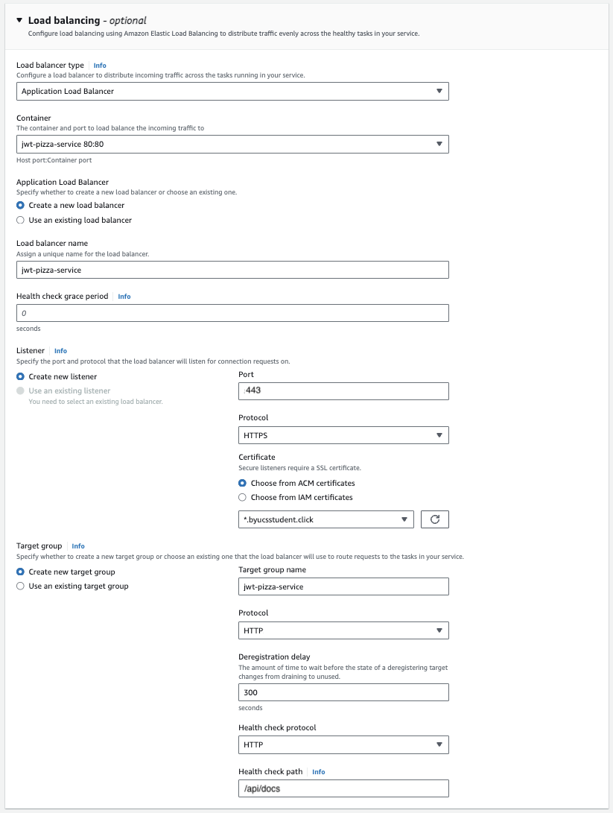
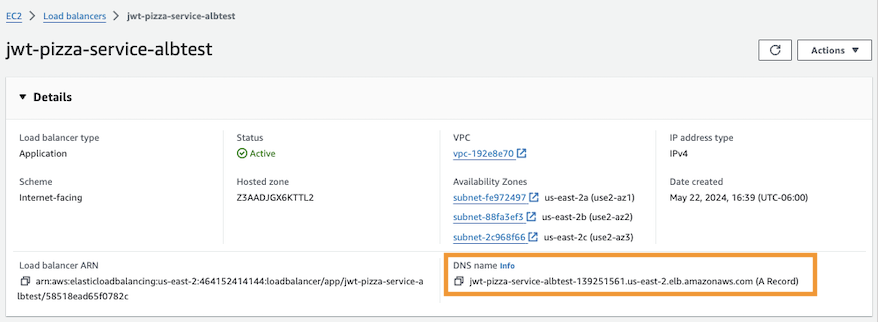
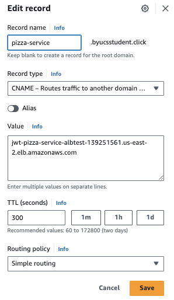
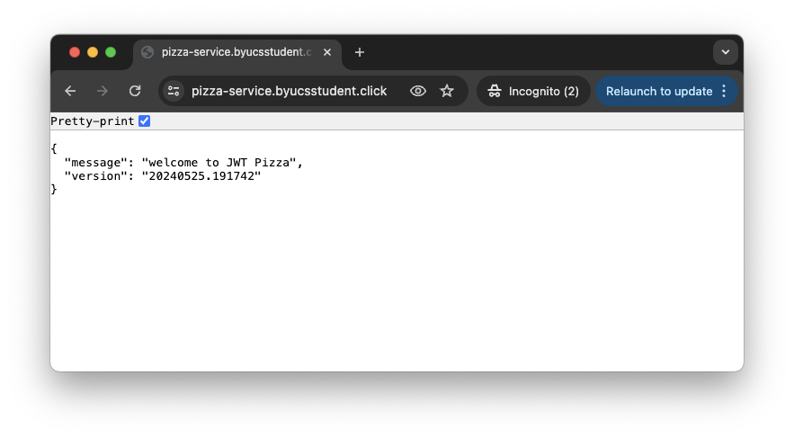

# Elastic Container Services (ECS)

🔑 **Key points**

- What is ECS?
- Manually deploying containers with ECS Fargate.
- Exposing containers with an EC2 load balancer.
- Assigning DNS to point to ECS.
- Deploying JWT Pizza Service to ECS.

---

📖 **Deeper dive reading**: [What is ECS](https://docs.aws.amazon.com/AmazonECS/latest/developerguide/Welcome.html)

---

The Elastic Container Service (ECS) provides the functionality necessary to deploy your Docker container image. After you have uploaded your image to [ECR](../awsEcr/awsEcr.md), you can create an ECS cluster and service to load your container onto either EC2 instances or AWS Fargate.

If you configure ECS to deploy to EC2 instances then you must launch, scale, and manage those EC2 instances. Alternatively, if you use AWS Fargate, Fargate will automatically handle the launching, scaling, and management of the containers. For our work in the course we will use AWS Fargate.

The basic pieces that ECS provides are as follows.



- **Task definitions**: A task description defines the container image to execute, the amount of memory and vCPU to provide, and how to determine the health of the container. You can actually define multiple containers to run as a task. This is usually done when a single container is highly coupled with another container.
- **Task**: A task represents the instantiation of a task definition. A running task is equivalent to running a Docker container, but it also has other characteristics that describe if the container is healthy.
- **Scheduler**: Controlled by EC2 to handle the launching, scaling, and deleting of tasks.
- **Service**: A service is a grouping of 1 or more tasks. For example, a blog service might have tasks representing containers for a web service, a business logic service, a memory cache, and a database. The service controls how many copies of a task are executing and replaces non-responsive tasks.
- **Cluster**: A cluster is a collection of EC2 instances or Fargate controller. Clusters can span availability zones in order to make the application resilient to local failures.

## Required roles and rights

Before you can configure Docker containers to run under ECS you need to authorize how the container executes. There are two roles that control the rights of an ECS task:

1. **Task execution role** - This defines the rights necessary to deploy a task. This includes things like the ability to start up a getting an ECR image and setting up CloudWatch logging.
1. **Task role** - This defines what rights the task has. This includes things like database access rights or read from S3.

We will not define a **Task role** at this time, but you will do this later as you add rights for the task to connect to your MySQL instance without providing explicit credentials.

### Create an ECS task execution role

Before you can create an ECS task, you must authorize AWS to let the ECS service take the actions on your behalf necessary to start up a task. This is done with the **Task execution role**. Take the following steps to create this IAM role.

1. Open the AWS browser console and navigate to the Identity Management (IAM) service.
1. Press `Roles` from the left side navigation panel.
1. Press `Create role`.
1. Under `Use case` select **Elastic Container Service** and then select **Elastic Container Service Task**.

   

1. Press `Next`
1. Select the `AmazonECSTaskExecutionRolePolicy`. This policy authorizes ECS to run a task on your behalf. Press `Next`.
1. Provide the `Role name` of **jwt-pizza-ecs**.
1. Press `Create role`

## Create an ECS task definition

Now you are ready to define the task that will execute your JWT Pizza backend. Take the following steps.

1. Open the AWS browser console and navigate to the Elastic Container Service (ECS) service.
1. Press `Task definitions` from the left side navigation panel.
1. Press `Create new task definition`.
1. Provide the name **jwt-pizza-service** for the `Task definition family`.
1. Under `Infrastructure requirements`
   1. Leave the `Launch type` as AWS Fargate.
   1. Set the `Operating System` to be _Linux/ARM64_.
   1. Select _.5 vCPU_ for CPU and _1 GB_ for Memory. This isn't very much computing power for a backend service but keeping things small like this will significantly reduce your AWS monthly bill.
   1. Leave `Task role` blank. We will define this in later instruction.
   1. Set the `Task execution role` to be the **jwt-pizza-ecs** execution role that you just created.
1. Under `Container - 1`.
   1. Provide the name `jwt-pizza-service`.
   1. Set the `Image URI` to the URI that was generated when you uploaded the container image to ECR. You can find this under ECR properties for your uploaded image. This should be something like:
   ```sh
   1234567890.dkr.ecr.us-east-1.amazonaws.com/jwt-pizza-service:latest
   ```
   1. Assign the `Container port` to 80 for the HTTP App protocol.
1. Press `Create`.

## Create an ECS cluster

A cluster represents a complete application where multiple services work in concert to provide a complete customer solution. The cluster can be defined to distribute services across multiple availability zones in order to protect against failures in a specific zone. To create a cluster take the following steps.

1. Open the AWS browser console and navigate to the Elastic Container Service (ECS) service.
1. Press `Clusters` from the left side navigation panel.
1. Press `Create cluster`.
1. Provide **jwt-pizza-service** as the Cluster name.
1. Under `Infrastructure` choose **AWS Fargate**.
1. Press `Create`.

## Create an ECS service

The service contains one or more associated tasks. The tasks work together in order to provide a specific functional piece such as authorization, content management, or media processing. The service also controls deployment, monitoring, and failure management. Take the following steps to create a service. As soon as you create a service, it will immediately deploy any tasks associated with the service.

1. Open the AWS browser console and navigate to the Elastic Container Service (ECS) service.
1. Press `Clusters` from the left side navigation panel.
1. Press the cluster you just created (`jwt-pizza-service`).
1. Under the **Services** tab press `Create`.

   

1. Under `Environment` select `Launch type` since we don't want to utilize a capacity strategy at this point. A capacity strategy defines how the service should scale in order to meet customer demand.
1. Under `Deployment configuration`
   1. Select `Service` since we want the JWT Pizza Service to continually run, as opposed to a short running task.
   1. Select `jwt-pizza-service` from the `Family` dropdown. This select the task definition that you created earlier.
   1. Provide **jwt-pizza-service** as the `Service name`.
1. Under `Networking`
   1. Remove the selection for the `default` security group. This provides no value, and we don't want to accidentally inherit a security rule that we are not expecting.
   1. Select the `jwt-pizza-service` security group that you created previously. This allows the container to accept incoming HTTP requests.
   1. Select the option to auto assign a `Public IP` address. We will need this so you can test the running task by making HTTP requests from the internet.
1. Press `Create`.

## Verifying the container deployment

Once you have launched the container it should only take a couple of seconds for it to be available for use. Navigate to the service and select the `Tasks` tab. Then select the currently running task and use the networking bindings to see the IP address that is being used. Navigate your browser to that location, and you should see the `jwt-pizza-service`.


Use the public IP address for the task to verify that your ECS deployment of the JWT Pizza Service is working correctly.

## Create an ECS service with a load balancer

Using the task's public IP address to communicate with the container only works if you don't plan to scale the number of deployed containers to meet an increase in customer requests, or ever deploy a new container whenever the code changes. That is not going to work for JWT Pizza. Instead, we want to expose the container through a load balancer that can balance HTTP requests across multiple copies of your ECS task and route traffic to the new versions of the task as they become available.

Before you can create a service that is associated with a load balancer, you need to delete the service that you created previously.

1. Open the AWS browser console and navigate to the Elastic Container Service (ECS) service.
1. Press `Clusters` from the left side navigation panel.
1. Press the cluster you created earlier (`jwt-pizza-service`).
1. Select the service you just created and press the `Delete service` button. This will delete all the running tasks and stop any additional monetary charges.

Take the following steps to deploy with an Application Load Balancer.

1. Open the AWS browser console and navigate to the Elastic Container Service (ECS) service.
1. Press `Clusters` from the left side navigation panel.
1. Press the cluster you created earlier (`jwt-pizza-service`).
1. Press the `Create service` button.
1. Under `Load balancing`

   1. Select `Application Load Balancer`
   1. Select the `Container` or incoming traffic to be `jwt-pizza-service 80:80`
   1. Create a new load balancer
      1. Provide `jwt-pizza-service` as the `Load balancer name`.
      1. Create a new listener on port 443 using HTTPS.
      1. Select the wildcard certificate for the hostname that you created previously.
   1. Create a new target group.
      1. Provide the name `jwt-pizza-service`.
      1. Set the Protocol to HTTP.
      1. Set the Health check path to `/api/docs`.
   1. Press `Create`.



### Testing the load balancer

Launching the service that is configured with a load balancer will automatically launch an EC2 Application load balancer that is configured to work with your ECS cluster. This takes several minutes to complete, but once it is done you should be able to make an HTTP request to your Docker container using the load balancer's public hostname.

You can find the load balancer's public hostname by taking the following steps.

1. Open the AWS browser console and navigate to the Elastic Cloud Computing (EC2) service.
1. Press `Load Balancers` from the left side navigation panel.
1. Press the `jwt-pizza-service` load balancer.
1. Copy the `DNS name` for the load balancer
   

In order to make a network request using the DNS name you have to tell Curl to use HTTPS, because that is all we opened up on the load balancer, but you also have to specify that you want to ignore an invalid certificate. You can do this with a command similar to the following.

```sh
curl -k https://YOUR_DNSNAME_HERE

{"message":"welcome to JWT Pizza","version":"20240525.191742"}
```

## Route 53

The last step for configuring the scalable deployment of your backend, is to create a DNS record so that you can access the container through the load balancer using your domain name rather than the generated one for the load balancer.

1. Open the AWS browser console and navigate to the Route 53 service.
1. Select the hosted zone for your hostname.
1. Create a new record.
1. Give the name `pizza-service` for the subdomain.
1. Set the record type to a `CNAME` record.
1. Set the value of the record to the DNS name for the application load balancer.
1. Press the `Create records` button.



### Testing the DNS record

Once the DNS record propagates you can open up your browser and hit your JWT Pizza Service by making an HTTPS request.



## ☑ Assignment

Create a JWT Pizza Service container using the instructions given above. This includes the following steps:

1. Create the required roles.
1. Create the task definition.
1. Create the ECS cluster.
1. Create the ECS service using a load balancer.
1. Create the DNS record

Once you are done, go over to Canvas and submit the URL of your JWT Pizza Service running on AWS.
