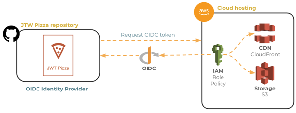
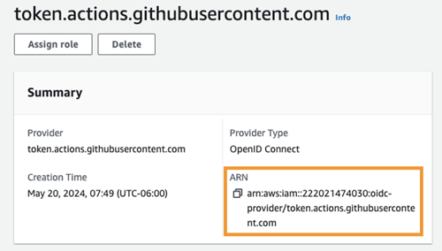
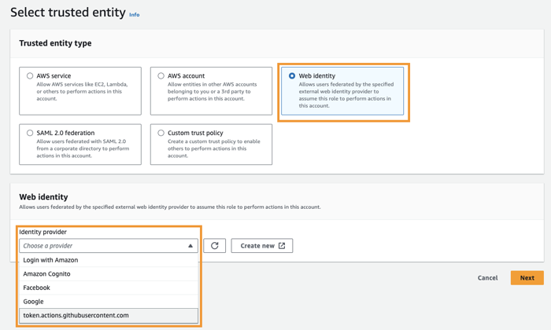
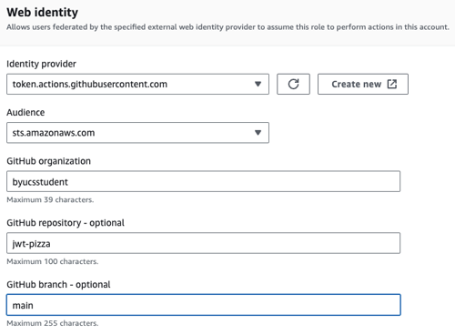
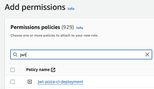
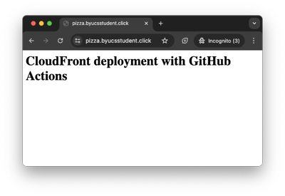

# AWS S3 deployment

In order to use CI to deploy our static frontend content to S3 you need to create a trust relationship between GitHub and AWS. This is done by using the Open ID Connection (OIDC) protocol to dynamically obtain an authentication token whenever you want to call the S3 endpoints for copying files. Using OIDC to authenticate with AWS makes it so that you don't ever have to store credentials in your CI pipeline.



### Setting up Open ID Connect (OIDC)

You establish a trust relationship between GitHub and AWS by configuring AWS to use GitHub as an OIDC identity provider, associating a OIDC identity with an AWS IAM role that allows access to S3, and configuring a GitHub Actions workflow to use the identity.

### Create and OIDC identity provider for GitHub

First you need to set up AWS to use GitHub as an OIDC provider.

1. Open the AWS IAM service console
1. Choose `Identity providers`
1. Press `Add provider`
1. Choose the provider type of `OpenID Connect`
   
1. Give the GitHub URL for the provider URL, and allow AWS Security Token Service as the audience.
   1. **provider URL**: https://token.actions.githubusercontent.com
   1. **Audience**: sts.amazonaws.com
1. Press `Add provider`
1. Click on the newly create identity provider to display its properties.
   
1. Copy the provider's ARN. You will use this later when defining your GitHub Action workflow.

### Create the IAM policy

We want to be careful what AWS services and resources we expose through the credentials we are creating and so we need to create an AWS IAM policy that only provides what in necessary to update your S3 deployment bucket and invalidate the files that the CloudFront distribution is hosting.

1. Open the AWS IAM service console.
1. Choose `Policies`.
1. Press `Create policy`.
1. Press `JSON` in order to define the policy with JSON.
1. Paste the following policy

```json
{
  "Version": "2012-10-17",
  "Statement": [
    {
      "Sid": "ListObjectsInBucket",
      "Effect": "Allow",
      "Action": ["s3:ListBucket"],
      "Resource": ["arn:aws:s3:::BUCKET-NAME-HERE"]
    },
    {
      "Sid": "AllObjectActions",
      "Effect": "Allow",
      "Action": ["s3:*Object", "cloudfront:CreateInvalidation"],
      "Resource": ["arn:aws:cloudfront:::distribution/DISTRIBUTION-HERE"]
    }
  ]
}
```

1. Replace `BUCKET-NAME-HERE` with the name of the S3 bucket you created.
1. Replace `DISTRIBUTION-HERE` with the CloudFront distribution ID.
   
1. Press `Next`.
1. Provide a meaningful policy name such as `jwt-pizza-ci-deployment`.
1. Press `Create policy`.

### Create the IAM role

Now we can create the AWS IAM role that allows access to S3.

1. Open the AWS IAM service console.
1. Choose `Roles`.
1. Press `Create role`.
1. Choose `Web identity`.
1. Select the identity provider that you just created for GitHub.

   

1. Press the `Next` button.
1. Add the `Audience` to be sts.amazonaws.com from the dropdown.
1. Add the `GitHub organization` to be you GitHub account name.
1. Add the `GitHub repository` for your fork of the `jwt-pizza` repository.
1. Add the `GitHub branch` to be main.

   

1. Press `Next`.
1. Add permissions by entering the name of the policy you created. (e.g. `jwt-pizza-ci-deployment`).

   

1. Press `Next`.
1. Name the role something meaningful like `github-ci`.
1. Press `Create role`.

### Configure GitHub Actions

The final step is to create a GitHub Actions workflow that deploys to the S3 bucket using the OIDC credentials that you just created.

1. In the repository that you specified when you created you identity provider, create a GitHub Actions workflow file named `deploy-s3.yml` in your project's `.github/workflows` directory. This will contain the workflow to copy files to your S3 bucket.
1. Paste the following template into the `deploy-s3.yml` file.

   ```yml
   name: Deploy

   on:
     push:
       branches:
         - main

   permissions:
     id-token: write

   jobs:
     deploy-s3:
       runs-on: ubuntu-latest
       steps:
         - name: Create OIDC token to AWS
           uses: aws-actions/configure-aws-credentials@v4
           with:
             audience: sts.amazonaws.com
             aws-region: us-east-1
             role-to-assume: AWS-ROLE-HERE
         - name: Push to AWS S3
           run: |
             mkdir dist
             printf "<h1>CloudFront deployment with GitHub Actions</h1>" > dist/index.html
             aws s3 cp dist s3://BUCKET-NAME-HERE --recursive
             aws cloudfront create-invalidation --distribution-id DISTRIBUTION-HERE --paths "/*"
   ```

1. Replace `AWS-ROLE-HERE` with the ARN of the AWS AMI role you created.
1. Replace `BUCKET-NAME-HERE` with the name of the S3 bucket you created.
1. Replace `DISTRIBUTION-HERE` with the ID of your CloudFront distribution.
1. Save the file, commit, and push.

The interesting pieces of the workflow include the request for OIDC authorization using the supplied role.

```yml
- name: Create OIDC token to AWS
  uses: aws-actions/configure-aws-credentials@v4
  with:
    audience: sts.amazonaws.com
    aws-region: us-east-1
    role-to-assume: AWSROLEHERE
```

If this is successful then you can execute any AWS CLI commands that the role allows. In our case it is the command to copy the `dist` directory to our bucket and invalidate the CloudFront distribution cache. If we didn't invalidate the cache than your new files would not

## Result

After following the above steps you should see the resulting `index.html` page when you view your website.


