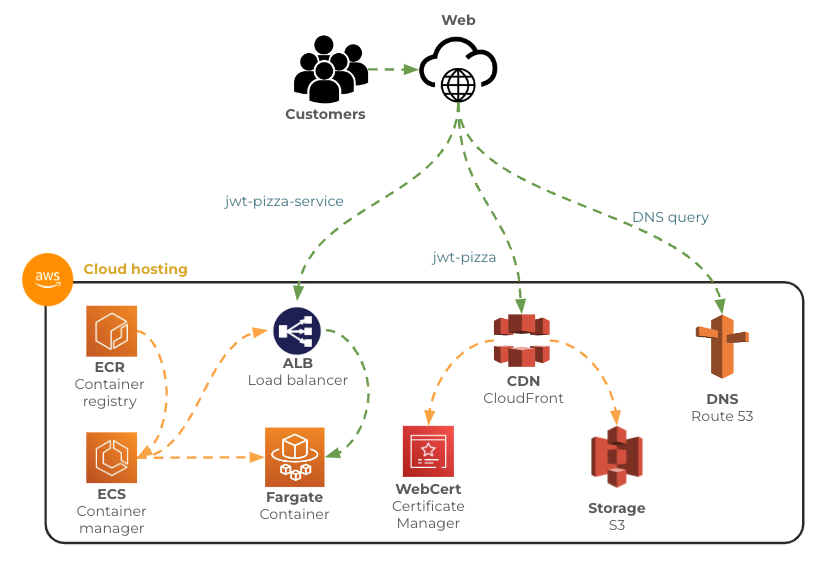

# Cloud deployment

Hosting on GitHub is fine for simple static websites that don't have to worry about significant scale. However, if you want to reach a large global audience with an architecture that is resilient and elastic you are going to need to deploy to a cloud environment that can meet those demands. To take things to the next level we are going to move to Amazon Web Service (AWS).

Specifically, you will deploy the `jwt-pizza` frontend end using S3 and the `jwt-pizza-service` backend using Fargate. The following diagram shows all of the AWS services involved in supporting this architecture.

## Architecture pieces

We are going to go into detail on each of the services in the above architecture. This will include what they each do, how to set them up, and how to connect them to each other. In the meantime, the following table gives you a general feel for what each of the services do.

| Service             | Description                                                                                                               |
| ------------------- | ------------------------------------------------------------------------------------------------------------------------- |
| Route 53            | DNS records that tell the web browser how to find the HTTP servers that deliver your front and backend.                   |
| CloudFront          | Content delivery network (CDN) that globally distributes your frontend static files.                                      |
| S3                  | Massively scalable file storage that contains your frontend static files.                                                 |
| Certificate manager | Generates and manages your SSL web certificates in order to support secure (HTTPS) network communication.                 |
| ALB                 | Network load balancer that distributes backend service requests across multiple network servers.                          |
| ECR                 | Docker container registry that stores your backend container images.                                                      |
| ECS                 | Docker container deployment system manager. This controls deploying new version and monitoring the health of the systems. |
| Fargate             | Docker container scaling automation. This will automatically deploy new containers as the load on your system increases.  |

## Phased build out

You will build this by taking the following steps:

1. Migrate the **frontend** hosting to AWS
   1. Remove the GitHub Pages hosting.
   1. Manually setup CloudFront, S3, Certificate Manager, and Route 53.
   1. Do a manual deployment to S3.
   1. Modify your frontend deployment GitHub Actions workflow to push to S3.
1. Migrate the **backend** hosting to AWS
   1. Convert your build process to build a Docker container.
   1. Manually setup ECR, ECS, ALB, and Fargate.
   1. Do a manual deployment to ECR and trigger deployment with ECS.
   1. Modify your backend deployment GitHub Actions workflow to push to ECR and trigger deployment with ECS.
1. Create CloudFormation scripts to build and teardown your frontend and backend services from scratch.

This will create a completely automated cloud scale architecture that should enable any level of growth that JWT Pizza achieves.
