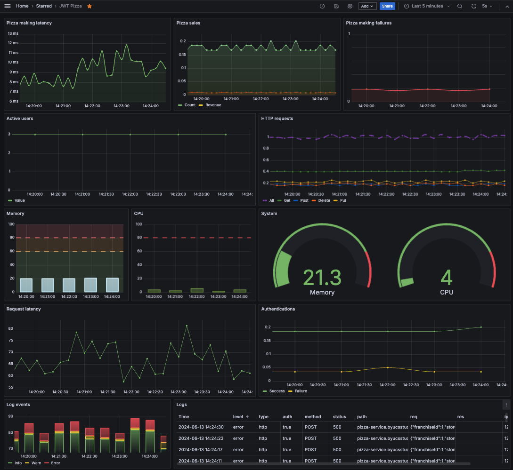

# ⓫ Chaos testing: JWT Pizza

🔑 **Key points**

- Validate your metrics and alerts by responding to a chaos test.

---


The JWT Pizza application has the ability built into it to inject Chaos into the system. It is an important part of your role as a DevOps engineer to know how to expediently, and efficiently, respond to critical events. This deliverable will give you significant experience with that process.

## Useful logs and metrics

In order to be successful with this deliverable you must have logs and metrics that are not only reporting nominal information, but also surfacing when there is a problem.

This means that you need to know when resources are maxed out, requests are failing, or latency is too high. The following example dashboard shows that there is a problem making pizzas and that the logs are filled with errors.



## Useful alerts

With the proper metrics in place you can then trigger alerts to resolve the incident in a timely manner. Make sure you create as many alerts as necessary so that you can respond at any hour of the day or night.


## Simulate traffic

You will probably need to simulate traffic in order for most failures to trigger. Consider using the [simulating traffic](../simulatingTraffic/simulatingTraffic.md) Curl commands that were described previously. It is also helpful to use the chaos endpoint you created in the [chaos testing assignment](https://github.com/devops329/devops/blob/main/instruction/chaosTesting/chaosTesting.md#-assignment) to make sure your alerts are working correctly.

You can also generate significant latency and failure from the Pizza Factory by ordering twenty or more pizzas in a single order.

## ☑ Assignment

Your job is to do the following:

1. Make sure the application is up and running correctly during the testing period.
1. Have all the [metrics](../grafanaMetrics/grafanaMetrics.md) and [logging](../grafanaLogging/grafanaLogging.md) reporting in place necessary for you to be able to observe and diagnose the failure.
1. Have an appropriate [alerting system](../grafanaOnCall/grafanaOnCall.md) in place so that you are effectively on call during the entire testing period.
1. Go to the [AutoGrader](https://cs329.cs.byu.edu), select Deliverable Eleven and select `I'm ready for some chaos!`
1. The incident will occur between 8am and 2pm the next day.
1. Respond to the incident in a timely manner.
1. Properly diagnose and remedy the root cause of the failure.
1. Produce an [incident report](../incidentReport/incidentReport.md) using the template found in the `jwt-pizza` repository under the [incidentReports](https://github.com/devops329/jwt-pizza/tree/main/incidentReports) folder.

> [!NOTE]
> If you are unable to be on call during the defined testing period you have the responsibility to notify the instructor and negotiate an alternative schedule.

The AutoGrader will know when you have resolved the issue and give you a score for that portion of the assignment as described in the rubric below.

When you generate your report you must commit the report to your fork of the `jwt-pizza` repository in a folder named `incidentReports`. The report filename should follow the convention `incident-YYYY-MM-DD-#.md`. For example:

```txt
incidentReports/
├── incident-2025-03-01-1.md
```

Submit the URL for the location of where the incident reports are found in your fork of the `jwt-pizza` repository to the Canvas assignment. This should look something like this:

```txt
https://github.com/youraccountname/jwt-pizza/tree/main/incidentReports
```

### Rubric

| Percent | Item                                                                                                                                                     |
| ------- | -------------------------------------------------------------------------------------------------------------------------------------------------------- |
| 80%     | Timely response and correction of chaos incident. After 6 hours have passed since the incident, 10% is deducted for each hour that the failure persists. |
| 20%     | Accurate and informative incident report committed to your fork of the `jwt-pizza` repository.                                                           |
