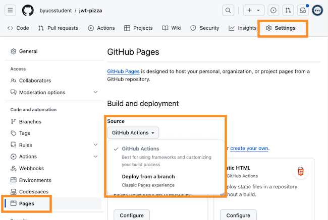
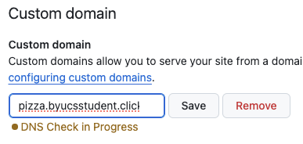

# Deliverable ⓵ Manual deployment: JWT Pizza

🔑 **Key points**

- Deploy JWT Pizza to GitHub Pages.

---


You now have everything you need to complete the first deliverable of the course. To create this deliverable you will complete the following steps:

1.  Create a git deployment branch named `gh-pages` in your fork of the jwt-pizza repository
1.  Associate the branch with your repo's GitHub Pages
1.  Test that the branch deploys to the GitHub page URL by pushing a simple `index.html` file.
1.  Associate your domain name with the GitHub Pages
1.  Bundle the jwt-pizza code and push it into the deployment branch

## Create the gh-pages branch

To configure GitHub Pages to host a static deployment you need to first create a branch that has the files you want to host.

1. Open **your fork** of the `jwt-pizza` repository on GitHub.com.
1. Create a new branch of the code called `gh-pages` by navigating to the branch view by clicking on the branch navigation icon.
   > 
1. Press the `New Branch` button, supply the name `gh-pages`, and press the `Create new branch` button.
   > 

## Associate gh-pages branch with Pages

Next you need to associate our new branch with GitHub Pages for the jwt-pizza repository.

1. Select the `Setting` option from the main navigation.
1. Select the `Pages` option from the left hand navigation.
1. Select the `Source` option and verify that `Deploy from a branch` is selected
   > 
1. In the `Brach` section select `gh-pages` as the branch, and press `Save`.
   > 

This will make the branch available from a URL that references your repository. The GitHub Pages settings view will display the name of the URL, but it should be something like:

```txt
https://youraccountnamehere.github.io/jwt-pizza/
```

## Creating a static deployment

Now you can copy the branch to your development environment, set up some files, and push it back to GitHub so that it will be statically deployed.

1. Open a command console in your development environment.
1. Navigate to your cloned copy of `jwt-pizza`.
1. Run the following commands to copy the `gh-pages` branch locally.

   ```sh
   git fetch origin gh-pages
   git checkout -b gh-pages origin/gh-pages
   ```

   This branch should contain all of the files for the jwt-pizza frontend. However, you don't want to deploy the project code, instead you want to deploy the distribution bundle that Vite creates. Before you do that, let's deploy a simple Hello World page to make sure things are working.

1. Delete all of the code in the branch. Remember that this branch is just to host a static deployment on GitHub Pages. You should never merge it back into `main`.
   ```sh
   rm -r * .env* .vscode
   echo "hello GitHub pages" > index.html
   git add .
   git commit -m "initial(pages)"
   git push
   ```

You can now point your browser to the GitHub pages site for your repository and see the index.html page you just created.

```sh
curl https://youaccountnamehere.github.io/jwt-pizza/

Hello GitHub Pages
```

## Assigning a custom domain

The JWT Pizza frontend doesn't work correctly unless it is hosted on the root path of the domain. By default GitHub Pages hosts the static deployment on a path called `jwt-pizza`. To get around this you must associate a custom domain with your GitHub Pages deployment.

⚠️ **Note**: If you do not already own a DNS hostname, you will need to go lease one now. You will use your hostname for all of your DevOps deployment tasks. You can lease a domain from AWS using Route53 or use a different provider such as [namecheap.com](namecheap.com).

Using your domain name take the following steps in order to associate it to your GitHub Pages.

1. Add a `CNAME` record to your domain name DNS records that points to the GitHub Pages hostname. For example, if your GitHub account name was `byucsstudent`, you owned a domain named `byucsstudent.click`, and you wanted to associate the static deployment of JWT Pizza with the subdomain of `pizza.byucsstudent.click` you would create the following DNS record.
   ```txt
   record name: pizza.byucsstudent.click
   record type: CNAME
   record value: byucsstudent.github.io
   ```
1. Wait for the newly created record to propagate. You can use `nslookup` or `dig` to verify that it is available.
1. Open the GitHub Pages settings for the fork of your jwt-pizza repository.
1. Put your subdomain name in the `Custom domain` edit box and press `Save`.
   > 
1. Check the box to `Enforce HTTPS`.
1. After the check completes you can navigate your browser to your subdomain and verify that "Hello GitHub Pages" is still being displayed.

## Deploying JWT Pizza

Now you are ready to actually deploy the JWT Pizza frontend. Open your development environment command console and run the following commands.

1. On the `main` branch, make sure we have the correct dependencies, and use Vite to bundle the frontend into a directory named `dist`.
   ```sh
   git checkout main
   npm ci
   npm run build
   ```
1. You also need to make a fix related to how GitHub Pages handles unknown requests. The problem is that the React Router used by the frontend relies on the HTTP file server to redirect back to `index.html` if an unknown path is requested. GitHub Pages attempts to serve a file named `404.html` when it can't find a requested file. So if you copy `index.html` over to `404.html` it will basically redirect all unknown requests back to `index.html` and the React Router will correctly interpret the path.
   ```sh
   cp dist/index.html dist/404.html
   ```
1. Change to the `gh-pages` branch, delete the old deployment, and copy the bundled version into its place.
   ```sh
   git checkout gh-pages
   rm -r assets *.html *.jpg *.png
   cp -r dist/* .
   ```
1. Add the files to git, commit, and push.
   ```sh
   git add .
   git commit -m "deploy(v1)"
   git push
   ```

That should do it. You can verify that it all worked by opening your browser to your pizza domain and start ordering pizzas.


## ☑ Assignment

Complete the steps outlined above with your own fork of the jwt-pizza repository and your custom domain name.

Once JWT Pizza is live on your domain, go over to Canvas and submit the URL. This should look something like this:

```txt
https://pizza.yourdomainname.click
```

### Rubric

| Percent | Item                                                                                        |
| ------- | ------------------------------------------------------------------------------------------- |
| 20%     | Strong GitHub commit history that documents your work in your fork of `jwt-pizza`           |
| 50%     | Successful manual deployment of JWT Pizza to GitHub Pages using a `gh-pages` branch         |
| 30%     | Completely functional JWT Pizza deployed with GitHub Pages accessible on custom domain name |
