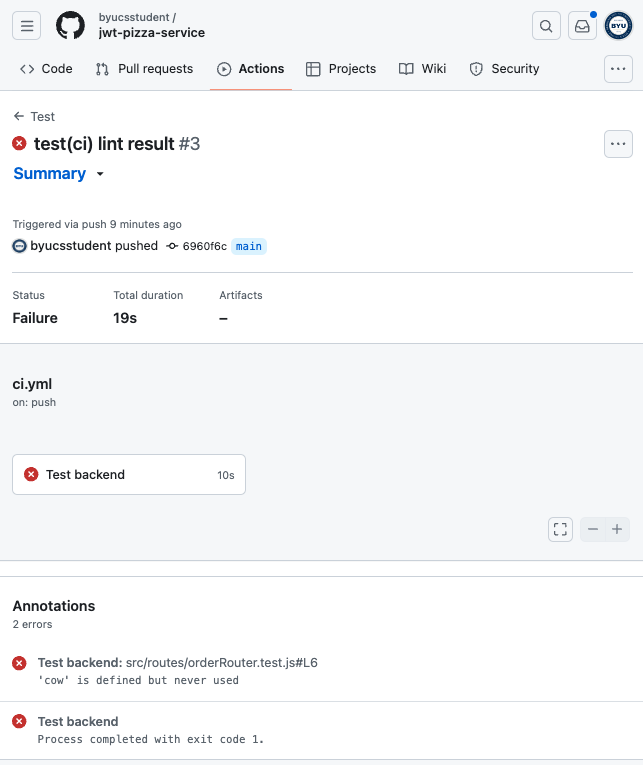

# Deliverable ⓷: Unit testing - CI

Now that you have created unit tests for the **jwt-pizza-service** you are ready to implement the continuous integration process that will validate the code on every commit.

## Create the GitHub Action workflow

In your fork of the **jwt-pizza-service** create the file `.github/workflows/ci.yml` and add the following.

```yml
name: Test

on:
  push:
    branches:
      - main

jobs:
  build:
    name: Test backend
    runs-on: ubuntu-latest
    steps:
      - name: Checkout repo
        uses: actions/checkout@v4

      - name: Setup Node
        uses: actions/setup-node@v4
        with:
          node-version: '20.x'

      - name: Install dependencies
        run: npm ci

      - name: Lint
        run: npm run lint
```

This workflow is fairly simple. It checks out the code, installs the NPM dependencies, and runs the linter.

When you commit and push this change, you can view the workflow executing on the GitHub Actions view of your repository. Assuming that you have cleaned up all of the linting error, you should see something similar to the following.

> 

If you go and introduce a linting error to your code by doing something like declaring an unused variable, you should see an error when you commit.

> 

## Executing tests in the workflow

Running the linter is fine, but what we really want to do is run our tests. This is complicated by the fact that we didn't mock out the database calls, and therefore your tests need a database to run against. You could go back and mock out the database calls. Doing so would make your tests faster, but would also remove a crucial integration that is a majority of what the service is doing. Creating a mock of the database would probably hide many possible errors and create a lot of testing code to maintain.

Instead let's have GitHub Actions install a container that actually has MySQL running on it.

# OLD STUFF THAT PROBABLY NEEDS TO BE DELETED

## CI: Testing, linting, and coverage

# Reporting Code Coverage

https://haseebmajid.dev/posts/2023-04-15--how-to-get-code-coverage-from-playwright-tests-in-a-sveltekit-app-/

https://axolo.co/blog/p/code-coverage-js-in-2023

This turned out to be a simple switch on Jest

```sh
npx jest --coverage
```

Or in the package.json

```json
  "scripts": {
    "test": "jest",
    "test-coverage": "jest --coverage  --coverageReporters json-summary",
    "test-coverage-report": "jest --coverage",
    "start": "node index.js",
    "lint": "eslint ."
  },
```

The `json-summary` produces a single report that can be used for building the coverage badge. Without that it builds an HTML file that demonstrates the coverage.

I got the coverage to fail by modifying the jest config.

```js
/** @type {import('jest').Config} */
const config = {
  coverageThreshold: {
    global: {
      branches: 100,
      functions: 100,
      lines: 100,
      statements: 100,
    },
  },
};

module.exports = config;
```

We can create badges to display the coverage using this:

https://dev.to/thejaredwilcurt/coverage-badge-with-github-actions-finally-59fa

It is pretty crazy. It makes a gist then updates it in the action. It then used some third party image generator that gets put into your readme.

https://github.com/marketplace/actions/jest-coverage-comment

This all feels very bittle, but maybe we can use it as an example of CI that is a mess of automation.
