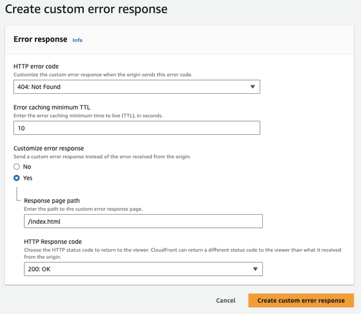
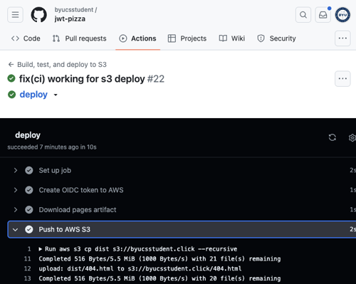

# Deliverable ⓹ Content Delivery Network Deployment: JWT Pizza

🔑 **Key points**

- Deploy your JWT Pizza frontend using S3, CloudFront, and GitHub Actions

---


## Prerequisites

Before you start work on this deliverable make sure you have read all of the preceding instruction topics and have completed all of the dependent exercises (topics marked with a ☑). This includes:

- [Security](../security/security.md)
- [Cloud deployment](../cloudDeployment/cloudDeployment.md)
- ☑ [AWS S3](../awsS3/awsS3.md)
- [AWS CloudFront](../awsCloudFront/awsCloudFront.md)
- [AWS S3 deployment](../awsS3Deployment/awsS3Deployment.md)

Failing to do this will likely slow you down as you will not have the required knowledge to complete the deliverable.

## Getting started

Now that we know how to deploy static content using CloudFront and S3 using GitHub Actions, it is time to move our CDN hosting from GitHub Pages to AWS CloudFront.

## CDN distribution

Set up your AWS S3 and CloudFront configuration as described in the [AWS CloudFront](../awsCloudFront/awsCloudFront.md) instruction. Your AWS configuration should consist of a private S3 bucket that contains your static frontend code. A CloudFront distribution then exposes the frontend to the world using a secure HTTP connection defined by your DNS hostname.

### Demonstrating completion

Once completed, your DNS entry should point to your CloudFront endpoint. You can verify this with the `dig` or `nslookup` utility.

```sh
dig +short CNAME pizza.byucsstudent.click

d3pl23dqq9jlpy.cloudfront.net.
```

## Secure deployment

Alter your GitHub Actions deployment process using the [AWS S3 Deployment](../awsS3Deployment/awsS3Deployment.md) instruction such that it updates S3 when files are pushed to your fork of `jwt-pizza`. Your GitHub CI pipeline deploys your frontend code through a secure connection that is authenticated using OIDC that follows the principle of least privilege, by exposing only the necessary access.

First off, you need to modify the **build** job to use the generic `upload-artifact` action instead of the GitHub Pages specific `upload-pages-artifact` action. To do this replace what is currently there:

```yml
- name: Update pages artifact
  uses: actions/upload-pages-artifact@v3
  with:
    path: dist/
```

with this action:

```yml
- name: Update dist artifact
  uses: actions/upload-artifact@v4
  with:
    name: package
    path: dist/
```

Now you can modify the **deploy** job so that uploads to S3 instead of pushing to GitHub Pages. Replace the **deploy** job with the following.

```yml
deploy:
  needs: build
  permissions:
    id-token: write
  runs-on: ubuntu-latest
  env:
    version: ${{needs.build.outputs.version}}
  steps:
    - name: Create OIDC token to AWS
      uses: aws-actions/configure-aws-credentials@v4
      with:
        audience: sts.amazonaws.com
        aws-region: us-east-1
        role-to-assume: arn:aws:iam::${{ secrets.AWS_ACCOUNT }}:role/${{ secrets.CI_IAM_ROLE }}

    - name: Download dist artifact
      uses: actions/download-artifact@v4
      with:
        name: package
        path: dist/

    - name: Push to AWS S3
      run: |
        echo Deploying $version
        aws s3 cp dist s3://${{ secrets.APP_BUCKET }} --recursive
        aws cloudfront create-invalidation --distribution-id ${{ secrets.DISTRIBUTION_ID }} --paths "/*"
```

This job gets the version from the previous build step, creates the OIDC authorization, downloads the build artifact, push to S3, and invalidate the CloudFront distribution cache.

### React routing on browser refresh

You need to remove the creation of the `404.html` that GitHub Pages used to handle when a user refreshes the browser. You can do that by deleting the creation of the file from your workflow.

```yml
cp dist/index.html dist/404.html
```

Instead, you need to configure CloudFront to return the `index.html` file whenever a **404** or **403** error is encountered. You can do this by going to `Error Pages` in the CloudFront distribution and adding a custom error response for both 404 and 403.



This will cause the React DOM Router to get loaded and properly route back to the correct React component for the path.

### Demonstrating completion

Once completed, your repository's GitHub Actions workflow history should demonstrate a successful deployment to S3.



## ⭐ Deliverable

In order to demonstrate your mastery of the concepts for this deliverable, complete the following.

1. Create a secure S3 bucket to host the frontend static files.
1. Create a web certificate for use with your CloudFront distribution.
1. Create a CloudFront distribution.
1. Alter your DNS record in Route 53 to point to the CloudFront distribution.
1. Create the IAM policies, roles, and identity provider definitions necessary to secure access for deployment.
1. Alter your GitHub Actions workflow to update S3 and CloudFront instead of deploying to GitHub Pages.

Once this is all working, go to the [AutoGrader](https://cs329.cs.byu.edu) and submit your work for the deliverable.

### Rubric

| Percent | Item                                                  |
| ------- | ----------------------------------------------------- |
| 45%     | Secure CloudFront deployment based on S3 bucket       |
| 10%     | Properly handles browser refresh React DOM Routing    |
| 45%     | Updated GitHub Action workflow deploying to S3 bucket |
