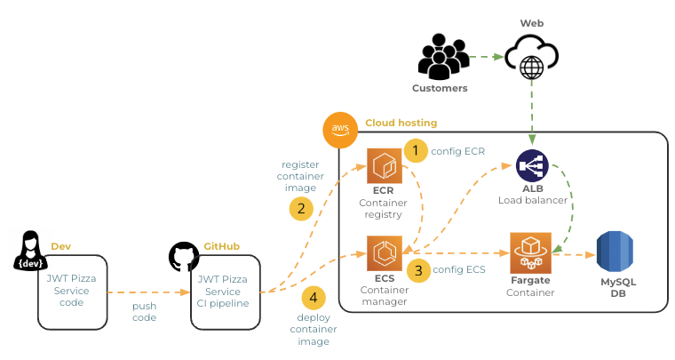
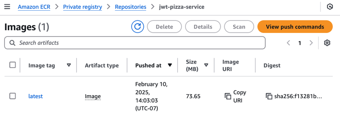

# Deliverable ⓺ Scalable deployment: JWT Pizza Service

🔑 **Key points**

- Deploy JWT Pizza Service to scalable services using CI.

[🎥 Video overview](https://youtu.be/mhFmGVfFA8c)

---


## Prerequisites

Before you start work on this deliverable make sure you have read all of the preceding instruction topics and have completed all of the dependent exercises (topics marked with a ☑). This includes:

- [Elasticity](../elasticity/elasticity.md)
- ☑ [AWS RDS MySQL](../awsRdsMysql/awsRdsMysql.md)
- [Docker](../docker/docker.md)
- [Containers](../containers/containers.md)
- ☑ [JWT Pizza Service container](../jwtPizzaServiceContainer/jwtPizzaServiceContainer.md)
- ☑ [AWS ECR](../awsEcr/awsEcr.md)
- ☑ [AWS ECS](../awsEcs/awsEcs.md)

Failing to do this will likely slow you down as you will not have the required knowledge to complete the deliverable.

## Getting started

Now that you have experience with creating, registering, and deploying the JWT Pizza Service manually, it is time to modify your CI workflow to do this automatically when you push a change to the repository. This deliverable represents the **Scalable compute** portion of our product overview diagram. It provides the hosting of the `jwt-pizza-service` in a way that can support an ever-growing customer base, all driven by an automated CI process.

Your work on this deliverable consists of four parts:

1. **ECR configuration**: Set up ECR to store your `jwt-pizza-service` Docker container images.
1. **Image registration CI**: Modify the CI pipeline to automatically build and deploy a new container image to ECR.
1. **ECS configuration**: Setup ECS to deploy a container to Fargate and expose it publicly using the application load balancer.
1. **Image deployment CI**: Modify the CI pipeline to automatically deploy a new container image to ECS.



## Step 1: ECR configuration

You should have already followed the [AWS ECR instruction](../awsEcr/awsEcr.md) in order to get your AWS account set up to store the JWT Pizza Service container images in a Docker compliant registry. If you have not done that yet, then do so now.

## Step 2: Image registration CI

You should have already followed the [AWS ECR instruction](../awsEcr/awsEcr.md) to modify your CI pipeline to build and upload a Docker container image for the JWT Pizza service. You trigger the CI workflow whenever you push a change to the `jwt-pizza-service` GitHub repository. If you CI pipeline is successful then you should have an image listed in your ECR repository.



If ECR does not list a jwt-pizza-service image, then execute the steps found in the [AWS ECR instruction](../awsEcr/awsEcr.md) to generate one.

## Step 3: ECS configuration

You should have already followed the [AWS ECS instruction](../awsEcs/awsEcs.md) in order to get your AWS account setup to host the JWT Pizza Service container using Fargate and an application load balancer. Additionally, you should have already set up your [RDS MySQL database](../awsRdsMysql/awsRdsMysql.md). If you have not done this yet, then do so now.

## Step 4: Image deployment CI

With ECR configured, the CI workflow for building and pushing a container image to ECR, and ECS configured to deploy a container, you are now ready to enhance the CI workflow to automatically push the container to ECS and update the application load balancer.

You deploy the new container to ECS by adding three new steps to the **deploy** job of the workflow.

1. First, add the step that makes a copy of the existing ECS `jwt-pizza-service` task definition and save it to a file named `task-definition.json`. Here is an [example task-definition.json](task-definition.json) if you are interested in what they look like.
   ```yml
   - name: Download task definition
     run: |
       aws ecs describe-task-definition --region us-east-1 --task-definition jwt-pizza-service --query taskDefinition > task-definition.json
       echo $(cat task-definition.json | jq 'del(.taskDefinitionArn, .requiresAttributes, .compatibilities, .revision, .status, .registeredAt, .registeredBy)') > task-definition.json
   ```
1. Modify the task definition so that it contains the name of the new container image that you just created.
   ```yml
   - name: Create new task definition
     id: task-def
     uses: aws-actions/amazon-ecs-render-task-definition@v1
     with:
       task-definition: task-definition.json
       container-name: jwt-pizza-service
       image: ${{ steps.build-image.outputs.image }}
   ```
1. Deploy the new task definition and update the ECS service. This will trigger ECS to create a rolling deployment of the new container and update the application load balancer to expose the new container.
   ```yml
   - name: Deploy new task definition
     uses: aws-actions/amazon-ecs-deploy-task-definition@v1
     with:
       task-definition: ${{ steps.task-def.outputs.task-definition }}
       service: jwt-pizza-service
       cluster: jwt-pizza-service
       wait-for-service-stability: false
   ```

### Test the container deployment

You should now be able to commit and push the workflow script to GitHub. This will trigger the container to be pushed to ECS where it will become visible through your EC2 load balancer.

After the container has been deploy you can test the backend by making curl requests. _(Replace the assignment of the host variable with your own hostname.)_

```sh
# Set the hostname - replace with your hostname
host=https://pizza-service.byucsstudent.click

# Note that the version number will be different
curl $host
{"message":"welcome to JWT Pizza","version":"20240613.144627"}

# Note that the menu will be empty until you add some tasty pizzas
curl $host/api/order/menu
[]
```

### Initial pizza data

Just like when you initialized the JWT Pizza Service for your development environment data, you will need to repeat those steps now so that you have some interesting data in your production environment. Follow the steps provided in the [JWT Pizza Data](../jwtPizzaData/jwtPizzaData.md) instruction with your production Pizza Service hostname.

## Deploy the full cloud stack

Now that have both your frontend and your backend running on AWS you need to change the configuration of your `jwt-pizza` code so that it calls your deployment instead of the JWT Pizza Headquarters implementation.

From your fork of the `jwt-pizza` repository open the `.env.production` and modify it so that the `VITE_PIZZA_SERVICE_URL` is pointing to your URL for your newly deployed backend.

```sh
VITE_PIZZA_SERVICE_URL=https://pizza-service.YOURHOSTNAMEHERE
VITE_PIZZA_FACTORY_URL=https://pizza-factory.cs329.click
```

Repeat the same change with the `.env.development` file so that you use your backend when you are experimenting your frontend in your development environment.

Then push your changes to GitHub. Your CI pipeline should deploy the frontend changes and complete your work on creating a full cloud stack. With this change you can open up the dev tools while visiting your front end and see the requests going to your backend.


## ⭐ Deliverable

In order to demonstrate your mastery of the concepts for this deliverable, complete the following.

1. Alter the IAM policies, roles, and identity provider definitions necessary to secure access for backend deployment.
1. Set up ECR to host your backend Docker container.
1. Set up ECS to deploy your backend Docker container using Fargate.
1. Alter your GitHub Actions workflow to update ECR and ECS in order to deploy the backend service.
1. Alter your DNS record in Route 53 to point to the application load balancer distribution.
1. Modify and deploy your frontend so that it calls your backend service.

Once this is all working, go to the [AutoGrader](https://cs329.cs.byu.edu) and submit your work for the deliverable.

### Rubric

| Percent | Item                                                    |
| ------- | ------------------------------------------------------- |
| 20%     | Secure Fargate deployment based on ECR and ECS          |
| 20%     | AWS Load balancer used to access Fargate                |
| 20%     | MySQL database deployed for backend data persistence    |
| 30%     | Updated GitHub Action workflow deploying to ECR and ECS |
| 10%     | Your backend called for all frontend requests           |

**Congratulations!** You have completed the process of using RDS, IAM, ECR, ECS, and Route 53 to deploy your backend service. Time to go celebrate. I'm thinking ice cream 🍦.
