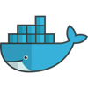
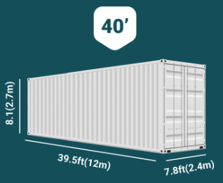
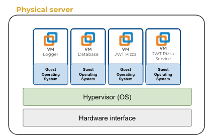
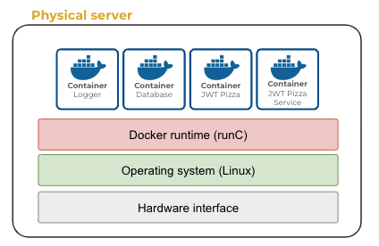
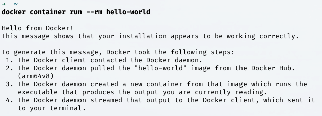

# Docker

🔑 **Key points**

- Containers revolutionized how we deploy applications.
- Containers are more efficient than virtual machines.
- Install Docker and experiment with building containers.

---

📖 **Deeper dive reading**: [What are containers](https://www.docker.com/resources/what-container/)

---



As the world went global, the shipping industry came up with an idea the revolutionized everything. They created a [internationally recognized specification](https://cdn.standards.iteh.ai/samples/76912/7354663676144f8ab1a7b57cb573b0a6/ISO-668-2020.pdf) that defined a shipping container as 7.8ft in width, 7.9ft in height, and either 20ft or 40ft long. The impact of this standard was profound. It standardized the width and lengths of truck beds, barges, and sea going cargo ships. Factories changed the quantity of goods that they shipped in a batch and retailers modified their stores to allow the containers to fit into their delivery bays. All of this was caused by the simple standardization of a box's dimensions.



### History

During the Y Combinator Summer 2010 startup incubator, Kamel Founadi, Solomon Hykes, and Sebastien Pahl came up with the idea to change the world of delivering applications in the same way that containers changed the world of delivering physical goods. This became the original of what is now known as Docker Inc.

In 2015 the Open Container Initiative (OCI) was established to standardized the definition of container formats and runtimes. This was a key step that ensured global compatibility among software vendors seeking to capture the container market.

Today the major players in the container space are Docker Inc, the original proponent of container technology, and Kubernetes, an offshoot of Google that made major contributions that brought containers to the enterprise. Each of the major cloud vendors, AWS, Google, and Microsoft, also provide significant services and support for containers.

### Docker technology

The core technology for Docker containers came from existing Linux technology, primarily LinuX Containers (LXC). Linux `namespaces` isolate the docker application's view of the operating systems environment. This includes process trees, network, user IDs, and the file system. The kernel's `cgroups` limit the available memory and CPU.

Once a container is executing in a hosted environment, a `container image` can be captured that consists only of the changes that were added to the parent container. This use a delta based filesystem called OverlayFS and makes the resulting size of the container image much smaller because it doesn't have all the files represented by the entire operating system.

A container image is then uploaded to a container registry where in can be downloaded and run in any environment that supports the container execution standard. Generally this works most efficiently on Linux systems executing a runC (Docker) or CRI-O (Kubernetes) runtime. Although, other runtimes and OS specific adaptations exist to make containers work on operating systems such as Windows and OSX.

💡 Diving deep into the Linux kernel's support for containers would make a great curiosity project.

## Comparison to Virtual Machines

The technology that Docker upset is called virtual machines (VM). The idea with a virtual machine is that you take a physical server and run a hypervisor layer that hides the actual characteristics of the underlying hardware from a copy of an operating system running in the virtual machine. This effectively isolates every virtual machine from each other. It also creates significant overhead since operating systems consume significant amounts of overhead. The OS also takes a long time to boot up which creates a significant start up cost when you are attempting to deploy applications quickly.



Containers, by contrast, run directly on the existing operation system and create isolation using the operating system's native infrastructure (namespaces and cgroups). That means a container can spin up in a few seconds, where a virtual machine might take minutes.



## Docker components

Docker is made up of three major components. The runtime, objects, and registries.

### Software

The Docker software is comprised mainly of the the Docker daemon, called dockerd, that manages Docker containers and handles container objects, and the Docker CLI, called docker, that provides a command-line interface used to interact with Docker daemons.

### Objects

- **Docker container**: Hosts an application in a lightweight isolated environment.
- **Docker image**: Persists a read only copy of a container. This allows for the transportation of a container to different runtime environments.
- **Docker service**: Facilitates communication between containers so that they can provide a higher level activity such as a service or application that is built from multiple containers running in concert. This is often referred to as a swarm.

### Registries

A Docker registry is a repository for Docker images. You can push container images to a register and then pull them down at a later time. Registries can be public or private. Docker Inc. provides the most used public registry, named Docker Hub. There are also other well used registries available from vendors such as AWS (ECR), Google (GCR), Microsoft (ACR), and GitHub.

## Installation

In order to load Docker in your development environment, install Docker Desktop using the instructions found on [Docker's website](https://docs.docker.com/get-docker/). There are installations for Mac, Windows, and Linux. This will install the Docker Desktop application, the docker runtime, and the Docker CLI.

After installing Docker Desktop there are some simple tutorials that you can run through. Feel free to spend some time there experimenting and having fun.

## ☑ Assignment

Install Docker to your development environment and the pull down the `hello-world` container image and run it.

The `pull` command will pull the container image down from Docker Hub.

```sh
docker pull hello-world
```

You can then run the container with the `container run` command and referencing the container that you just pulled down. The `--rm` flag will remove the container once it has stopped running.

```sh
docker container run --rm hello-world

Hello from Docker!
```

While the output doesn't seem very exciting, it is important to understand all the magic that happened in order for `Hello from Docker!` to print out. The CLI started a daemon that loaded the container image into an isolated environment that controls its memory and CPU consumption as well as restricts it from globally accessing other processes, the file system, or users. It then started up the root process for the container and let it do its thing, in this case, printing out Hello and exiting.

All of that happened in less than a second.

Take a moment and consider what you can do with a tool like this. You can containerize **any** application that you get working in your development environment. You can create an image and push it up to a repository. You can then pull that image down to any container compatible environment and have your exact same application running in seconds.

Take a screenshot of the resulting output and upload it to the Canvas assignment. This should look something similar to the following.


