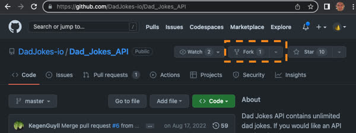

# GitHub

You should already be familiar with the basics of Git and GitHub. If you do not feel comfortable with using Git or GitHub then you should spend sometime learning about and experimenting with the functionality that they provide. Here are some suggested resources:

- [Git Guide](https://github.com/git-guides)
- [Introduction to GitHub](https://github.com/skills/introduction-to-github)
- [GitHub Hello World](https://docs.github.com/en/get-started/start-your-journey/hello-world)
- [Git Cheat Sheet](https://training.github.com/downloads/github-git-cheat-sheet/)

For this course we will be using GitHub for the following reasons:

1. Hosting all of the course instruction
1. Forking the application code
1. Deploying to GitHub pages
1. Deploying using GitHub actions
1. Keeping notes about what you have learned and things you want to remember

## Creating a GitHub account

If you do not already have a GitHub account then go and [create one now](https://github.com). GitHub provides a free version of their services that will more than cover your usage in this class. Chances are that once you start using GitHub you will use this account for many years to come, both for personal and professional projects.

## Forks

A GitHub fork provides the ability to create a copy of a GitHub repository. Usually you [fork a repo](https://docs.github.com/en/get-started/quickstart/fork-a-repo) to get a copy of an open source code base that you want to experiment with, or contribute to. For example, the repository containing these instructions. A fork is similar to cloning a repository to your development environment, but it clones to GitHub instead. Then pull the fork down to your development environment to work on it. The fork maintains a link to the upstream (original) repository that allows you to easily pull down updates and merge them with your fork. A fork also allows you to create a pull request in order to push suggested changes to the original repository.

If you have never forked a repository before you should go find an open source project that interests you. For example, here is the [Dad Jokes API](https://github.com/DadJokes-io/Dad_Jokes_API). This simple web service provides an endpoint to get a joke. Consider forking this repository in order to experiment with how it works. Don't worry too much about what the code is doing. That will make more sense as the class goes on.

It would be awesome if we can increase the fork count for `Dad Jokes API` into the hundreds. Also make sure you push the `Star` button to show that you like the repo. Let's blow KegenGuyll's mind!

## Taking notes

Keeping notes of what you have learned and things that you want to remember is an essential step for accelerating your web programming skills. GitHub supports the inclusion of a file with the special name `README.md` in the root of your repository. The `README.md` file is displayed in GitHub when you view your repository. This file uses `Markdown` syntax. If you have not used Markdown before, then take some time to [learn how to use it](https://docs.github.com/en/get-started/writing-on-github/getting-started-with-writing-and-formatting-on-github/basic-writing-and-formatting-syntax).

Later in the course you will fork the application team's repositories. You should consider adding another Markdown file named `notes.md` to these repositories so that you can track what you have learned in the course.

## Pull requests

📖 **Deeper dive reading**:

- [GitHub Pull Requests](https://docs.github.com/en/pull-requests/collaborating-with-pull-requests/proposing-changes-to-your-work-with-pull-requests/about-pull-requests)
- [GitHub pulls from forks](https://docs.github.com/en/pull-requests/collaborating-with-pull-requests/proposing-changes-to-your-work-with-pull-requests/creating-a-pull-request-from-a-fork)

GitHub allows you to create a fork of any repository on GitHub. You just push the `Fork` button from the repository's GitHub page. You can then make modifications to the repository fork and push the changes as a _pull request_. This notifies the original repository's owner that a request is being made to enhance the original repository. The owner can review your changes and if appropriate commit the changes into the original. This is how open source communities manage development from a volunteer group of global developers.

In this class, if you notice something in the instruction that needs to be enhanced, feel free to fork the [instruction repo](https://github.com/devops329/devops), and make a pull request. This will give you experience with this forking and improve the instruction for others at the same time. Plus your name will be included as a contributor. How cool is that!
