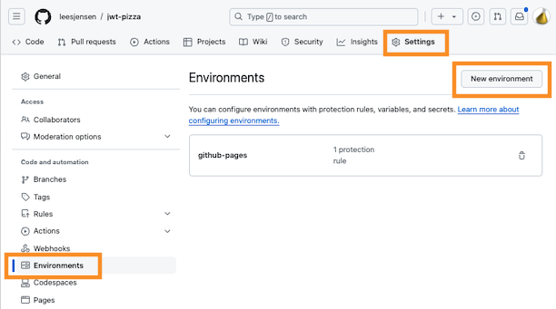
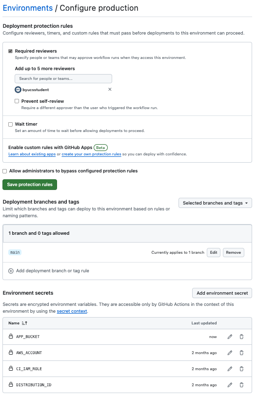
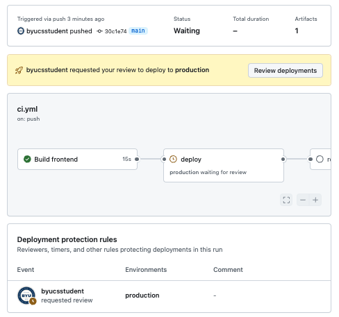
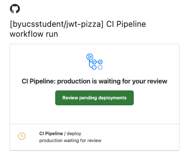
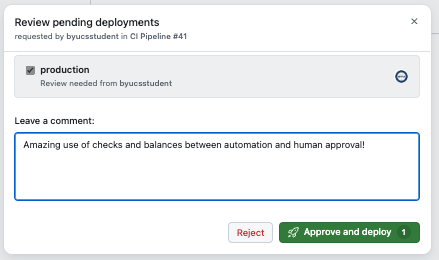
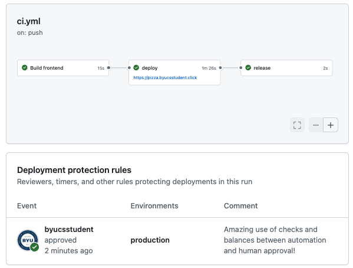

# GitHub Environments

🔑 **Key points**

- GitHub environments allow you to isolate your secrets and tag workflows.
- Convert your CI workflow to use GitHub environments.

---

GitHub supports the concept of `environments` that allow you to isolate your secrets and enforce protection rules. Protection rules can require a manual approval, delay a job, or restrict the environment to certain branches.

## Creating an environment

Create an environment by going to your `jwt-pizza` repository's settings in GitHub and selecting the **Environments** view from the left-hand navigation. Then press the `New environment` button.



Give the new environment the name `production`. Once you have created the environment you can specify if it must be reviewed before a GitHub Action workflow can execute, that it can only execute from a given branch of the code, and also what secrets should be used with the CI pipeline.

This makes it so you can have a human gate in your deployment pipeline, as well as secrets that are different for your production environment, where customer data is kept, as opposed to your staging environment that can be more lax in security.

The following image shows that the production environment requires the following:

- The user `byucsstudent` must review the code before a workflow can execute. For your environment you will want to set this to be your GitHub user.
- The code must be deployed from the `main` branch
- There are several secrets that are specific to the production environment. Specifically, there is a different CloudFront distribution ID for the production environment. That helps to decrease the risk of deploying a non-production release to your production environment.



Make yourself the reviewer and add the same [secrets](../awsS3Deployment/awsS3Deployment.md) that you created previously in order to generally deploy `jwt-pizza` to AWS. This should include the following:

| Secret          | Description                                                 | Example              |
| --------------- | ----------------------------------------------------------- | -------------------- |
| AWS_ACCOUNT     | Your AWS account number                                     | 343243424            |
| CI_IAM_ROLE     | The IAM user with rights to deploy your application         | github-ci            |
| APP_BUCKET      | The S3 bucket hosting your static deployment files          | pizza.ilovebyu.click |
| DISTRIBUTION_ID | The CloudFront Distribution ID for your frontend deployment | F3GRFXFEBQ8EEU       |

## Configuring access

In order for your CI workflow to still have access using the AWS IAM CI rule that you created previously, you must now modify it so that it is accessible when your workflow runs under this environment. In the AWS Console, open up the IAM dashboard, and modify the `Trust relationship` for the `github-ci` role that you created previously. In the `Condition` object, modify it so that it allows access for the **production** environment on your `jwt-pizza` repository.

```json
{
  "Version": "2012-10-17",
  "Statement": [
    {
      "Effect": "Allow",
      "Principal": {
        "Federated": "arn:aws:iam::YOURAWSACCOUNTID:oidc-provider/token.actions.githubusercontent.com"
      },
      "Action": "sts:AssumeRoleWithWebIdentity",
      "Condition": {
        "StringEquals": {
          "token.actions.githubusercontent.com:aud": "sts.amazonaws.com",
          "token.actions.githubusercontent.com:sub": [
            "repo:YOURGITHUBACCOUNTNAME/jwt-pizza:environment:production",
            "repo:YOURGITHUBACCOUNTNAME/jwt-pizza:ref:refs/heads/main",
            "repo:YOURGITHUBACCOUNTNAME/jwt-pizza-service:ref:refs/heads/main"
          ]
        }
      }
    }
  ]
}
```

## Modify the CI workflow

You can now modify your GitHub Action workflow for `jwt-pizza` to execute under the production environment that you just created. Edit the `.github/workflows/ci.yml` file to include a reference to the **production** environment.

```yml
deploy:
  needs: build
  permissions:
    id-token: write
  runs-on: ubuntu-latest
  env:
      version: ${{ github.event.inputs.version }}
  environment:
    name: production
    url: https://pizza.byucsstudent.click
```

You can also include a **url** property that will display whenever the workflow executes. Make sure you set the URL to represent your JWT Pizza hostname.

## ☑ Exercise

Once you have completed the changes outlined above, go ahead and deploy the CI workflow change to your fork of the `jwt-pizza` code. This should trigger the review rule for the production environment. If you look at the GitHub Action dashboard you will see that the execution blocked waiting for the review.



You should also receive an email to the address associated with your GitHub account.



After you review all the changes included in the deployment you can press the `Review deployments` button and complete the approval process.



Pressing the approval button will allow the workflow to continue.

Once you are done, it should look something like the following.


