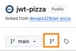
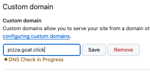

# GitHub Pages

With our newly delivered JWT Pizza frontend and the understanding of what a static deployment looks like we can take the next step of deploying the frontend to the world.

One easy way to do this is to use `GitHub Pages`. At a basic level GitHub Pages is a simple HTTP file server that allows you to publish a set of files under a GitHub URL. You create a branch on your GitHub repository that contains static web files and then you modify the repository settings to indicate that you want to statically host that branch with the GitHub Pages HTTP file server.

## Create the gh-pages branch

To configure GitHub Pages to host a static deployment we need to first create a branch that has the files we want to host.

1. Open **your fork** of the `jwt-pizza` repository on GitHub.com.
1. Create a new branch of the code called `gh-pages` by navigating to the branch view by clicking on the branch navigation icon.
   > 
1. Press the `New Branch` button, supply the name `gh-pages`, and press the `Create new branch` button.
   > 

## Associate gh-pages branch with Pages

Next we need to associate our new branch with GitHub Pages for the jwt-pizza repository.

1. Select the `Setting` option form the main navigation.
1. Select the `Pages` option from the left hand navigation.
1. Select the `Source` option and verify that `Deploy from a branch` is selected
   > 
1. In the `Brach` section select `gh-pages` as the branch, and press `Save`.
   > 

This will make the branch available from a URL that references your repository. The GitHub Pages settings view will display the name of the URL, but it should be something like:

```txt
https://youraccountnamehere.github.io/jwt-pizza/
```

## Creating a static deployment

Now we can copy the branch to your development environment, set up some files, and push it back to GitHub so that it will be statically deployed.

1. Open a command console in your development environment.
1. Navigate to your cloned copy of `jwt-pizza`.
1. Run the following commands to copy the `gh-pages` branch locally.

   ```sh
   git fetch origin gh-pages
   git checkout -b gh-pages origin/gh-pages
   ```

   This branch should contain all of the files that represent the jwt-pizza frontend. However, since that is the frontend code we need to instead provide the bundled code that Vite creates. Before we do that let's deploy a simple Hello World page to make sure things are working.

1. Delete all of the code in the branch. Remember, that this branch is just to host a static deployment on GitHub Pages. You should never merge it back into `main`.
   ```sh
   rm -r * .env* .vscode
   print "hello GitHub pages" > index.html
   git add .
   git commit -m "initial(pages)"
   git push
   ```

You can now point your browser to the GitHub pages site for your repository and see the index.html page you just created.

```sh
curl https://youaccountnamehere.github.io/jwt-pizza/

Hello GitHub Pages
```

## Assigning a custom domain

The JWT Pizza doesn't work correctly unless it is hosted on the root path of the domain. As you have seen above, by default GitHub Pages will host the static deployment on a path called `jwt-pizza`. To get around this you must associate a customer domain with your GitHub Pages deployment.

⚠️ If you do not own a DNS hostname you will need to go lease one. We will use this for all of your DevOps deployment tasks. You can lease a domain from AWS using Route53 or use a different provider such as [namecheap.com](namecheap.com).

Using your domain name take the following steps in order to associate it to your GitHub Pages.

1. Add a `CNAME` record to your domain name DNS records that points to the GitHub Pages hostname. For example, if your GitHub account name was `byucsstudent`, you had a domain name of `goat.click`, and you wanted to associate the static deployment of JWT Pizza with the subdomain of `pizza.goat.click` you would create a create the following DNS record.
   ```txt
   record name: pizza.goat.click
   record type: CNAME
   record value: byucsstudent.github.io
   ```
1. Wait for the newly created record to propagate. You can use nslook or dig to verify that it is available.
1. Open the GitHub Pages view for the fork of your jwt-pizza repository.
1. Put your subdomain name in the `Custom domain` edit box and press `Save`.
   > 
1. After the check completes you can navigate your browser to your subdomain and verify that the GitHub page is still being displayed.

## Deploying JWT Pizza

Now we are ready to actually deploy the JWT Pizza frontend. In your development environment command console and run the following commands.

1. From the main branch use Vite to bundle the frontend into a directory named `dist`.
   ```sh
   git checkout main
   npm run build
   ```
1. Change to the GitHub pages branch, delete the old deployment, and copy the bundled version into its place.
   ```sh
   git checkout gh-pages
   rm -r assets *.html *.jpg *.png
   cp -r dist/* .
   ```
1. Add the files to git, commit, and push.
   ```sh
   git add .
   git commit -m "deploy(v1)"
   git push
   ```

That should do it. You can verify that it all worked by opening your browser to your pizza domain and start ordering pizzas.


