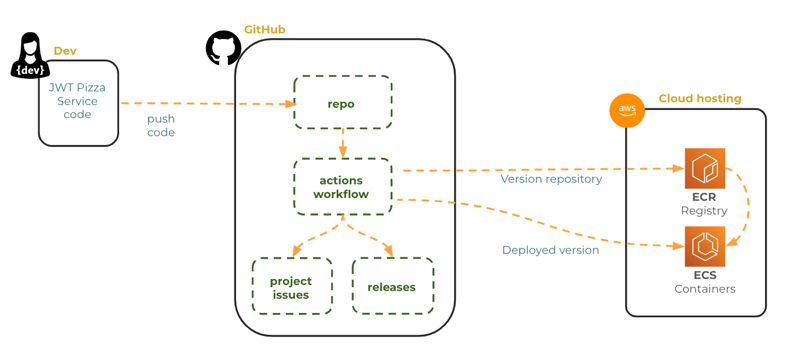
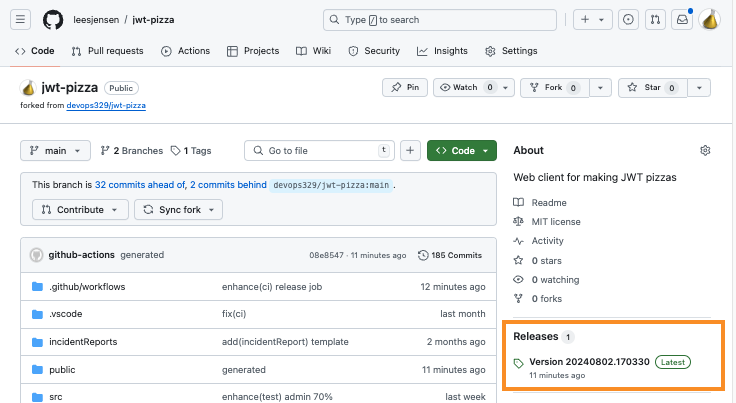
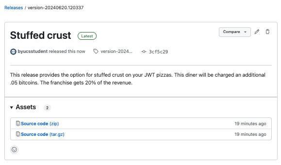
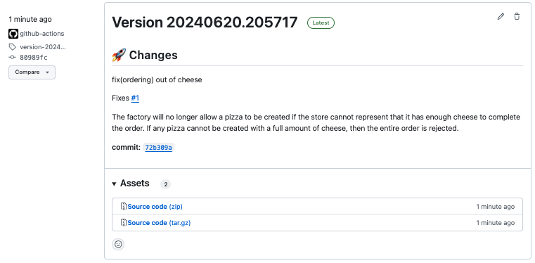

# GitHub Releases

🔑 **Key points**

- GitHub supports representing releases as part of its core functionality.
- Add GitHub releases to your CI pipeline.

---

📖 **Deeper dive reading**: [Managing GitHub Releases](https://docs.github.com/en/repositories/releasing-projects-on-github/managing-releases-in-a-repository)

GitHub supports the ability to associate a release with a version and commit. When you combine GitHub's release tracking with updates to project issues and pushes to your production environment, you can create an complete automated CI pipleline that manages your entire release infrastructure from a GitHub action workflow.



You can do this manually by going to the home page for a repository and selecting controls on the `Releases` section on the right of the view. From there you can press the `Draft a new release` button.

Type your version ID into the version box. This will automatically create a Git tag with this name and apply it to the latest commit. You can also select an existing Git tag if you already have one.

You can then give your release a name and provide a description using Markdown. Press the `Publish release` button to create the release.


This will create the release and also associate it with any artifacts that exist on the commit that was tagged. You can access the newly created release from the repository's main page.



If you click on the release it will show you all the details.



This is a really nice way to visualize when a commit was deployed as a production release.

## Automating releases

Since we are DevOps engineers, reading the human-dependent steps above should immediately make us uncomfortable. So let's change your `jwt-pizza` CI pipeline so that it creates the GitHub Release instead of depending on a manually executed step.

You do this by creating a new workflow job named **release** that triggers when both the build and deploy jobs complete. This job will use the third party `ncipollo/release-action` to call the GitHub API and automatically create the tag and release based upon information found in the execution trigger and the version ID created in the **build** job. You can reference the version variable from the build job with the `needs.build.outputs.version` variable.

> [!NOTE] Blindly using other people's code is a security risk. We have mitigated the risk for our purposes by manually reviewing the code, _and_ by specifying the exact commit from which the action should be used. This gives us confidence that bad actors cannot execute arbitrary code in our workflows by "updating" their source.

Add the following to your `ci.yml` pipeline.

```yml
release:
  needs:
    - build
    - deploy
  runs-on: ubuntu-latest
  steps:
    - name: Create Release
      uses: ncipollo/release-action@2c591bcc8ecdcd2db72b97d6147f871fcd833ba5
      env:
        version: ${{needs.build.outputs.version}}
      with:
        tag: version-${{ env.version }}
        name: Version ${{ env.version }}
        body: |
          ## 🚀 Changes

          ${{ github.event.head_commit.message }}

          **commit**: ${{ github.sha }}
```

With this job in your pipeline, it will automatically create the version the next time you commit to your fork of the `jwt-pizza` repository.

## ☑ Assignment

Do the following:

1. Review your GitHub Action workflow for `jwt-pizza` to see how it creates and uses a version number.
1. Modify your GitHub Action workflow for `jwt-pizza` so that it automatically creates a tag and version that represents the production release.

Go to the associated Canvas assignment and submit a screenshot of the resulting release. This should look something like this:


