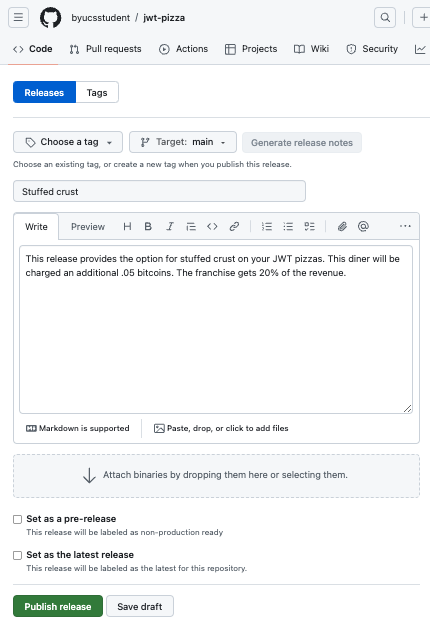

# GitHub Releases

📖 **Deeper dive reading**: [Managing GitHub Releases](https://docs.github.com/en/repositories/releasing-projects-on-github/managing-releases-in-a-repository)

GitHub supports the ability to associate a release with a version and commit. You can do this manually by going to the home page for a repository and selecting controls on the `Releases` section on the right of the view. From there you can press the `Draft a new release` button.

Type your version ID into the version box. This will automatically create a Git tag with this name and apply it to the latest commit. You can also select an existing Git tag if you already have one.

You can then give your release a name and provide a description using markdown. Press the `Publish release` button to create the release.



This will create the release and also associate it with any artifacts that exist on the commit that was tagged as well as display the release on the repository's main page.


This is a really nice way to visualize when a commit was deployed as a production release.

## Automating releases

Since we are DevOps engineers, reading the human-dependent steps above should immediately make us uncomfortable. So let's change your `jwt-pizza` CI pipeline so that it creates the release instead of depending on a manually executed step.

First of all you need to create a version ID that can be used through out the GitHub action workflow. You can do this by outputting the version from your **build** job. You can reuse the version output to create the version.json file that is deployed to the production environment. That ensures that your version number is consistent across the deployment.

```yml
outputs:
  version: ${{ steps.set_version.outputs.version }}
steps:
  # ...

  - name: set version
    id: set_version
    run: |
      echo "version=$(date +'%Y%m%d.%H%M%S')" >> "$GITHUB_OUTPUT"

  - name: Build
    run: |
      printf '{"version": "%s" }' ${{steps.set_version.outputs.version}} > public/version.json

  # ...
```

Next, you want to create a job the triggers when both the build and deploy jobs complete. This job will use the third party `ncipollo/release-action` to call the GitHub API and automatically create the tag and release based upon information found in the commit.

```yml
release:
  needs:
    - build
    - deploy
  runs-on: ubuntu-latest
  steps:
    - name: Create Release
      uses: ncipollo/release-action@v1
      env:
        version: ${{needs.build.outputs.version}}
      with:
        tag: version-${{ env.version }}
        name: Version ${{ env.version }}
        body: |
          ## 🚀 Changes

          ${{ github.event.head_commit.message }}

          **commit**: ${{ github.sha }}
```

With this job in your pipeline, it will automatically create the version the next time you commit to your fork of the `jwt-pizza` repository.

## ☑ Assignment

Do the following:

1. Modify your GitHub Action workflow for `jwt-pizza` so that it creates and uses a version number.
1. Modify your GitHub Action workflow for `jwt-pizza` so that it automatically creates a tag and version that represents the production release.

Go to the associated Canvas assignment and submit a screenshot of resulting release. This should look something like this:


