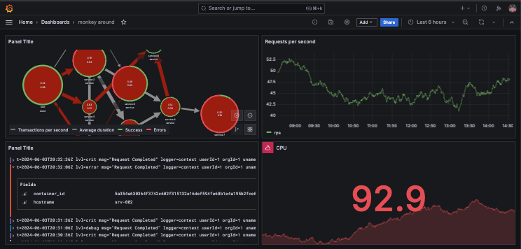
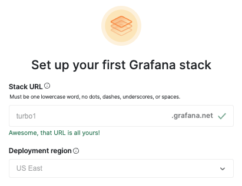
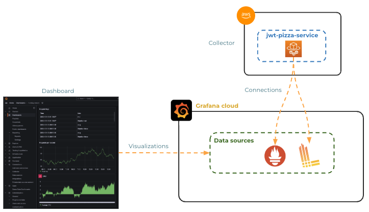
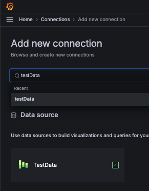
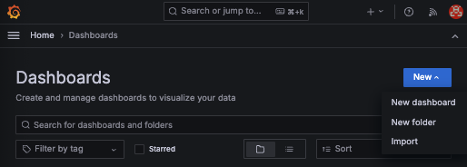
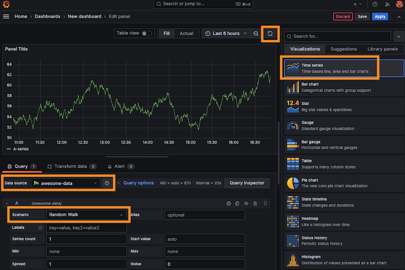
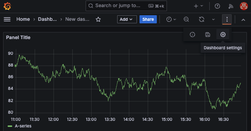
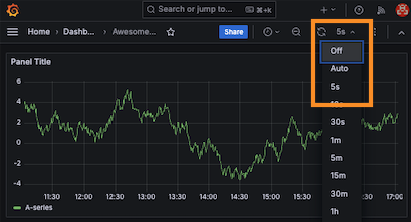
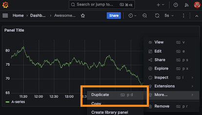
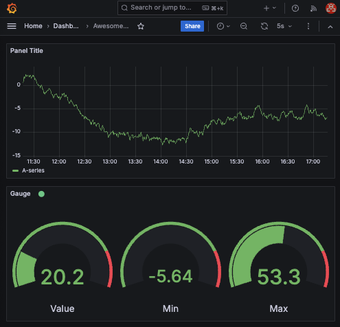

# Grafana

In 2014, Grafana started as an open source metric visualization tool based on the Kibana logging dashboard for ElasticSearch.

The model allowed for a wide variety of data sources to be plugged into a set of stunning collections of data visualizations.

The Grafana team, lead by Torkel Ödegaard, continued to enhance the application to include alerting, logging, stack tracing support, and even load testing. With a full suite of observability tools, Grafana created a SaaS offering named Grafana Cloud that handles and manages all of the metrics, logging, and tracing needs for an application.

### Torkel Ödegaard

Grafana Labs Co-Founder, Grafana creator & and tech lead. Avid book reader, SciFi fan, coder, guitar player.

> “I have been a fan of code coverage before (not anymore). They end up being cool, I can see what lines are executed in tests, and what % that is. But never have I found them useful for informing me what to do, and become noise as well as promote bad unit tests.”
>
> _source: [X](https://x.com/torkelo/status/1638803195752316928)_

### Products

Grafana's product suite includes the following.

- **Grafana**: Visualization dashboard
- **Loki**: Logging
- **Mimir**: Metrics
- **Tempo**: Tracing
- **OnCall**: Alerts
- **K6**: Load Testing

## Grafana Cloud

Grafana Cloud provides a generous free tier to get you started and allow you to experiment. No credit card is required and there is enough in the offering to fully explore the product or build a small observability system. In addition to full access for the first two weeks, the following are included in the free tier:

- 10k series Prometheus metrics
- 50GB logs, 50GB traces, 50GB profiles
- 500VUh k6 testing
- 20+ Enterprise data source plugins
- 100+ pre-built solutions

### Create a Grafana Cloud account

In order to get started with Grafana Cloud you need to create a free account.

1. Go to [the Grafana website](https://grafana.com/)
1. Press the `Create account` button.

   

1. Provide your credentials either with any of the SSO options or with your email address.
1. After you confirm your credentials Grafana Cloud will assign you a grafana.com subdomain for your account. This will look something like `yourusername.grafana.dev`. Remember that URL for future use. It provides access to all of your data source configuration, data storage, and visualization dashboards.

   > 

1. Continue with the sign up process. This takes a few minutes as they spin up resources for you in their cloud hosting environment. Once it is done you will see the setup options. Press the `Skip setup` option in the top right corner and select `I'm already familiar with Grafana`.
1. Click on the hamburger menu in the top left corner and wander around the functionality that is available there.

### Grafana architecture

At a high level, Grafana Cloud consists of three major parts.

1. **Collector**: Software running as part of your application, either in your code or as an additional agent program, collects data and send it over a connection to be stored in Grafana Cloud.
1. **Data source**: A representation of logging or metrics data that is configured to either be read directly from the service providing the data (e.g. MySQL database or AWS CloudWatch), or from data stored in Grafana Cloud (e.g. Prometheus or Loki). The data source also defines a query and filter that controls how the data is presented to the visualization dashboard.
1. **Dashboard**: The dashboard contains visualization panels that each display a data source with additional rendering properties such as the time range to display, colors, visualization type. There are [dozens of panel types](https://grafana.com/docs/grafana/latest/panels-visualizations/visualizations/) that you can use when building your dashboard. This includes line charts, bar charts, pie charts, gauges, big numbers, node networks, tables, flame graphs, and so on.

## Your first visualization

To get started we are going to configure a `TestData` data source. This data source is simply a random number generator that we will use to demonstrate how things work.

1. From the `Home` menu select `Connections` and pick `Add new connection`.
1. This will display all of the different data sources that you can make a connection to.
1. Type `TestData` into the search box and click on the resulting data source.

   

1. Press the `Add new data source` button.

   

1. Rename the data source to **awesome-data** and press `Save & test`.
1. Click on the bread crumb navigation to go back to the _Connections > Data sources_ view. You should see the **awesome-data** data source at the top of the list.

Now you can create a visualization from the data source.

1. Click on the `Home` menu and select `Dashboards`.
1. Press the `New button` and select `New dashboard`.

   

1. Press the `Add visualization` button.
1. Select the `awesome-data` data source.
1. This will display the settings for a new panel that you are adding to the dashboard. Notice the following:

   1. The `Data source` is set to **awesome-data**. You can change the data source of a visualization at any time.
   1. The `Scenario` has **Random Walk** selected. This means the you are pulling random data from the data source. There are lots of other types of data that the data source exposes for use with different types of visualizations.
   1. The `Visualization` is set to **Time series**. This is a good choice for your random walk data.

      

   1. Press the refresh button at the top of the graph to pull in some data from the data source.

1. Press the `Save` button and confirm the request. This will save the panel and display your new dashboard. Click on the gear menu to change the dashboard settings.

   

1. Rename the dashboard to `Pizza Dashboard`.
1. Press the `Save` button and confirm.
1. Click on the `Auto refresh` button and select 5s to have the visualization refresh every five seconds. This will bring in new random data, but with a real data source it would create a rolling display of the metrics.

   

You have just created your first visualization dashboard. Way to go! Now let's add another panel by duplicating the first one and modifying its properties.

1. Click on the panel's dot menu and select `Duplicate`.

   

1. Click on the dot menu for the new panel and select `Edit`.
1. Change the `Scenario` to **Grafana Live** to get live Grafana request metrics.
1. Change the `Visualization type` to **Gauge**. This should immediately start rendering current, min, and max values in the panel.

   

1. Save the changes and go back to your Pizza Dashboard. You may need to refresh the page for the changes to display.

   

Feel free to edit the panel and experiment with both the scenario and visualizations in order to get familiar with what types of data you can render.

## ☑ Assignment

Follow the provided instruction to set up your Grafana Cloud account and create a dashboard with at least four visualizations using the TestData data source. Once you are done, go over to Canvas and submit the screenshot of your dashboard.
