# K6

🔑 **Key points**

- Grafana has significant support for load testing with K6.
- Create a K6 load test by recording browser requests.
- Analyze the results of the load test.

---


K6 automates load testing by playing back requests you make from a browser or writing HTTP request commands using JavaScript. K6 executes the HTTP requests concurrently with the number of simulated users that you define. Given enough computational power and network bandwidth you can simulate realistic customer load so that you can gain confidence that the system won't fail when handling real traffic.

### History

In 2000, a pair of developers were working on a multiplayer game that required significant load testing in order to simulate real usage. Taking what they learned from building internal load tools, they started a consulting company to help other developers benefit from their expertise. In 2016, they took the next step and coded all the best practices they had learned into an open source SaaS offering named K6. In 2021, K6 was acquired by Grafana Labs and became part of Grafana Cloud.

This is a great example of a small team doing what they love, building something useful, and making a good living in the process.

## An example run

The following results are based upon a load test against the JWT Pizza application that simulates a simple login, look at the menu, and purchase a pizza scenario. K6 generates an impressive amount of metrics and visualizations that help to understand how well the application responded to the simulated load. The following graph shows 10 concurrent virtual users (VU), making a maximum of 3.33 requests per second, with an average 95th percentile response time of 118ms.

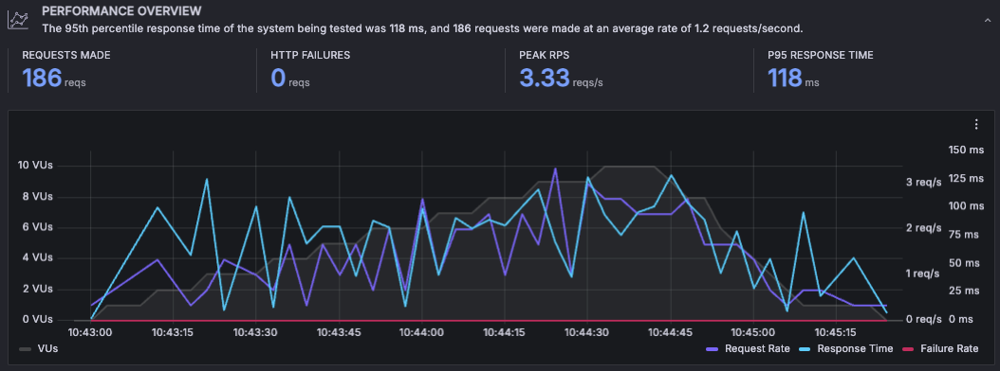

You can see the breakdown of metrics for each endpoint. This includes how many requests were made and the different latency statistics. This demonstrates that the login (api/auth) request takes on average 108 ms. That seems understandable since it creates a cryptographically signed JWT. The Pizza creation call (api/order) takes 48 ms on average. Since making a pizza requires a call to the JWT Pizza Headquarters that seems reasonable.


When looking at latency metrics the important values are often found in the upper percentiles. These include the top 1% or even the top 0.1% of slow requests. Here we see that even though login usually only takes 108 ms, 1% (P99) of the requests took 143 ms with a standard deviation of 17 ms. That isn't too bad, but sometime you will have results where the average in something like 10 ms, but the p99 is 3000 ms. On the surface this might not feel like a big deal since only 1 in 100 customers will have to wait 3 seconds to log in, but with complex applications there tends to be a layering effect where the login request will make a dozen or so endpoint requests in series. If each of those 12 requests have a 1% chance of taking 3 seconds you may end up with 10% of your customers always waiting multiple seconds. Now a small fraction becomes a noticeable delay that drives down retention and impacts the business.

By simulating load and experimenting with changes in the architecture, you can quickly remove bottlenecks that otherwise would have had significant impact.

## Setting up a K6 test

You will create your first K6 load against your JWT Pizza production deployment. Normally you would not load test a production system. Instead, you would spin up an environment specifically for load testing using your CloudFormation automation template, but since spinning up hardware costs money, and you don't have any customers hitting your production environment yet, you will use production for now. Take the following steps.

### Creating the project and test

1.  Open up your Grafana Cloud dashboard.
1.  Open the Home menu, click `Testing & synthetics > Performance > Projects`.
1.  Click the button to `Start testing`.

    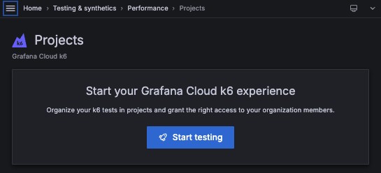

    This will display the default project that was created along with your account. You can create a new project if you desire, but for now the default will do.

    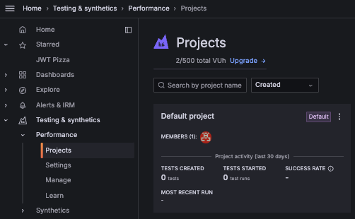

1.  Click on the `Default project` name in order to create a new test. This might display some tutorial documentation that you can read or dismiss. You should then see a `Create new test` button. _(Note that the creators of K6 actually had a pet alligator in the office, and thus the alligator theme.)_

    

1.  Press the `Create new test` button. This will display the new test and give you different options for how you can create it. There are three options.

    1. Download and use the **K6 CLI** to build a test in your development environment
    1. write a JavaScript testing script in the Grafana Cloud K6 **Script Editor**
    1. or use the Grafana Cloud K6 **Test Builder**.

    Using the Test Builder is the fastest way to get up and running, so we will use that.

1.  Press the `Start Building` button.
1.  This will display the **Test Builder** interface.

    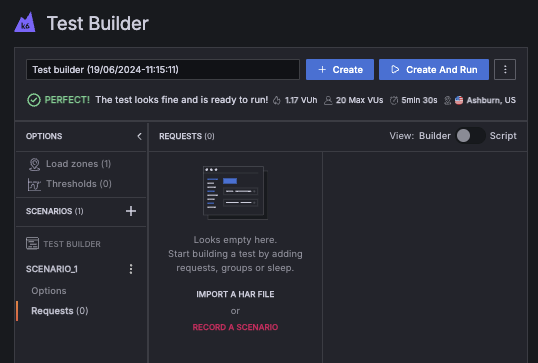

    If you use the `RECORD A SCENARIO` button you will need to install a Chrome extension that will create a script based upon your actions in Google Chrome. Feel free to do this if you would like. However, I like to keep the things I install in my development environment to a minimum. Instead, we will record and upload a HTTP Archive (HAR) file that Chrome can easily build for you.

1.  Rename the test from the default to `Login and order pizza`.

### Recording a HAR file

You can use the Google Chrome developer tools to easily record and export a HTTP Archive (HAR) file.

1. Open Google Chrome and navigate to your JWT Pizza production website. Make sure you are logged out of the website so that you can have a clean start.
1. Open the developer tools. Switch the developer tools to the network tab. This is where everything gets recorded and where you will eventually export the HAR file from.
1. Select the `Preserve log` button so that your entire sequence of requests are saved. Clear the recorded requests if it isn't already blank.

   

1. Refresh the browser so that the first request for JWT Pizza is recorded. Go through the process of logging in, selecting a pizza from the menu, buying the pizza, and then verifying that the pizza is valid.
1. Save the HAR file representing all the displayed requests on the Network tab by pressing the download icon. Name the file `buyPizza`. This will save the HAR file to your computer.

💡 If your curiosity sense is tingling then go ahead and examine the contents of the HAR file and take some time to read about HAR files. This would make a great Curiosity project.

### Initializing the test with the HAR file

Now you are ready to use the HAR file to create your K6 load test.

1. Navigate back to the test that you previously created and click on the `IMPORT A HAR FILE` button.
1. Drag the `buyPizza.har` file from your file explorer onto the **Import HAR** target area.

   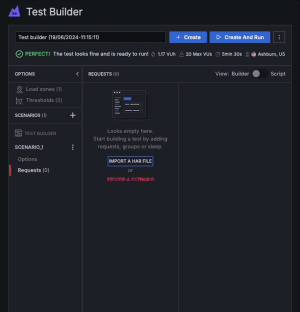

   As part of the import process you want to _Correlate the request an response_ data, **not** include _Static assets_ (Unless you want to know how long it takes to download things like images), and automatically generate sleep. Inserting the sleep steps is important because you want to simulate what a real customer would do. The sleep times that are inserted reflect the actual pauses between requests when the network requests were recorded.

   When you upload the HAR file you will need to disable the filtering on `pizza-factory.cs239.click` so that your pizza validation request is included in the test script.

   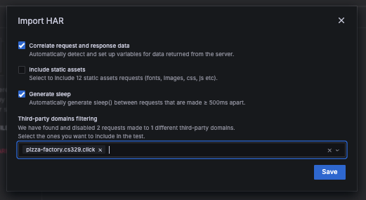

This results in a series of test steps. You can click on each one to see what they do. It should show you everything about the requests. That includes the path, headers, and query commands. The recording will contain several HTTP OPTION requests. These are important for simulating real traffic, but for now you can remove them in order to simplify the test. Click on each one and press the trash can icon.

### Finalizing the test

Take some time and examine each step in the test. You can give a name to each HTTP request step so that you can easily identify what is going on in the script. When you are all done you should have a series of about 10 requests.

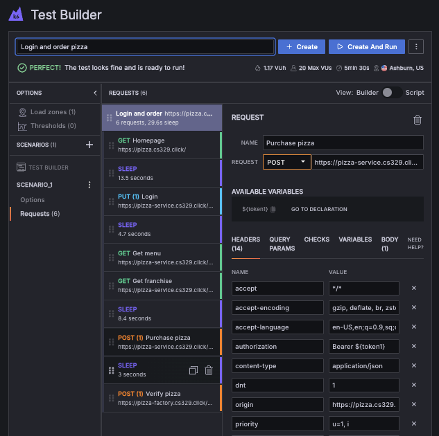

Now you need to define how the test will execute. On the left-hand menu, click the `SCENARIO_1 -> Options` navigation. This will display how the test scenario will execute. By default, it will gradually ramp up from 0 to 20 virtual users over a 1-minute period. These users will make the requests represented by the requests you just defined over and over again. For the next 3 and a half minutes the 20 users will keep making the requests. Then over a period of 1 minute the users will trickle down until there are none left.

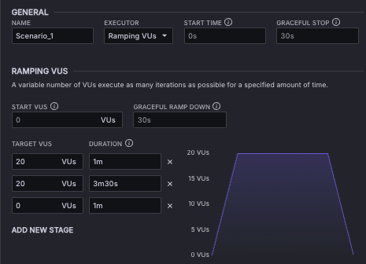

You can change this to be whatever you want, but remember that this will generate real traffic to your production environment. Make sure you consider how having a significant number of requests over a long duration will impact your AWS bill.

In order to get a feel for how controlling the scenario works, go ahead and manipulate the target VUs and duration until it looks like the following.

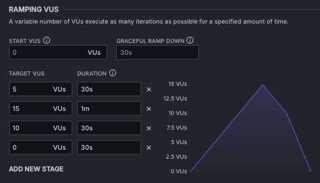

When you are done, press the `+ Create` button.

## Running a test

With your test created, the next step is to start it and let the results flow in.

Open up the test and press the `Run` button. Notice that there is an option to **Set up a schedule**. You can use this if you want your test to run when the target environment is not being used. That way you can use your production environment without having to stay up all night.

It will take a few minutes for K6 to spin up the servers that make your requests and start ramping up your script. However, it shouldn't be long before the results start getting displayed.


You defined the test to run for two and a half minutes. As that time elapses you should see the request rates decreasing and eventually the test will display as finished. If the test is not running as you expected then you can press the `Stop Test` button to abort the run.

## Analyzing the results

Once the test is completed you will see all the resulting metrics.

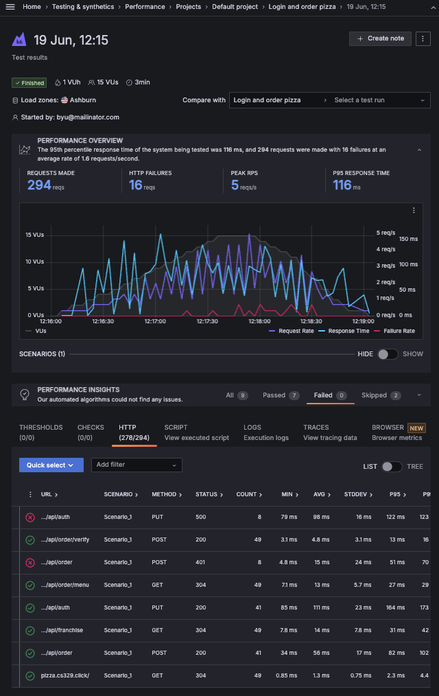

Notice that this test recorded a few failures with the **login** (8 of 41) and **order** (8 of 41) requests. If you click on the request line it will expand to show where the errors occurred.

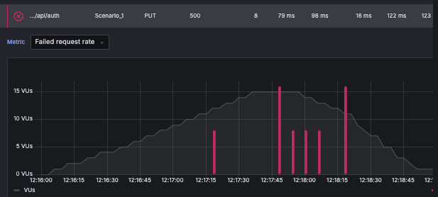

The login requests return 500, while the order requests returned 401. That makes sense because if you didn't authenticate then you won't be able to order a pizza. We can fix that in a minute, but let's continue looking at the results.

If you click on the other options under the `PERFORMANCE INSIGHTS` you will see lots of detailed information. For example, the `ANALYSIS` tab contains graphs that help to understand the performance characteristics of the test. Take some time and explore the meaning of each of the graphs. Notice that you can change the aggregation to be things like the average or a certain percentile.

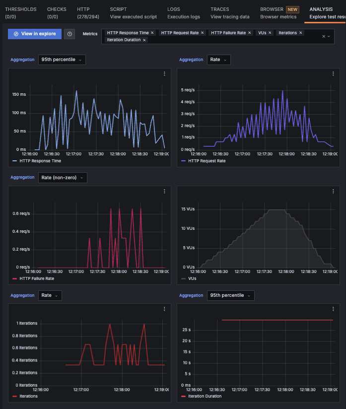

### Adding a check

We can make it so that the script doesn't continue if there was a login failure. To do this we add a check on the request.

1. Open up and edit the test.
1. Click on the login step ([PUT] /api/auth) and select the `Checks` tab.
1. Press the `ADD NEW CHECK` button.
1. Specify the check type to be **HTTP status code**, set the `Condition` to `Equals`, with a value of 200.

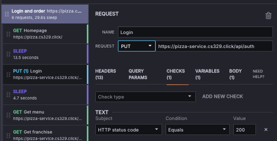

This will cause a check to be inserted into the script and the results will display the number of failed checks. If you switch the view of the scenario to **Script** from **Builder** by pressing the `View` slider you can see the resulting script and the insertion of the check in the login request.

```js
response = http.put('https://pizza-service.cs329.click/api/auth', '{"email":"d@jwt.com","password":"a"}', {
  headers: {
    accept: '*/*',
    'content-type': 'application/json',
    dnt: '1',
    origin: 'https://pizza.cs329.click',
    priority: 'u=1, i',
  },
});
check(response, { 'status equals 200': (response) => response.status.toString() === '200' });
```

However, we want the iteration to stop executing the following steps if the check fails. To make that happen we need to get out of the test Builder and create a test that is driven by a script that you write.

## Editing the test script

While you are looking at the script in the Builder, make a copy of it. Then navigate back to the root of the Default project and press the `Create new test` button like you did to build the original test, but this time select the `Script Editor`. Replace the default script that is displayed with the one you created using the Builder.

You now need to make a couple modifications. First, add the `fail` function to the items imported from the `k6` module.

```sh
import { sleep, check, group, fail } from 'k6'
```

Next modify the check code so that it fails the iteration if the HTTP status is not 200 and output the body to the console.

```sh
  if (!check(response, { 'status equals 200': response => response.status.toString() === '200' })) {
    console.log(response.body);
    fail('Login was *not* 200');
  }
```

Now you can press the `Create` button you will see that you have two tests. One created with the visual Test Builder and one that is driven directly by the script that you just created with the Script Editor. If you run the newly created script version, you will still get the occasional login error, but the test will stop the execution of the instance whenever the check fails. That means that all the order errors are gone.

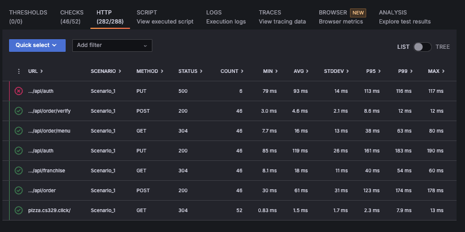

If you look at the logs tab for the execution you will see that the return body for when the request was 500 shows that there is a problem with the same user trying to log in concurrently. That means there is no problem with the test, but there is an issue with the JWT Pizza Service that needs to be resolved.

```json
{
  "message": "Duplicate entry 'qAjm-F_SYmJczs82ToQUJbvNE5VoauNxIGA9O3u7KpI' for key 'auth.PRIMARY'",
  "stack": "Error: Duplicate entry 'qAjm-F_SYmJczs82ToQUJbvNE5VoauNxIGA9O3u7KpI' for key 'auth.PRIMARY'\n    at DB.query (/home/ubuntu/services/jwt-pizza-service/database/database.js:288:40)\n    at DB.loginUser (/home/ubuntu/services/jwt-pizza-service/database/database.js:103:18)\n    at process.processTicksAndRejections (node:internal/process/task_queues:95:5)\n    at async setAuth (/home/ubuntu/services/jwt-pizza-service/routes/authRouter.js:120:3)\n    at async /home/ubuntu/services/jwt-pizza-service/routes/authRouter.js:86:18"
}
```

## Using variables

Hopefully, by this point you realize that K6 is executing JavaScript code that you can manipulate. One key point for successfully manipulating your K6 script is the introduction of variables. It is likely that when you created your login script from a HAR file that K6 created a variable to represent the authentication token obtained during the authorization request so that it can be used in later requests. You can see this demonstrated in the following code snippet where `vars.authToken` is set to the token found in the response.

```js
const vars = {};

// login
response = http.put('https://pizza-service.byucsstudent.click/api/auth', '{"email":"d@jwt.com","password":"diner"}', {
  headers: {
    accept: '*/*',
    origin: 'https://pizza.byucsstudent.click',
  },
});
check(response, { 'status equals 200': (response) => response.status.toString() === '200' });

vars.authToken = response.json().token;
```

The authToken variable is then used for all the following endpoint requests.

```js
// Get menu
response = http.get('https://pizza-service.byucsstudent.click/api/order/menu', {
  headers: {
    accept: '*/*',
    authorization: `Bearer ${vars.authToken}`,
    origin: 'https://pizza.byucsstudent.click',
  },
});
```

You will want to exploit this pattern when you build your own load testing scripts. For example, when you acquire a pizza Json Web Token (JWT) during the purchase endpoint request and then supply it later on with the pizza verification call. If you don't do this then you will be verifying the pizza that was created when you created your HAR file and not the pizzas generated during the load test.

## Wrap up

Congratulations! You have created your first load test. That is a big step in your DevOps mastery. K6 is a great example how the need for automation drives the creation of powerful tools that benefit everyone.
