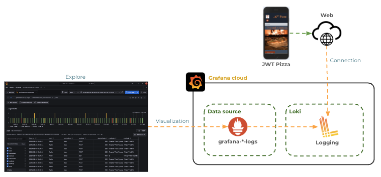
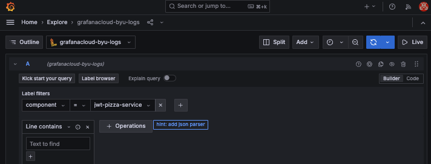
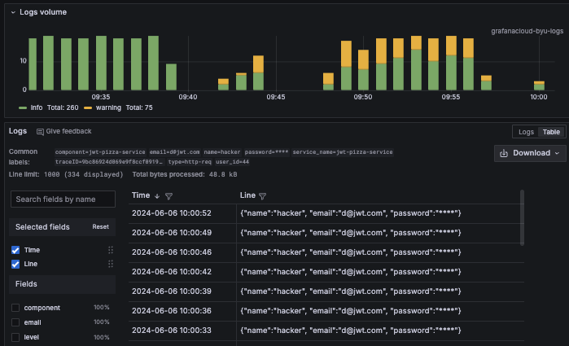
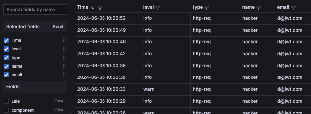
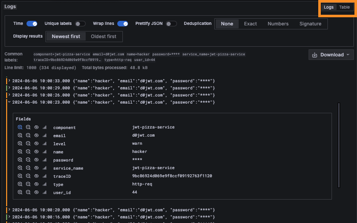
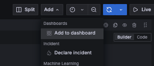
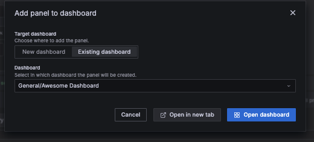
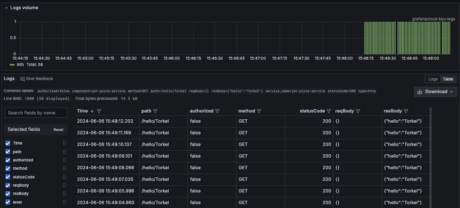
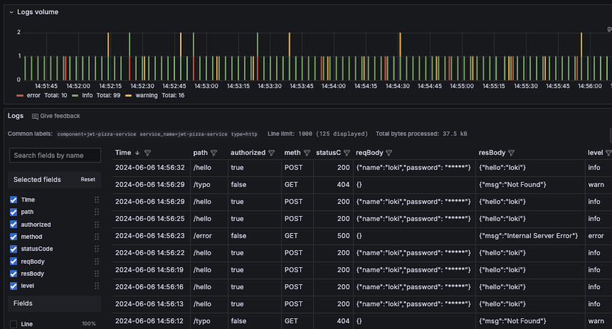
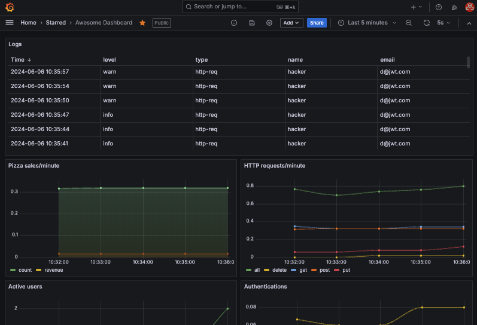

# Grafana logging

Grafana Cloud provides a service called Loki that makes it easy to harness the full power of logging.

Your application sends log events over HTTP to the Loki service which stores the log events persistently. A data source then represents the logs and allows you to create visualizations on your Grafana dashboard.



## Inserting logs using HTTP

For this exercise you will use the `HTTP Metrics` connector to insert data into a Prometheus data service hosted on Grafana Cloud and exposed using the `grafana-youraccountnamehere-prom` data source that Grafana created by default when you set up your account.

In order to send logs over HTTP you will need an API key.

1. Open up your Grafana Cloud dashboard.
1. Select the `Connections` option form the left home menu and press `Add new connection`.
1. In the connection search box enter `Logs HTTP` and press enter
1. This will display the template necessary to obtain the API Key for uploading logs to the Grafana Cloud Loki service.
1. Supply the name `jwt-pizza-logs` for the `Access Policy token name`.
1. Press `Create token`.
1. Copy the token to a secure location in your development environment. You will need this token up upload logs.
1. Note the section titled `Anatomy of your Loki log`. This defines how to format the data that you upload to Loki.
1. Note the section titled `Send logs from your application code`. This gives you examples of how to upload a log event using things like Curl, Node.js, or Go. The example has your API Key already prepopulated in the example.
1. Examine the example for Curl. It will look something like the following:

   ```sh
   curl -X POST -H "Content-Type: application/json" -H "Authorization: Bearer 111111:glc_111111111111111111=" -d '{"streams": [{"stream": {"Language": "Curl", "source": "Shell"},"values": [["'"$(($(date +%s)*1000000000))"'", "This is my log line"]]}]}' https://https://logs-prod-006.grafana.net/loki/api/v1/push
   ```

   ⚠️ **Note** that as of when this instruction was written there is a bug in the URL. It has the protocol listed twice. Remove the duplicate `https://` if you use this example.

### Loki JSON log syntax

The HTTP body of the logging request follows the [HTTP Loki log syntax](https://grafana.com/docs/loki/latest/reference/loki-http-api/#ingest-logs), and is what you will use when you generate log messages.

Each message is comprised of one or more streams. Each **stream** contains the labels (e.g. tags) for the log messages represented by the stream. This is followed by one or more **values** that represent that actual log message. You can also include an option **metadata** object that defines one or more metadata values. Note that labels are indexed and searchable, while metadata is not index but can still be used for filtering log messages. You should not include labels that have high cardinality, or lots of different values. That will cause Loki queries to perform poorly.

The general syntax looks like this:

```json
{
  "streams": [
    {
      "stream": {
        "label": "value"
      },
      "values": [["<unix epoch in nanoseconds>", "<log line>", { "<metadata label>": "<metadata value>" }]]
    }
  ]
}
```

If you were going to create a log message that described a login HTTP request, you might create a message that looked like this:

```json
{
  "streams": [
    {
      "stream": {"component":"jwt-pizza-service", "level": "info", "type":"http-req"},
      "values": [
        ["1717627004763", "{"name":"pizza diner", "email":"d@jwt.com", "password":"****"}", { "userID":"32", "traceID": "0242ac120002"}]
      ]
    }
  ]
}
```

### Using Curl to insert logs

Using the example command and your newly minted API key, you can now insert data into Loki. Make sure you replace the Grafana account number and API key represented in the authorization token with your account number and API key.

```sh
curl -X POST -H "Content-Type: application/json" -H "Authorization: Bearer 111111:glc_xxxxxxx" -d '{"streams": [{"stream": {"component":"jwt-pizza-service", "level": "info", "type":"http-req"},"values": [["'"$(($(date +%s)*1000000000))"'","{\"name\":\"hacker\", \"email\":\"d@jwt.com\", \"password\":\"****\"}",{"user_id": "44","traceID": "9bc86924d069e9f8ccf09192763f1120"}]]}]}' -H "Content-Type:application/json" https://logs-prod-006.grafana.net/loki/api/v1/push
```

When you execute this command it will log a JSON body as the log event. Notice a few interesting things that are going on with the log event.

1. Labels are provided for component, level, and type. This allows you to efficiently search and filter based on these labels.
1. JSON is used for the body of the log event. Grafana Loki can automatically parse the JSON fields for display and filtering.
1. The data is automatically inserted using the `date` shell command.
   ```sh
   '"$(($(date +%s)*1000000000))"'
   ```
1. The password field in hidden. This is a critical security practice so that you do not store user's passwords in the logs.

Go ahead and wrap the curl command in a for loop that randomly sets the message level, and let it run while you set up a visualization.

```sh
for i in {1..100}; do
  if (( RANDOM % 2 )); then level="warn" else level="info" fi;

  curl -X POST -H "Content-Type: application/json" -H "Authorization: Bearer 111111:glc_xxxxxxx" -d '{"streams": [{"stream": {"component":"jwt-pizza-service", "level": "'"$level"'", "type":"http-req"},"values": [["'"$(($(date +%s)*1000000000))"'","{\"name\":\"hacker\", \"email\":\"d@jwt.com\", \"password\":\"****\"}",{"user_id": "44","traceID": "9bc86924d069e9f8ccf09192763f1120"}]]}]}' -H "Content-Type:application/json" 'https://logs-prod-006.grafana.net/loki/api/v1/push' ;

  sleep 3;
done
```

This should generate enough log data to make a visualization interesting.

## Using the Grafana Explorer

Grafana comes with a data explorer tool that allows you to examine a data source without creating a visualization panel.

1. Open up your Grafana Cloud dashboard.
1. Open the Home menu, click on Explore. This will display the empty explore interface where you can enter a query.
1. Select the data source to be your Grafana Cloud log data source. This should follow the pattern **grafanacloud-youraccountnamehere-logs**.
1. The `Label filters` enter **component** and **jwt-pizza-service** as the value.
   
1. Click on the hint to `add json parser`.
1. Press the blue `Run Query` button to see the results.

This will display the log messages for the past 30 minutes. You can adjust the time range by either clicking and dragging over the `Logs volume` pane, or by change the time range specified on the top navigation bar next to the `Run Query` button.



Because you chose the Json parser, the log message was automatically parsed into fields and it is visually differentiating based on the **level** field.

By default, there will be a column for Time and Line. You can select which columns you want to see by manipulating the selected fields displayed on the left. Here is the same data with different fields displayed in the graph.



You can also change to display the events in log format instead of table format by pressing the button on the right.



Take some time and play around with the Explorer. It has tons of functionality for transforming and filtering your data. The better you understand how to use it, the better you will be able to find trends, performance problems, and failures in your application.

#### Creating a visualization

Once you have the Explorer displaying your logs exactly as you would like, press the `Add` button on the top navigation and select the option to **Add to dashboard**.



Change the option to add to an **Existing dashboard** and then select your **Awesome Dashboard** and press `Open in new tab`.



This should create a new panel on your dashboard. Configure the panel as you would like and then save the dashboard.

You can stop your curl command from generated logs by directly calling the Grafana logging endpoint because you are now going generate them with code.

## Sending logs from code

In order to demonstrate how to generate logs from you code we need a simple Express service. Create the service by doing the following.

1. Open you command console.
1. Execute the commends:
   ```sh
   mkdir loggingExample && cd loggingExample
   npm init -y
   npm install express
   ```
1. Modify the `package.json` file to include a start script.
   ```json
     "scripts": {
       "start": "node index.js"
     },
   ```
1. Create a `config.json` file to include your Grafana credentials. Replace the values with the ones that were supplied when you created the data source connection. Make sure you include this in your `.gitignore` file if you push this code to GitHub so that you don't publicly post your Grafana API key.

   ```json
   {
     "source": "jwt-pizza-service",
     "userId": 1,
     "host": "",
     "apiKey": ""
   }
   ```

1. Create a `logger.js` file that at the basic level does the same thing that the curl command was doing. However, there are some additions.

   - The configuration is read form the `config.json` file.
   - The `httpLogger` function provides an Express custom middleware to handle all the HTTP request and response logging in one place.
   - The `log` function can be called directly if you want to log additional information.
   - The `sanitize` function keeps any confidential information from entering the logs.

   ```js
   const config = require('./config.json');

   class Logger {
     httpLogger = (req, res, next) => {
       let send = res.send;
       res.send = (resBody) => {
         const logData = {
           authorized: !!req.headers.authorization,
           path: req.path,
           method: req.method,
           statusCode: res.statusCode,
           reqBody: JSON.stringify(req.body),
           resBody: JSON.stringify(resBody),
         };
         const level = this.statusToLogLevel(res.statusCode);
         this.log(level, 'http', logData);
         res.send = send;
         return res.send(resBody);
       };
       next();
     };

     log(level, type, logData) {
       const labels = { component: config.source, level: level, type: type };
       const values = [this.nowString(), this.sanitize(logData)];
       const logEvent = { streams: [{ stream: labels, values: [values] }] };

       this.sendLogToGrafana(logEvent);
     }

     statusToLogLevel(statusCode) {
       if (statusCode >= 500) return 'error';
       if (statusCode >= 400) return 'warn';
       return 'info';
     }

     nowString() {
       return (Math.floor(Date.now()) * 1000000).toString();
     }

     sanitize(logData) {
       logData = JSON.stringify(logData);
       return logData.replace(/\\"password\\":\s*\\"[^"]*\\"/g, '\\"password\\": \\"*****\\"');
     }

     sendLogToGrafana(event) {
       const body = JSON.stringify(event);
       fetch(`https://${config.host}/loki/api/v1/push`, {
         method: 'post',
         body: body,
         headers: {
           'Content-Type': 'application/json',
           Authorization: `Bearer ${config.userId}:${config.apiKey}`,
         },
       }).then((res) => {
         if (!res.ok) console.log('Failed to send log to Grafana');
       });
     }
   }
   module.exports = new Logger();
   ```

1. Create an `index.js` that contains your simple demonstration service. Most of the code in the service provides example endpoints. The interesting part if the use of the `logger.httpLogger` middleware that handles all of the HTTP logging. This keeps the main code clean while still providing significant value.

   ```js
   const express = require('express');
   const app = express();
   const logger = require('./logger');

   app.use(express.json());
   app.use(logger.httpLogger);

   app.get('/hello/:name', (req, res) => {
     res.send({ hello: req.params.name });
   });

   app.post('/hello', (req, res) => {
     res.send({ hello: req.body.name });
   });

   app.get('/error', (req, res) => {
     throw new Error('Trouble in river city!');
   });

   app.use((req, res) => {
     res.status(404).send({ msg: 'Not Found' });
   });

   app.use((err, req, res, next) => {
     res.status(500).send({ msg: 'Internal Server Error' });
   });

   app.listen(3000, function () {
     console.log(`Listening on port 3000`);
   });
   ```

1. Start up the service.

   ```sh
   npm run start
   ```

1. Run a curl command to repeatedly hit the **hello** endpoint.
   ```sh
   while true; do curl localhost:3000/hello/Torkel; sleep 1; done;
   ```

You should be able to now go back to your dashboard and see the log entries flowing in.



### Generating lots of log events

With the service in place you can use other curl commands to call all the service endpoints and generate different log messages.

```sh
while true; do curl -X POST localhost:3000/hello -H "Content-Type:application/json" -H "Authorization: Bearer xyz" -d '{"name":"loki", "password":"toomanysecrets"}' ; sleep 3; done;

while true; do curl localhost:3000/error ; sleep 30; done;

while true; do curl localhost:3000/typo ; sleep 17; done;
```

This results in lots of data to analyze using your newly acquired logging abilities. Notice the following:

1. Authorization is reported correctly.
1. The HTTP method, path, and status codes are represented.
1. The request and response bodies are present.
1. The passwords are sanitized.



## ☑ Assignment

Do the following:

1. Build the example logging application.
1. Generate log messages by calling it with curl.
1. Explore the logs using the Grafana Cloud Explore functionality.
1. Insert the resulting visualization to your dashboard.

Once you have completed the above tasks you should have a dashboard that looks something like the following.



Screenshot the dashboard and submit it to the associated Canvas assignment.
