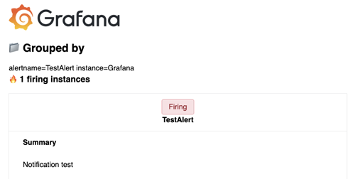
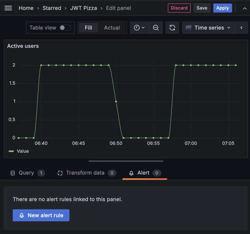
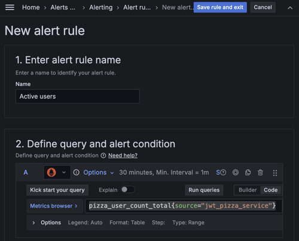
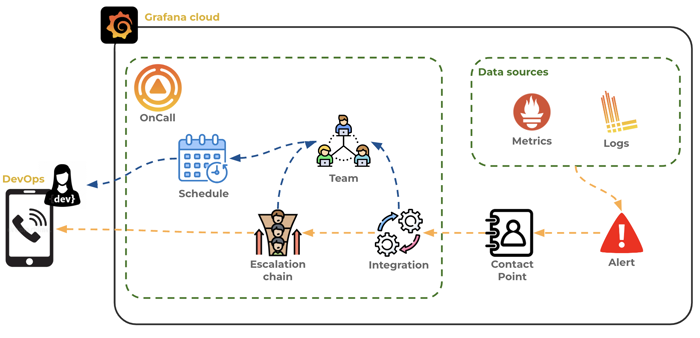
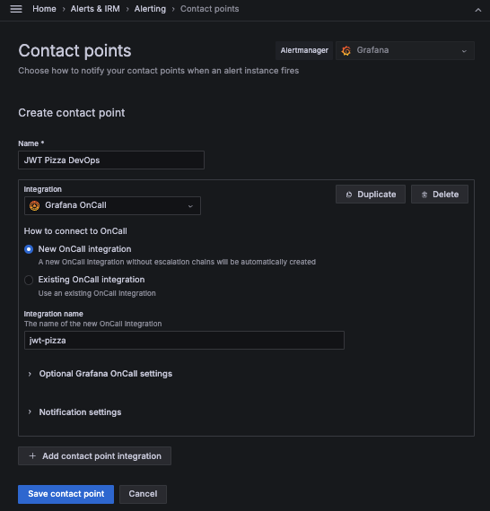
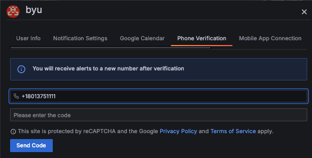

# Grafana OnCall

📖 **Deeper dive reading**: [Grafana OnCall](https://grafana.com/docs/oncall)

Grafana generates alerts based on metric thresholds that you can define when you build a metric visualization. Those alerts can trigger a wide variety of systems. For example, they can send emails, post to a Discord server, activate PagerDuty, invoke AWS SNS, or call an HTTP endpoint. Grafana also provides a more complex alerting system that allows you to set up teams, rotation schedules, and incident management.

## Simple Grafana alerts

Let's first take a look at the simple alerting system. There are two steps involved. First you define a contact point and then you associate the contact with an alert definition. When the alert triggers it sends the notification to what ever the contact point is defined to use.

### Creating a email contact point

You create a contact point by opening your Grafana Cloud dashboard and selecting `Alerting > Contact points`. This will displays all of your currently defined contact points. If you haven't created any contact points then the `grafana-default-email` contact will be the only thing in the list. Let's create a new contact point by pressing the `Add contact point` button. This will give you the option to provide a name and define the integration for notification. Provide the name **JWT Pizza Email** with an integration choice of **Email** and an email address that you can access. For this example I used the throw away _Mailinator_ email service.

We then press the `Test` button and check our email. There we find the notification message. You can use the Contact Point optional email settings to configure the format and what the message says.

### Create an email alert

Now that we have a contact point we can attach it to a alert. You can define the alert directly from the main menu `Alerting > Alert rules` navigation, or by editing the visualization that you want to trigger the alert. Let's assume we have a visualization the displays the current number of active users. From this you can define an alert by editing a visualization, selecting the alerts tab, and pressing `New alert rule`.

This displays the alert dialog with everything preset to trigger based on the state of the _Active users_ visualization. This includes the PromQL query that selects the metric data. In this case it is querying the current count of pizza users from the JWT Pizza Service.

As you scroll the settings for the alert you will see that it is reducing the metric data to only select the last value. Other options include things such as selecting the average or the sum of the data. The threshold for triggering the alert is customizable with predicates such as above or below, or a specific range. We will set the value for the threshold to anything above 1.

## OnCall

Additionally, an alert can activate another Grafana service called `OnCall`. OnCall provides the ability to schedule, manage, and coordinate the incident responses for an entire team of DevOps engineers. Here is a list of the functionality that OnCall provides above the simple notification ability provided by metric alerting.

- **Escalation chains**: Prioritized actions paths that escalate the management of an alert until it is resolved.
- **Teams**: Any number of specialized teams can be created and associated with escalation chains or alerts.
- **Scheduling**: Individuals or teams can be scheduled for being _on call_. When an event is triggered, the escalation chain attempts to notify the scheduled team members first.
- **Alert groups**: Associate related alerts and serve as a history for responses and resolutions. An alert group is automatically
- **Incident management**: Provides long running tracking, managing, and reporting of an incident that results form an alert.
- **Notifications**: Convenient email, text message, and push notification.
- **Mobile application integration**: A full mobile app for your team members that allows them to adjust their schedule, respond to alerts, and define their desired notification chain.

### OnCall flow

In order to use OnCall you must do the following:

1. Define the communication methods and notification policy for yourself.
1. Associate yourself with a team.
1. Schedule yourself for an OnCall shift.
1. Create an escalation chain that describes how events should be handled.
1. Create an integration between a Grafana alert contact point and an OnCall escalation chain.

## Setup

1. create a contact
1. Create an integration
1. Set up an alert

The following steps will allow you to create an alerting system in Grafana:

### Attempt 99

1. Set up you contact info
1. Create a team
1. Add yourself to the team
1. Create a schedule with you on it. Set the team for the schedule.
1. Create the integration
   1. Create a contact point
   1. Associate the team.
1. Create a contact point for grafana oncall
1. Create an alert.
   1. Create an evaluation group.
   1. connect the contact point created earlier.

### Attempt 1

This is all you need to do to get alerting working assuming that you have added your email in the list for the `grafana-default-email` contact point.

If you want it to show up in the OnCall Alert Groups you also need to add the Grafana OnCall integration to the `grafana-default-email` contact point. This will force you to create an integration. The funny thing is that you cannot create an integration without a contact point. They are tightly coupled.

1. Create a rule
   1. Rename condition
   1. Metric: Purchase bucket, category: count
   1. Specify the query `increase(purchase_bucket{category="count"}[1m])`
   1. I deleted the default expressions.
   1. `Add expression` type: threshold
   1. Input: Purchase, is above 2
   1. Set as `alert condition`
   1. Press `Preview`. Note that it should be firing.
   1. Set the evaluation behavior to be Folder: GrafanaCloud.
   1. New Evaluation group named `jwt pizza`. You can reuse this for future rules.
   1. Set the contact point to the one we previously created. I used `grafana-default-email` for right now.
   1. Press Save rule and exit

The only way you can get a Grafana user associated with an alert is to create a escalation chain that references the user and then associate the escalation chain with the integration.

1. Escalation Chain

   1. new escalation chain
   1. Add a step for default notification to User and then your user.
   1. Add another step to wait 5 minutes
   1. Add another step to send important notification to your user.

1. Modify Integration that was created when you created the contact point
   1. Click on Routes `default`
   1. Choose the escalation chain you just created.

### Attempt 2

We will need:

1. An integration and its associated contact
1. A schedule
1. An alert

### Configure your ability to receive notifications

1. Open up your Grafana Cloud dashboard.
1. Open the Home menu, from the `Alerts & IRM` category click on `OnCall`, and then select **Users**.
1. Press the `Edit` button for your user.
1. Verify that your **Email** address is correct.
1. Click on the `Phone Verification` tab, enter your phone number, and press the `Send Code` button in order to verify your phone number so that you can receive notifications.
   

   Verify your number using the code that is provided and then press the `Make Test Call` button so that you can make sure the system is set up correctly.

You can also install the Grafana OnCall application ([iOS](https://apps.apple.com/us/app/grafana-oncall/id1669759048) or [Android](https://play.google.com/store/apps/details?id=com.grafana.oncall.prod)), associate your Slack account, or integrate you Google Calendar. This makes provides you different ways to receive notifications and configure your OnCall shifts.

Back on the `User info` tab, you can specify how you want to be notified. There are two types of notifications: **Default** and **Important**. You define a series of steps involving different notification methods and waiting periods. For example, you could specify that for a Default notification you would receive an email, followed by a five minute wait, and then an SMS message.

### Create a contact point

There is a default contact point. You can set yourself as the default by editing it and then setting the integration.

1. Open up your Grafana Cloud dashboard.
1. Open the Home menu, from the `Alerts & IRM` category click on `Alerting`, and then select **Contact points**.
1. Press the `Add contact point` button.
1. Supply the name `jwt-pizza-devops`
1. Select **Grafana OnCall** as the `Integration`.

### Create an integration

There are things like Email, or discord, but there is also Grafana OnCall which I think gives better control. You can console to messages that are sent.

### Create a rule

grafanacloud-byu-prom
metric=purchase_bucket category=count
add an expression, threshold > 2 for the alert purchase_bucket.

### Random notes

- An alert will not show up in the OnCall Alert Groups unless you have a contact point with a Grafana OnCall integration associated with it.
- Contact point: who to contact. This references an integration that can be Grafana OnCall or a bunch of things like AWS SNS, Discord, Pager Duty, ...Each has their own configuration.
- Alertmanager: There is a default of Grafana. Grafana is built in and accessible from the top level alert settings. I have associated my cs Email with this manager as the `grafana-default-email`.
- Notification policies: tell who to send them to and how to aggregate alerts. There is a default policy that is sent to `grafana-default-email`, group for 30s and then wait 5 minutes before sending updates.
- ML Support - They can look for patterns and forecast from data sources.
- You can define your SLO, put them on a dashboard and generate alerts.
- You can manage and declare incidents

- OnCall and alerts are related by not the same thing.
- An integration connects contact points, message templates, routes, and escalation chains to OnCall. Without an integration you cannot use the notification settings for a user.

- If you don't want to use onCall then you can just create a contact point and associated it with an alert. The problem is that it only allows email by default.

# --------------------------------- OLD

1. Create a Contact Point
   - Note - The Contact Point is the bridge between an alert and the OnCall integration

- Alerting -> Contact Points -> Add Contact Point
- Give it a name (I named mine after myself)
- Select Grafana OnCall for Integration

1. Create an Escalation Chain

- An escalation chain is a chain of actions to be taken to escalate the alert - notifying those who need to take action.

- OnCall -> Escalation Chains -> New Escalation Chain
- Give it a name
- Add escalation step to notify users
  - Options include:
    - Send single notification (default or important)
    - Do one of the above once every minute until the alert is acknowledged
- Select notification style, yourself as the user

1. Create an integration

- OnCall -> Integrations -> New Integration
- Choose Grafana Alerting
- Name it
- Choose Grafana as the alert manager
- Add your contact point
- Save
- Send a demo alert

1. Create an Alert Rule

- Give it a name
- Create query (I queried requests per minute)
- Reduce can stay same, threshold whatever you want it
- Store and evaluate in Pizza Server
- No labels, add contact point

Escalation chains options
I have it send a single text to my phone.
I could get it to text every minute until resolved, call me, send an email, whatever.
