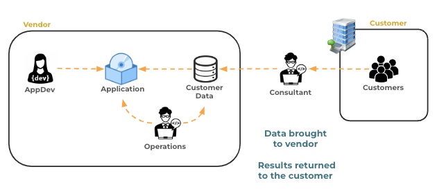
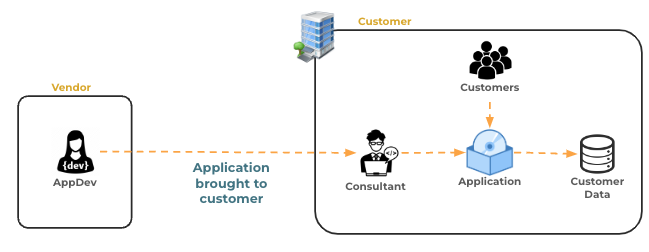
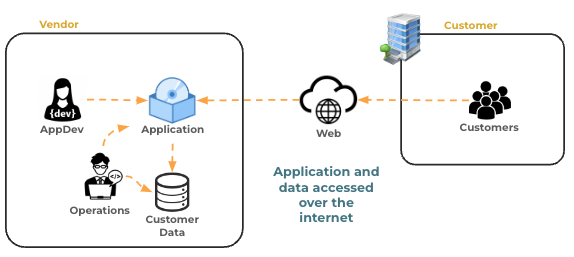
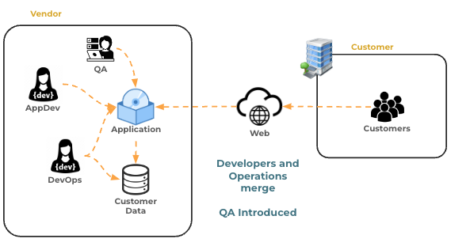
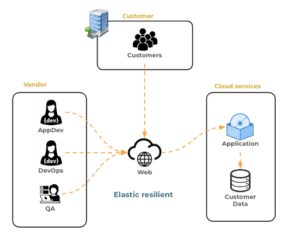

# A brief history of QA and DevOps

🔑 **Key points**

- QA and DevOps have revolutionized software development over the last decade.
- Cloud services have increased the effectiveness of QA and DevOps teams.

---

Surprisingly little has changed about how software engineers build an application, but the process of ensuring quality and delivering software has changed drastically in the last two decades. In the early days of computing, the expense and complexity of hardware required the application to be hosted at the application provider's physical location. The customer would then bring their data to the vendor office for processing. The vendor would execute extensive manual testing to make sure the application was behaving properly.

In the 1960s and 70s, computing solutions became cheaper and so customers started hosting their own hardware at their offices. The software vendor then hired teams of consultants to visit a customer's physical location and deploy and manage the application on the customer's computers.

Oftentimes the consultant would discover bugs that only occurred in the customer's environment and report them back to the vendor. In a way, this began the practice of releasing buggy software to the customer and letting them test the code.

When the internet boomed in the late 1990s, the hosting of software moved back to the vendor's data center, and the customer provided their data over the internet. All the vendor's consultants then got new jobs as data center operational staff. The operations staff managed the data center hardware and controlled how and when an application was delivered to the computers running in the data center.

In this model, application engineers were charged with adding customer value to the application, while quality assurance and operations staff were charged with making sure the application was stable and accessible to the customer. This resulted in a natural conflict of interest between application engineering and operations that was harmful to the interests of both the company and the customer. Application engineers wanted to quickly build new value. Operations wanted to keep things stable. Changes broke existing functionality or destroyed existing data. Stability slowed the deployment of enhancements, security updates, and bug fixes from reaching the customer.

Both aims were good, but when they became entrenched in organizational bureaucracy, the competing goals created a software delivery bottleneck that harmed both the customers and the profits of the vendor.

## Agile and the birth of DevOps and Quality Assurance

Starting in the mid 90s, Agile techniques were having a major impact on how software was developed. [Agile methodologies](https://www.agilealliance.org/agile101/the-agile-manifesto/) encouraged moving quickly, with small incremental steps that were verified by automated testing, and easily reversible due to quality coding practices and version control.

These practices enabled the industry to build larger and more complex software more quickly. Once we became adept in applying Agile principles to software development and quality assurance, we naturally saw the opportunity to apply Agile principles to the software delivery bottleneck. This resulted in a hybrid role called **Developer Operations (DevOps)** that broke down the walls between building, testing, and deploying applications. The **Quality Assurance (QA)** role was also formalized to automate the independent review of the application's quality.

## Quality Assurance and developer operations

Initially the QA and DevOps engineer roles were an extension of the application engineer's role. Not only did an engineer write software for the application, but they also wrote software that automatically tested and deployed it to the customer.

The key to the success of QA and DevOps focuses on the **automation** and acceleration of four major goals.

1. **Versioning** - Providing easy, trackable, reversible, modifications.
1. **Testing** - Verifying quality.
1. **Deployment** - Deploying and reversing deployment.
1. **Management** - Monitoring and controlling all operational aspects of the system.

In order to accomplish these goals, a successful team focuses on _drastically removing human involvement_ (**Toil**), and replacing it with _automated processes_ (**Infrastructure as Code**). By solving the software delivery problem with automation, we remove the slow, error-prone, human involvement and replace it with processes that run continuously, quickly, and predictably. We also enable the ability to immediately reverse deployments that fail and therefore reduce the impact on the customer. Even the detection of failure is turned over to automated processes, removing the need for constant human monitoring of the application.

From one perspective, you can look at the DevOps and QA teams as building internal applications that enable an external customer to successfully use the company's product.

DevOps broke down the barrier between application engineering, testing, and operations, and replaced it with automation. This resulted in applications being built and delivered to customers at unprecedented speed, while, almost paradoxically, the application quality and customer satisfaction also increased dramatically.

## Cloud services - Automate hardware deployment

The next revolution came in the early 2000s when cloud services such as Amazon Web Services (AWS) started providing elastic computing, large storage capacity, managed databases, and global networking solutions. These services were accessible via application programming interfaces (APIs). That meant they were a perfect fit for the QA/DevOps automation mindset. Previously the focus was on automating application building, testing, deployment, and management. With cloud services, the DevOps and QA engineer could also automate the infrastructure scale, capacity, and performance characteristics.

In many small companies this removed the role of an operations and testing department from the software delivery management process. No longer did a company need to build and manage a costly data center, along with the manual deployment of software and hardware. A small team of software engineers could piece together an automated process that would remove the human element from the process and greatly increase the velocity of application development, deployment, customer satisfaction, and profits.

## Site reliability engineering

As the idea of DevOps grew, it started to become its own role within large organizations. This resulted in dedicated DevOps teams working in concert with application engineers to deliver software.

For example, Google codified DevOps practices into a Site Reliability Engineer (SRE) role. This is an independent organization within Google that seeks to create stability for the customer while increasing the velocity of new feature delivery. They have even written multiple [books](https://sre.google/books/) on the subject.

💡 You might find SRE an interesting curiosity subject.

## Platform engineering

As DevOps built more and more infrastructure to automate the delivery of software, a set of best practices and tools emerged. This resulted in centralized refinement of those practices and tools and the creation of the **Platform Engineer** role. A platform engineering team serves as a service team that provides the tools that an application team needs to get their application into production.

## Application delivery goals

Application, DevOps, site reliability, and platform engineers all share the same primary goals.

1. **Satisfaction** - Optimize customer satisfaction, velocity, scalability, and cost.
1. **Automate** - Treat testing, deployment, and management as a programming problem by minimizing human involvement.

The purpose of this course is to teach you the techniques and the tools that are necessary to master their implementation. Understanding how we got to where we are, along with the reoccurring themes and innovations that have happened, can give you a deeper appreciation of the shoulders that you are standing on.
