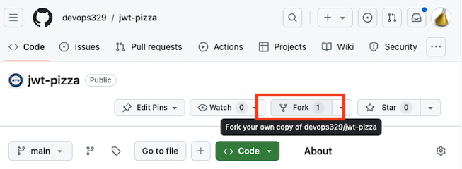

# JWT Pizza Client


The development team has given you access to their frontend client application. You need to fork the code to your GitHub account, run it locally and study how it works. Once you are comfortable with the code, you then need to put on your QA hat and start writing tests.

Here are the steps to take:

1. Navigate your browser over to the [jwt-pizza](https://github.com/devops329/jwt-pizza) repository on GitHub.
   
1. Copy the URL for your fork of the repository.
   
1. Use the URL to clone the repository from your account to your development environment.
   ```sh
   git clone https://github.com/youraccountnamehere/jwt-pizza.git
   ```
1. Change directory into the newly clone repository and install the NPM package dependencies.
   ```sh
   cd jwt-pizza
   npm install
   ```
1. Launch the frontend code in development mode using NPM. Press `o-return` to open your browser.
   ```sh
   npm run dev
   ```

## Keep in sync

As the development team makes changes to the frontend code you will need to sync your fork of the repository. As long as you are only adding tests and not changing the core code, you shouldn't have to merge any code.

To sync your fork, navigate to your account's fork of the `jwt-pizza` repository. It will display if your fork is out of date. Press the `Sync fork` button and confirm the action.


You will then need to pull the changes down to your development environment.

```sh
cd jwt-pizza
git pull
```
