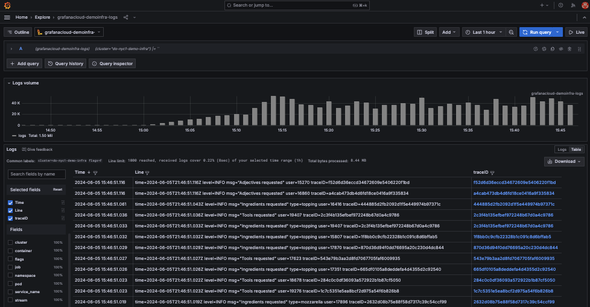

# Logging

Metrics give you a good overview of how well the system is operating, but sometimes you need to dig into the details to full understand what is going on. For example, you might see that your request latency is going up unexpectedly. However, the response time metric only tells you that the overall system latency is increase. It doesn't tell you why it is increasing. Is it a single request? Is it requests from a specific user? Or is it requests being handled by a specific server?

A logging system usually gives you a record of an individual event that is tagged with information that you can use to aggregate similar events. You can also use the timestamp of the events to see what is going on in the system at the same time.

## Timestamps

## Event tags

## Centralization

## Immutability

## PII

## Aggregation

## Search

## Performance considerations

- How often
- how much data
- Should you upload in bulk
- Do you need to do transformations and normalizations
- What format do you want to log in
