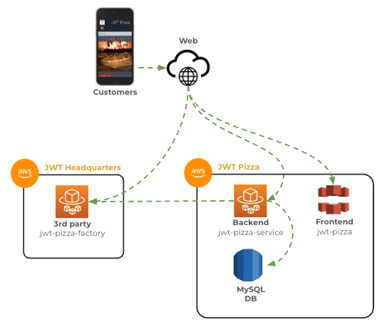
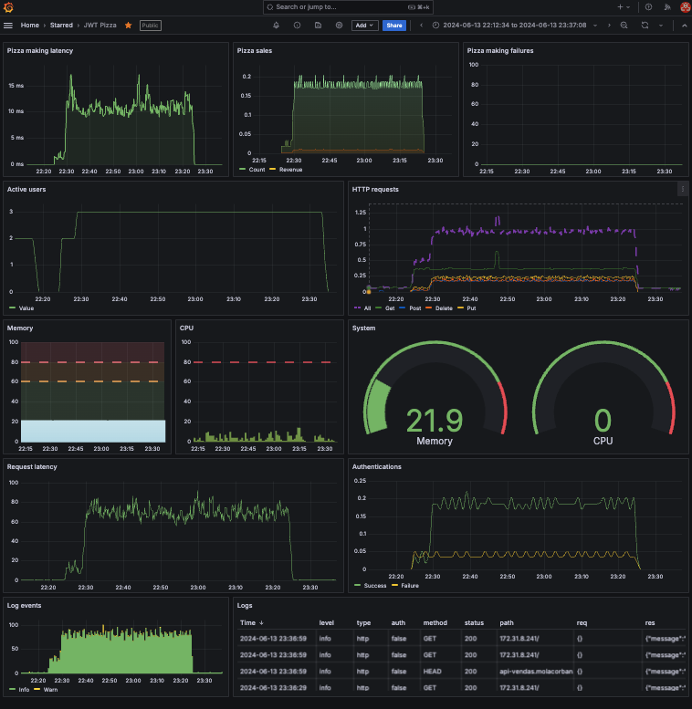

# Observability

🔑 **Key points**

- Metrics, logging, and traces are standard observability tools.
- Key metrics include latency, traffic, errors, and saturation.
- There are many important observability characteristics to consider.

---

When you run an application in your development environment, you know that you are the only user and you can debug your usage with console output or breakpoints. Things get significantly more complex when you deploy an application to a remote production environment and have millions of active customers. When you add the complexity of multiple components in a distributed architecture, including some that are running on the customer's device and others that run in 3rd party servers, it can be incredibly difficult to know where things are going wrong.

Has the database run out of memory? Is an old version being deployed for the frontend? Has the backend service lost network connectivity? Is the 3rd party pizza factory experiencing a slowdown, or is there just some small bug in the code for any of those components?

Without being able to observe what is happening inside the box, you are left to guess what the problem is based entirely on external observations. That usually means that a frustrated customer is reporting a problem in very vague terms, or worse, no one is reporting the problem and your customers are just walking away to your competitor, Session Cookies and Milk™.

## Observability tools

There are three types of tools that are usually associated with increasing the observability of a software system.

1. **Metrics**: Provides raw numbers, such as requests rates and CPU percentages, that can be aggregated together to quickly analyze the health of a system. They can also provide a historical record of system performance.
1. **Logging**: Records key information as it passes through the system. This includes fields such as request IP addresses, SQL queries, and authentication requests.
1. **Tracing**: Allows you to debug a distributed system in a similar way you would use an IDE to walk through each line of code. With tracing you can follow the path of a request that started on a customer's device, through the backend service, and into a database.

## Vital observability characteristics

There are a number of vital characteristics that make an observability tool valuable. These characteristic define the value and cost of the monitoring. Simple systems that only retain a couple of hours of data and are located on difficult to access storage are not as valuable as realtime dashboards that allow for complex queries with years of history. However, the realtime systems are complex to build and maintain and therefore significantly more expensive. In the end, the characteristics that you choose should be aligned with the value of the system you are observing.

### Golden Signals

As described in the [Google SRE Handbook](https://sre.google/sre-book/monitoring-distributed-systems/), there are four metrics, or signals, that you need to observe closely. This include the following.

- **Latency**: The time it takes to service a request.
- **Traffic**: How many requests are happening concurrently.
- **Errors**: How many failures are happening.
- **Saturation**: How much capacity is left in the system.

Each of the signals indicates a different aspect of overall healthiness of the system. For example, you could be responding quickly to requests, but also generating lots of errors, or reaching saturation of the network bandwidth. Errors may be high in number, but low in relation to the percentage of traffic.

### Correct interpretation

It is also important to get the correct calculation of each signal. Often times percentages are more important than raw values as was demonstrated with the previous mention of high error rates. At other times, raw numbers are more important than percentages. For example, you may only have .0001% of authentication requests failing, but when 10,000 of those are from the same IP address you had better pay attention.

Latency numbers can be especially misleading. An average latency of 10 ms looks good, but if the 99th percentile is 30000 ms you may have a serious problem.

### Immutability

The record an observability tool creates must be immutable, or in other words, it cannot be altered or deleted. This is critical both for security and auditing reasons. If an attacker can cover their tracks by simply altering the logs, they will remain undetected in the system.

### Performance

It is important that there is not a significant lag between when an event happens and when it is recorded by an observability tool. A few seconds is fine, but if that turns into minutes or hours then the value of the tool is greatly diminished.

Consider the situation where your website latency has significantly increased. If you don't know about it until an hour later, your customers are not going to be happy. Likewise, after you have discovered the problem and deployed a solution, you would need to wait an hour before you know what the impact of the modification was.

### Elasticity

all the desirable characteristics that you want for your application also apply to your observability system. This includes elasticity. You want to handle a spike in log requests without having to manually adjust your system. Without this, your observability will lag, or worse, fail entirely exactly at the moment when you need it most.

### Aggregation and accessibility

In the early days of logging, each server had a cache of logs. If there was a problem, you had to SSH into the server and manually examine the log files until you found where the problem occurred. If the failure was triggered across multiple requests that were logged on different servers, then you were in a world of hurt to try and figure out what happened.

Instead, you want to transfer observability data as quickly as possible to a central location where it can be aggregated and accessed from anywhere you might need.

### Visualization

An insightful visualization dashboard allows you to find and diagnose problems faster. When one metric spikes, it is often helpful to be able to correlate it with other metrics that rule out false positives and help you focus in on real problems.

Make sure your dashboard properly uses color, font size, and scale. Being able to easily change the time frame represented by the visualizations is also critical. A dashboard that only shows the last hour won't be of much use when you are trying to figure out if a measurement is an anomaly, or the same thing that happens every year at this time.

### Cost

Valuable logs and metrics are expensive to acquire, persist, and query. However, the cost of not providing observability to your system can be even higher when the system crashes or there is a security breach.

The key is to balance the costs with the return on those investments. More than likely you will receive significant benefits from investing in observability, even it if only means that your engineering staff sleeps better at night.

## Incident response

In the early days of system monitoring, humans watched metric dashboards looking for anomalies. It was common for a Network Operations Center (NOC) to be staffed 24 hours a day 7 days a week in order to respond to critical system failures.

This quickly evolved into the adoption of triggered alerts that would fire when certain thresholds were exceeded. That made it possible to drastically reduce the operations staff, or eliminate it entirely, with _on call_ staff who could be woken in the middle of the night.

When a staff member was notified of the incident they would first examine the metric and logging data, determine the scope and severity of an incident, and then initiate a response. Severity is often categorized with different levels.

| Severity          | Description                                                                                                                                                                                                                                              | Response                                     | Expected resolution |
| ----------------- | -------------------------------------------------------------------------------------------------------------------------------------------------------------------------------------------------------------------------------------------------------- | -------------------------------------------- | ------------------- |
| **Critical**      | The system is offline or operationally ineffective. This could be that the entire website is offline, or that a commerce website is unable to execute purchases.                                                                                         | Entire staff                                 | Immediate           |
| **High**          | Major functionality or subsystems are malfunctioning. For example, the authorization system is not responding. This would make it impossible for new users to access the system, but current users would be unaffected.                                  | Entire associated team                       | Immediate           |
| **Moderate**      | Loss of functionality that is periodically impacting a significant portion of customers. This would include things like periodically returning 404 errors for expected content, or some critical images not loading.                                     | Member from associated team                  | Immediate           |
| **Low**           | Loss of functionality for a small portion of customers, or functionality that is not vital to the primary outcomes of the system. For example, some percentage of customers are unable to view their profile picture, or aggregated data is out of date. | Priority ticket assigned to associated team  | 24 hours            |
| **Informational** | Minor, unexpected changes in metrics or other benign observations.                                                                                                                                                                                       | Out of band communication to associated team | 1 - 7 days          |

### Self healing

With the automation mindset of DevOps, response systems started to change from human involvement to automated corrections. If a container was not responding, it could be automatically replaced. If the number of users was exceeding the capacity of the system, more containers could be deployed to handle the load. If the data center in one region failed due to a catastrophic weather event, traffic could be automatically routed to a different region.

At the very least, the human responders would have an array of automated responses that they could employ to rapidly resolve the incident. This further increased the value of the DevOps team and the importance of automation. It became increasingly rare for a human to drive to a data center to switch out a hard drive, restore the data from a backup, and reboot the router so that the website would come back up. Instead, an automation script was executed and moments later the entire system was normal.

### Use of AI

With decades of collected metrics and response data, the area of incident response became fertile ground for replacement by an artificial intelligence system. Today, it is common for all but the most critical failures to be handled automatically by AI. After resolution, the AI system creates a postmortem report that is reviewed by the team. This allows for long term alterations to the system that provide even greater stability.

💡 Writing a curiosity report on how AI can be used to sift through metrics and logs to find anomalies and generate appropriate alerts or execute self healing would be very interesting.
