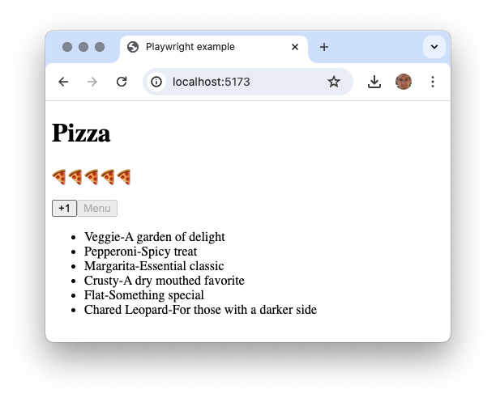

# Playwright


📖 **Deeper dive reading**:

- [Playwright](https://playwright.dev/)
- [Testing best Practices](https://playwright.dev/docs/best-practices)
- [Writing tests](https://playwright.dev/docs/writing-tests)
- [VS Code Playwright extension](https://playwright.dev/docs/getting-started-vscode)

For the purposes of this course, we could pick any of the top UI testing frameworks. However, we are going to pick a newcomer, Playwright. Playwright has some major advantages. It is backed by Microsoft, it integrates really well with VS Code, and it runs as a Node.js process. It is also considered one of the least flaky of the testing frameworks.

Playwright gets its speed and stability by running directly against each of the major browsers DevTool API. This is a major advantage over other tools that either directly or indirectly use the Selenium WebDriver or only support a single browser.

## Tutorial project

In order to have something that we can use to demonstrate how to use Playwright, we need to first create an example project. Take the following steps:

1. Create a test directory
   ```sh
   mkdir playwrightExample && cd playwrightExample
   ```
1. Create the basic Vite React app.
   ```sh
   npm init -y
   npm install vite@latest -D
   npm install react react-dom
   ```
1. Modify `package.json`
   ```json
     "scripts": {
       "dev": "vite"
     },
   ```
1. Create a very simple `index.html` home page
   ```html
   <!DOCTYPE html>
   <html lang="en">
     <head>
       <title>Playwright example</title>
     </head>
     <body>
       <div id="root"></div>
       <script type="module" src="/index.jsx"></script>
     </body>
   </html>
   ```
1. Create a simple `index.jsx` React application

   ```jsx
   import React from 'react';
   import ReactDOM from 'react-dom/client';

   ReactDOM.createRoot(document.getElementById('root')).render(<App />);

   function App() {
     const [count, setCount] = React.useState(1);
     const [menu, setMenu] = React.useState([]);

     async function getMenu() {
       const response = await fetch('https://jwt-pizza-service.cs329.click/api/order/menu');
       const data = await response.json();
       setMenu(
         data.map((item, i) => (
           <li key={i}>
             {item.title}-{item.description}
           </li>
         ))
       );
     }

     return (
       <div>
         <h1>Pizza</h1>
         <p>{'🍕'.repeat(count)}</p>
         <button onClick={() => setCount(count + 1)}>+1</button>
         <button disabled={!!menu.length} onClick={getMenu}>
           Menu
         </button>
         <ul>{menu}</ul>
       </div>
     );
   }
   ```

   Now you can run `npm run dev` and experiment with the demonstration application. Notice that you can order pizzas by pressing the `+1` button and get the JWT pizza menu by pressing `Menu`. Once the menu is displayed it will disable the menu option. Get familiar with the code so that you are ready to start writing your UI tests.



## Installing Playwright

With our demonstration app created we are ready to install Playwright. While installing tell it to use JavaScript, use the `tests` directory, ignore the GitHub Actions workflow for now, and not install any Playwright browsers.

```sh
npm init playwright@latest
```

This will update `package.json` with the `playwright` package, create a `playwright.config.js` file, and create some sample tests in the `test` and `tests-examples` directories. This will also update your `.gitignore` file so that you don't accidentally check in test coverage or report information.

### Install a testing browser

If you review the `playwright.config.js` file you will notice the configuration of the browser it will run.

```js
  /* Configure projects for major browsers */
  projects: [
    {
      name: 'chromium',
      use: { ...devices['Desktop Chrome'] },
    },

    {
      name: 'firefox',
      use: { ...devices['Desktop Firefox'] },
    },

    {
      name: 'webkit',
      use: { ...devices['Desktop Safari'] },
    },
```

For simplicity sake, we will only tests with `chromium` and so delete the other entries. Once you have modified the file we need to go install the `chromium` driver.

```sh
npx playwright install --with-deps chromium
```

## Running your first test

The easiest way to run your first Playwright tests is to use the examples that came with the Playwright installation.

```sh
├── tests
│   └── example.spec.js
└── tests-examples
    └── demo-todo-app.spec.js
```

Playwright will run any test found in its testing directory as defined by the `testDir` property in the `playwright.config.js` file. By default this is set to the `tests` directory. The `example.spec.js` found in the `tests` directory contains two simple tests. The first test goes to the Playwright website and checks to make sure the resulting page has the title `Playwright`.

```js
test('has title', async ({ page }) => {
  await page.goto('https://playwright.dev/');
  await expect(page).toHaveTitle(/Playwright/);
});
```

You can run the tests from your project directory with the following console command.

```sh
npx playwright test

Running 2 tests using 2 workers
  2 passed (1.1s)
```

Congratulations you have just ran your first Playwright test.

### Viewing the results

In addition to outputting the result to the console, this will create a file named `test-results/.last-run.json` that contains the result of running the test.

If you want to see a visual report in a browser window you can run:

```
npx playwright show-report
```

This will allow you to interactively review what happened with the test.


### Interactive execution

You can also run the test using the Playwright UI mode.

```sh
npx playwright test -ui
```

This opens up a window that shows all the tests found in the `tests` directory and allows you to interactively execute them and review the results. This includes a time lapse overview of what the browser was doing while it executed and the ability to see the state of the browser during each step of the test.

> 

## Writing your own tests

Let's get rid of the example tests that were provided and create our own tests.

## VS Code Playwright extension

[Playwright extension](https://marketplace.visualstudio.com/items?itemName=ms-playwright.playwright)

The VS Code extension for Playwright is well worth the time to install and master. You can actually use it to install Playwright for your project instead of using the manual steps defined above.

Just like the Jest VS Code extension, the Playwright extension will detect that you have Playwright tests and allow you to run them from the `flask` menu of the sidebar.

Some of the cool features include:

- Installing other browsers
- In context error messages
- Debugging tests
- Picking a locator by clicking on an element
- Recording a new tests
- Record starting at the cursor
- Displaying the trace viewer

You can also debug your tests by placing a break point and walking through

## GitHub Action execution

# More old stuff

To get Playwright to run I followed the instructions in [cs260](https://learn.cs260.click/page/webServices/uiTesting/uiTesting_md). I did have to change the created file so use ES modules instead of Common modules. This was a simple change from the `required` syntax to the `import` syntax.

```js
const { defineConfig, devices } = require('@playwright/test');
import { defineConfig, devices } from '@playwright/test';
```

I also modified the config file to drop out the extra browsers and to specify the webServer to work with Vite on startup.

```js
  projects: [
    {
      name: 'chromium',
      use: { ...devices['Desktop Chrome'] },
    },
  ],

  /* Run your local dev server before starting the tests */
  webServer: {
    command: 'npm run dev',
    port: 5173,
    reuseExistingServer: true,
  },
```

## Install Playwright extension

> Playwright Test for VSCode
> v1.0.22
> Microsoft

This creates a little beaker icon in the tools


### Show browser and Trace viewer

These tools are great. They allow you to interactively see what the tests are doing.

## Writing tests

https://playwright.dev/docs/writing-tests

## Modify the tests

I then deleted the examples and modified the simple `example.spec.js` to be `store.spec.js` and to contain the following.

```js
// @ts-check
import { test, expect } from '@playwright/test';

test('testAddStoreButton', async ({ page }) => {
  let serverStoreJson = [
    { name: 'nyc', date: '2028-01-01' },
    { name: 'san diego', date: '2032-10-31' },
  ];

  // Mock out the server
  await page.route('*/**/api/store', async (route) => {
    expect(route.request().method()).toBe('GET');
    await route.fulfill({ json: { store: serverStoreJson } });
  });

  await page.route('*/**/api/store/provo', async (route) => {
    expect(route.request().method()).toBe('POST');
    serverStoreJson = [...serverStoreJson, { name: 'provo', date: '2021-10-31' }];
    await route.fulfill({ json: { store: serverStoreJson } });
  });

  await page.goto('http://localhost:5173/');
  await expect(page).toHaveTitle('DevOps Demo');

  // add a new store
  await page.locator('css=input').fill('provo');
  const addStoreBtn = page.getByRole('button', { name: 'Add' });
  await addStoreBtn.click();
  const storeTable = page.getByRole('cell', { name: 'provo' });
  await expect(storeTable).toHaveText('provo');
});
```

## Adding coverage

This is proving to be more difficult than expected.

[Tutorial](https://mickydore.medium.com/adding-playwright-tests-to-your-vite-project-with-code-coverage-f6cfa65f0209)

The basic steps are to install

- playwright-test-coverage: wrap all the test calls with the calls that start and stop test coverage on each page. I believe this is just using the basic Playwright coverage API.
- vite-plugin-istanbul: use istanbul (aka nyc) as a vite plugin.
- nyc: Code coverage library used to generate and visualize the output.
- create nycrc.json to specify nyc parameters for failing the coverage test.

[NYC Docs](https://github.com/istanbuljs/nyc)

Create nycrc.json

```js
{
  "check-coverage": true,
  "branches": 80,
  "lines": 80,
  "functions": 80,
  "statements": 80
}
```

Modify vite.config.js

```js
import istanbul from 'vite-plugin-istanbul'

export default defineConfig({
  plugins: [
    ...,
    istanbul({
      include: ['src/**/*'], // files to track coverage on
      exclude: ['node_modules'], // files to NOT track coverage on
      requireEnv: false
    })
  ]
})
```

Change tests to use playwright-test-coverage

```js
// import { test, expect } from '@playwright/test' <- we can remove this
import { test, expect } from 'playwright-test-coverage';
```

add a new script that runs tests with coverage using nyc

```json
// package.json
"scripts": {
  ...,
  "test:e2e-coverage": "nyc --reporter=lcov  --reporter=text-summary playwright test"
}
```

The different reporters do different things. `lcov` will create an HTML report. `text-summary` prints out a simple display.

this produces a file named:

**coverage/lcov-reports/index.html**

## GitHub Action with coverage

Finally I modified the action to run the coverage test

```yaml
jobs:
  build:
    name: Build client
    runs-on: ubuntu-latest
    steps:
      - name: Checkout repo
        uses: actions/checkout@v4
      - name: Setup Node
        uses: actions/setup-node@v4
        with:
          node-version: '20.x'
      - name: Build
        run: npm ci && npm run build
      - name: Install Playwright Browsers
        run: npx playwright install --with-deps chromium
      - name: Run Playwright tests
        run: npm run test:coverage
```

Now when I run the action it fails

```
Run npm run test:coverage

> pizza-client@0.0.1 test:coverage
> nyc --reporter=text-summary playwright test
Running 1 test using 1 worker
·
  1 passed (2.3s)
ERROR: Coverage for branches (50%) does not meet global threshold (80%)
=============================== Coverage summary ===============================
Statements   : 97.61% ( 41/42 )
Branches     : 50% ( 1/2 )
Functions    : 100% ( 12/12 )
Lines        : 97.61% ( 41/42 )
================================================================================
Error: Process completed with exit code 1.
```
