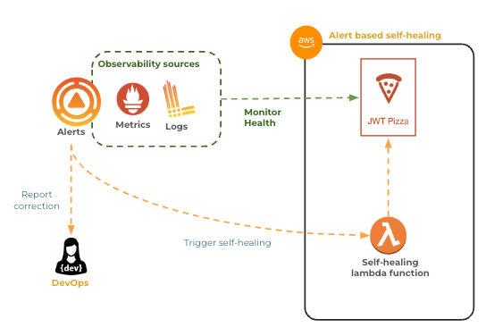
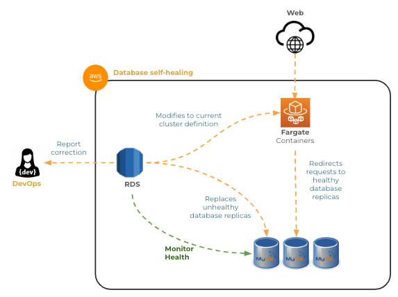
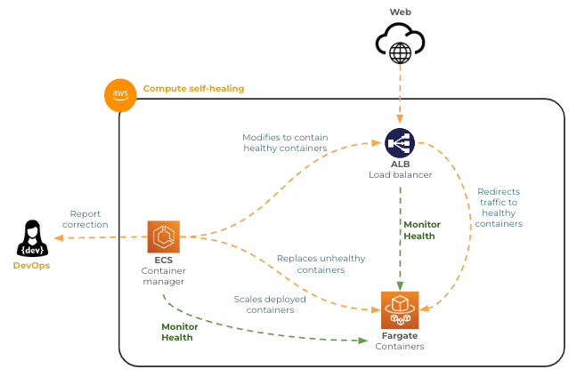

# Self healing

The ultimate goal of DevOps engineers is to automate themselves out of a job. The capstone of that automation is a system that automatically detects a problem, deploys a correction, and records the modification in an audit log.

Consider a system where you have hooked up your Grafana observability alerts to call an AWS Lambda function. The function automatically corrects the problem then simply notifies the DevOps team that the correction has taken place.

This could work well for things like auto scaling. When the CPU on your computing infrastructure reaches a saturation threshold, the Lambda function would scale the available resources up. You can also do the reverse and scale down the resources when they are below a utilization threshold.

## AWS self healing

Many AWS services come with automated self healing built right into the service. For example, RDS can monitor your database and automatically redirect write and read requests away from unhealthy replicas.

Likewise, ECS and EC2 work together to monitor the health of Fargate containers. If the ALB notices that a container is unhealthy it will automatically move traffic to other containers. When ECS detects unhealthy containers, it replaces them and changes the ALB configuration.

ECS also monitors the load on the containers and automatically scales the number of containers up or down.

All of this happens without any human involvement.

## The reality and future

In reality it is difficult to achieve complete self healing. However, if you can automate the self healing, or even just delay the impact, of common problems, you allow your DevOps teams to get a good night's sleep and create even better automation designs.

The introduction of AI systems can help to further resolve issues that would have previously required human involvement. The reality is that detecting anomalies and deploying playbook actions are things that AI can do really well. This is especially true given the large body of training data that is available.
