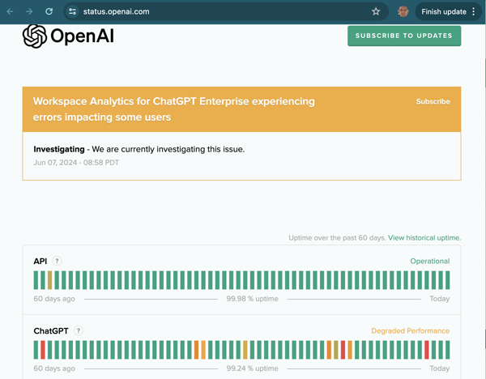
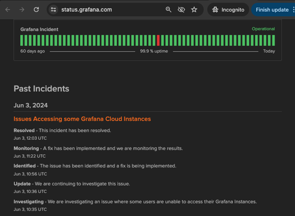
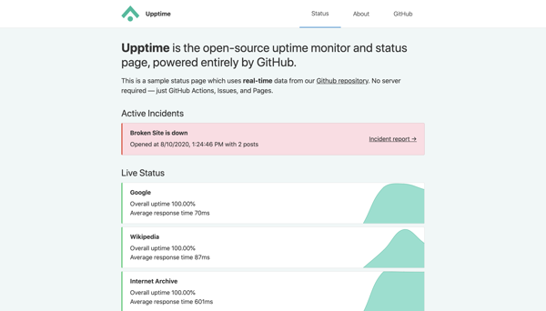

# Status reporting

🔑 **Key points**

- Status pages for applications are standard practice.
- Review status page examples in order to get familiar with what they provide.

---

When your customers have the perspective that your application is unstable or that your company doesn't care about stability, they will quickly find an alternative in your competitors' offering. As a software engineer who cares about quality, you can take several approaches to maintain customer trust:

1. **Reduce the likelihood of bugs**: Focus on good software design principles. Isolate or remove problematic functionality. Keep the system simple.
1. **Handle failure gracefully**: Create circuit breakers that fallback on dependable functionality. Provide redundancy.
1. **Ensure quality**: Invest significantly in testing.
1. **Respond quickly**: Detect and correct failure as rapidly as you can.
1. **Communicate**: Let your customer know what is going on and that you have it under control.

No product is ever going to be completely free of defects. You want to do everything within reason to minimize their impact on the customer, but there comes a point where the investment is not worth the return. That is where **Communication** comes in. The worst thing you can do is let your customer find out weeks after an incident from a news, or a social media feed, that you suffered an outage, lost data, or were hacked. You want to react to a problem before you customers report it and already have a message automatically generated that conveys confidence in your ability to address the issue.

## status.mydomain.com

One common way to communicate with customers is to have a [status](https://github.com/ivbeg/awesome-status-pages?tab=readme-ov-file#public-status-pages) subdomain that serves as the communication point for customers desiring information.

#### status.openai.com

Here is the [Open AI status](https://status.openai.com) page.

Notice that they specify when the problem was discovered, what the problem is, and what the current state is. You can even subscribe to receive updates.

#### status.grafana.com

Grafana takes things a step further. If there is a serious problem with functionality that they detect you are using, they will display a message banner directly on the impacted page.

Notice that the banner has a link that takes you to their status page where the incident is described in detail.

## Creating your status page

There are several ways to create a status page for your application. Usually you don't want to have it actually hosted as part of your application because that is kind of self-defeating. Instead, you need to build a completely different stack, hopefully hosted in a completely different environment from your application.

As an alternative to building your own status page, you can use one of the many cloud services that are available. You can also use one of the many open source projects.

### Upptime

One that I haven't tried, but that looks interesting is [upptime](https://github.com/upptime/upptime). Upptime makes extensive use of GitHub. A scheduled GitHub Actions workflow monitors the website and updates GitHub Pages to display the status. GitHub Issues are used to track an incident and the results are automatically integrated into the [status page](https://demo.upptime.js.org/).

> 

If you are looking for a discovery project, this might be a good one to try. I would love to hear about your experience.
