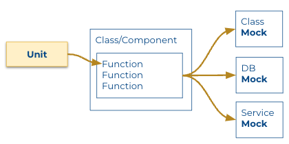
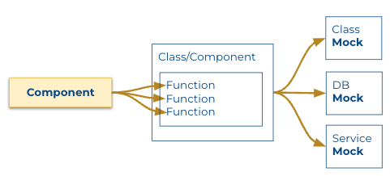
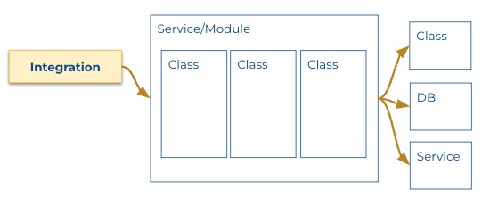

# Testing categories

**Key points**

- Understand the different categories of testing

While the general idea of testing is to simply verify that code is doing what it is supposed to do, it is often helpful to classify testing into different categories. Each category has different tools, limits, and expectations. It also gets a bit fuzzy where the boundaries of each type cross. In general there is a lot of overlap. The thing to keep in mind is the focus of the category and teh value it brings. It is not so important how much you are blurring the lines between catagories as long as you are not overly duplicating your tests.


## Categories

### Unit

Unit testing demonstrates the correctness of a very small piece of code such as a function or class. This differs from other testing models that focus on how code integrates into a larger system, is used by a customer, or handles load. With unit testing you actively try to abstract out the context of the target. Usually this is done by creating mocks of, or faking, the input to the target and the outputs of dependencies.

Consider a unit test for a service endpoint.

```js
test('login', async () => {
  const loginRes = await request(app).put('/api/auth').send(testUser);
  expect(loginRes.status).toBe(200);
  expect(loginRes.body.token).toMatch(/^[a-zA-Z0-9\-_]*\.[a-zA-Z0-9\-_]*\.[a-zA-Z0-9\-_]*$/);

  const { password, ...user } = { ...testUser, roles: [{ role: 'diner' }] };
  expect(loginRes.body.user).toMatchObject(user);
});
```

With a unit test, you would only validate that it could read its input and properly return the expected output. If the endpoint called other components, services, or devices such as a database those would all be mocked out.



A unit test tries to be only cover the vital parts of the test without being tied down to specifics that might cause maintenance issues as the underlying code evolves. Basically you want the test to fail if the **unit** no longer provides its core responsibility, but you don't want it to fail based on timing, locality, or data transitions that are not core to the unit.

### Component

Component testing takes unit testing to the next level. With component testing you want to remove some of the mocks and make sure that component works as a whole. With our endpoint example you would want to make sure that every thing in the class/component works well together. This usually involves calling multiple endpoints on a component or class and making sure that any state shared by the component is properly updated. For example, a unit test would make sure that the login endpoint works correctly. A component test would make sure that everything dealing with authorization works correctly. That would include login, register, logout, and delete user all worked correctly.



External entities are still mocked out, but the entire component is extensively exercised as part of the test.

### Integration

Integration testing takes component testing to the next level. You now test a service or module as a whole, making sure that everything within the module remains consistent. For example, instead of just testing the authorization portion of a service like we did in component testing, you would test the entire service. Can I register a user, make a purchase, logout, come back and login again, check my order status, and then contact the support team concerning my order.



At this point you probably want to also drop a significant portion of your mocks. Knowing that the database actually persists data is an important part of integration testing. Likewise if a dependent service changes its endpoints you definitely want your integration test to fail.

### Regression

Before the software industry learned to automate our testing, it was common practice to write or modify some code, manually test it, and then execute a frenzy of manual spot checking to make sure you didn't break anything that depended on the code you changed. When you break existing code it is called a regression bug because you are regressing to an earlier state of instability. For a quality assurance team, regression testing was the major focus of what they did. This created a very inefficient cycle of developers making changes to a specific part of the code and QA rejecting those changes because it broke different parts of the system.

Automated regression testing is actually fairly easy to achieve. You just need to write appropriate component and integration tests and then run those tests whenever any related code changes. Knowing that you have a full suite of regression tests to protect you will increase your confidence that you didn't inadvertently break anything. You might even find that you no longer need to have an independent QA team to help debug your code.

### End to end

End to end testing exercises every part of the application from the highest level. This includes how services interact with each other as well as any dependent third party services and all devices such as databases, caches, and search systems.

Once you get to this level of testing you are approaching what a real user does and the tests become more authentic with very little pieces being mocked out. The difficultly with end to end testing is that is hard to use with test driven development since it is at a much higher level than you are usually working on when implementing a specific feature. It also reproduces many of the tests that happen at the integration, component, or unit levels. That creates significant maintenance overhead.

However, without end to end testing you really can't be confident that the application is actually working in any realistic way.

### Synthetic

Synthetic testing is similar to end to end testing, but it only tries to simulate what a normal user would do. This is useful for driving load testing where realistic use is important.

### Load

Load testing leverages synthetic tests as it creates a load on the application that represents dozens, hundreds, or even thousands of customers. The idea with load testing is not to assert that the code does what it is supposed to do, but that they entire system doesn't fall over under load, or that it elastically scales according to the load.

### Penetration

Penetration testing is the exact opposite of synthetic testing. With a penetration test you try and use the application in a way that no user normally would so that it can be exploited for nefarious purposes.

### Smoke

### User acceptance

User acceptance testing is usually manual testing that is done by an actual user. They are given the application and asked to see if it matches their expectations.

### Compatibility

### Accessibility

### Localization

### Beta

### Black box

### White box

## Our plan

For this course we will do the following:

1. Integration and unit testing for the `jwt-pizza-service` and the database. This will make actual calls from the service to the MySQL database.
1. Unit testing for `jwt-pizza`. This will mock out all calls to the external services.
1. End to end, load, and penetration testing on the deployed production system.
