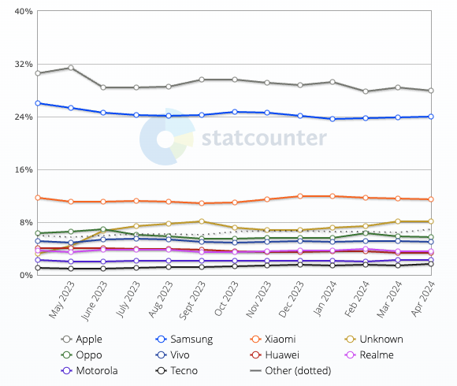
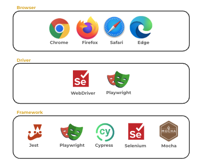

# UI Testing

**Key points**

- UI testing can be difficult
- Devices, OS, and browsers create a complicated testing matrix
- Browsers, drivers, and frameworks create the testing stack
- Flakiness is a major problem

No one understands the difficulty of testing applications in a browser better than the companies that build web browsers. They have to test every possible use of HTML, CSS, and JavaScript that a user could think of. There is no way that manual testing is going to work and so early on they started putting hooks into their browsers that allowed them to be driven from automated external processes. [Selenium](https://www.selenium.dev/) was introduced in 2004 as the first popular tool to automate the browser. However, Selenium is generally considered to be flaky and slow. Flakiness means that a test fails in unpredictable, unreproducible ways. When you need thousands of tests to pass before you can deploy a new feature, even a little flakiness becomes a big problem. If those tests take hours to run then you have an even bigger problem.

Testing UI code that executes in a web browser is significantly harder than testing backend code that runs from a command console. With backend code you are running under a predictable operating system with little variation on how it executes. With code that renders in a browser, you must actually execute the code in the browser and then simulate a user interacting with the application through mouse, finger, and keyboard actions.

#### Device, browser, and OS explosion

UI testing is further complicated by the variations of browsers and devices that the UI may execute on. According to _statCounter_, the global mobile vendor usage for 2023-2024 indicated that Android and Apple evenly split a majority of the mobile market.



> _source: [statCounter](https://gs.statcounter.com/vendor-market-share/mobile/worldwide)_

In addition to the different devices, you also need to consider the different browsers. Each of these browsers has unique characteristics and behaviors that are also influenced by the device they are running on. As of February 2024, here are the statistics for browser usage.

| Browser | Percentage |
| ------- | ---------- |
| Chrome  | 65%        |
| Safari  | 18%        |
| Edge    | 5%         |
| Firefox | 3%         |

> _source: [similarWeb](https://www.similarweb.com/browsers/)_

## Browser drivers

Browser drivers act as the bridge between your test scripts and the actual web browser environment. These tools simulate user interactions like clicking buttons, filling out forms, and navigating pages. They essentially become the invisible hands that execute your tests within a real browser.



Currently, the most common browser drivers are based upon the W3C [WebDriver](https://www.w3.org/TR/webdriver2/) specification. The standard was derived based upon an early pioneer of browser testing named [Selenium](). Many of the common testing frameworks that exist today use the Selenium WebDriver as their foundation. There are other drivers that follow the WebDriver specification for specific browsers. These include SafariDriver, OperaDriver, and FirefoxDriver.

Alternatively, the testing framework Playwright chose to go directly against the browser APIs for all of the major browsers. This includes WebKit (Safari), Chromium, and Firefox. They took this approach in order to execute tests faster, with less flakiness.

### Running headless

Usually a driver will allow you to execute in a **visual** or **headless** mode. When running in headless mode there is no UI rendering of the application and so the tests run significantly faster. However, when developing tests it is useful to see what is actually happening while the test executes.

## Testing frameworks

There are lots of UI testing frameworks available for you to use. Here are some of the major players.

| Tool       | Pros                                                                                                                                           | Cons                                                                               | Driver                                        |
| ---------- | ---------------------------------------------------------------------------------------------------------------------------------------------- | ---------------------------------------------------------------------------------- | --------------------------------------------- |
| Jest       | Popular choice for JavaScript projects, integrates seamlessly with React Testing Library, offers snapshot testing for visual regression checks | Primarily for JavaScript-based UIs                                                 | Selenium WebDriver                            |
| Cypress    | Easy to learn with a visual test editor, offers time travel debugging for easier troubleshooting                                               | Focused on end-to-end testing, may not be ideal for complex unit testing scenarios | Chrome DevTools Protocol                      |
| Playwright | Designed for modern web development, supports multiple browsers natively, offers a recorder for faster test creation                           | Requires coding knowledge in JavaScript, Python, or .NET                           | Native calls to Chromium, WebKit, and Firefox |

## Writing tests

The various test frameworks provide different methods for writing tests. This can be customer scripting language, visual interactions, or using common programming languages such as JavaScript or C#. The chose of the language has a significant impact on the performance, capability, and ease of the framework.

Here is an example test written in JavaScript for the Playwright framework.

```js
import { test, expect } from '@playwright/test';

test('addStore', async ({ page }) => {
  // Mock out the service endpoints
  let mockServiceData = [
    { name: 'nyc', date: '2028-01-01' },
    { name: 'san diego', date: '2032-10-31' },
  ];

  await page.route('*/**/api/store', async (route) => {
    expect(route.request().method()).toBe('GET');
    await route.fulfill({ json: { store: mockServiceData } });
  });

  await page.route('*/**/api/store/provo', async (route) => {
    expect(route.request().method()).toBe('POST');
    mockServiceData = [...mockServiceData, { name: 'provo', date: '2021-10-31' }];
    await route.fulfill({ json: { store: mockServiceData } });
  });

  // Initiate the page loading
  await page.goto('http://localhost:5173/');
  await expect(page).toHaveTitle('DevOps Demo');

  // add a new store by pressing the button
  await page.locator('css=input').fill('provo');
  const addStoreBtn = page.getByRole('button', { name: 'Add' });
  await addStoreBtn.click();
  const storeTable = page.getByRole('cell', { name: 'provo' });
  await expect(storeTable).toHaveText('provo');
});
```

## Flakiness

Browser driven testing is inherently flaky tests due to the nature of simulating a user across diverse devices. Flake can cause tests to intermittently pass or fail. This slows down development cycles and create a sense of distrust in the testing process. Here are some ways to combat flaky tests:

- Identify and eliminate synchronization issues: Ensure your tests wait for elements to load completely before interacting with them.
- Handle dynamic content effectively: Use robust selectors that can adapt to slight changes in the UI.
- Minimize reliance on external factors: Avoid tests that depend on network conditions or third-party services.
