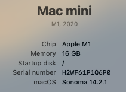
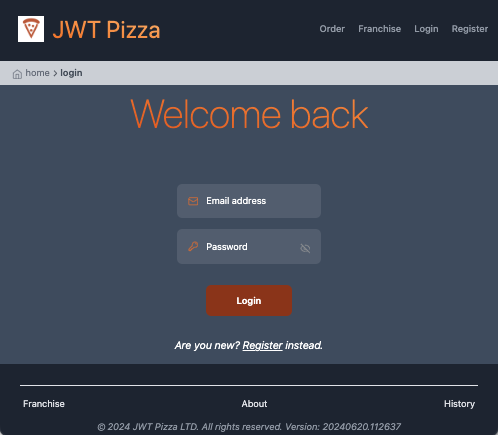
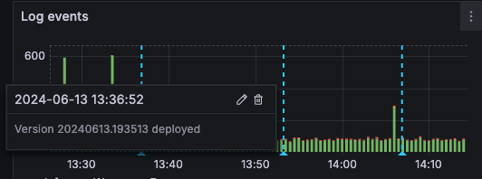
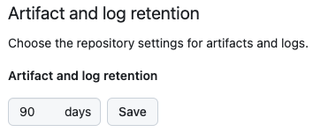

# Versioning

When building production software it is vital that you make use of version identifiers that uniquely represent each component that is used by a customer. The version ID makes it so you know what code was used when features were introduced, bugs were discovered, or a failure occurred. Without the version ID it would be very difficult to reproduce a problem, or to say with any certainty that the problem as been remedied.

The most critical requirement for a version ID is that it can be used to uniquely reference an immutable copy of the deliverable package, or the source code that can be used to rebuild the deliverable package. Preferably, you want both. The source code is necessary for debugging, and sometimes it is impossible to reproduce the actual deliverable package. This happens when the CI workflow or tools necessary to build the package no longer exist.

If you cannot reliably correlate what a customer sees to the code changes that resulted in the behavior, then a version ID loses much of its value.

A good version ID is consistent in its representation and will contain the following information.

- Uniquely identifies the source codebase.
- Uniquely identifies the deliverable package.
- Represents when the version was created.
- Readily describes the magnitude of the change.
- Provides a detailed description of the changes.
- Is comparable to other version IDs.

## Supplemental information

Putting everything you would like to know into a single version ID is an impossible task. For that reason, it is good to put a reasonable amount of information into the ID while still keeping it concise in its representation. You then use the ID to reference more detailed information such as:

- The location of the production package.
- The source code repository ID.
- Deployment documentation that describe what changes were made and what impact it will have on the customer.
- The accessibility of the version (e.g. public, internal, specific parties).
- Metrics associated with the testing of the version.

## Version schemes

There are lots of different thoughts about how to represent everything that went into the creation of a software deliverable with a simple concise version ID. The following describe some of the most commonly used methods.

### Incremental versioning

One simple scheme for version IDs is to simply increment a number each time a candidate production package is built. The version ID only conveys a sequential relationship between versions. This has the nice characteristic of being easy to understand and is representable in almost any context. The downside of this approach is that it doesn't convey much information itself. You must alway correlate the number to some other table in order to gain any meaning other than if it is newer than some other version.

### Semantic versioning

A common versioning scheme is to use an ID that has a syntax of `major.minor.patch`. Each piece in the version ID represents an increasing number. Each number represents the following.

- **Major**: Incremented for incompatible feature changes.
- **Minor**: Incremented for backward-compatible feature changes.
- **Patch**: Incremented for backward-compatible bug fixes.

For example, 3.4.0 would represent that this is the 4th feature improvement of the 3rd incompatible release of the component. A subsequent version ID of 3.4.1 would indicate that a problem was found in the last release doesn't cause any backward compatibility issues.

This scheme focuses on describing the order of releases and also how disruptive the release is.

### Date versioning

Date versions focus on representing when the production package was created. A common scheme is to use the syntax `YYYY.MMDD.HHmmSS`. For example:

```txt
2052.0212.121011
```

This clearly conveys how recent the package is and also is easily comparable to other deployments. The downside is that it doesn't convey how disruptive the release is, or why the release was made.

### Referential versioning

This scheme simply supplies an identifier for another system. Common representations include a Git SHA or Jira ticket ID. This makes it easy to correlate the version with another system that has significant representational power. For example, the Git SHA will tell you exactly what the code was built from, issues associated with the build, the CI pipeline that was used, and the team members who worked on the release.

The downside of this versioning scheme is that it lacks any information in the ID itself. You cannot even tell how this version compares sequentially with other versions.

## Examples

#### Apple macOS



#### Google Chrome

[Chrome](https://www.chromium.org/developers/version-numbers/) uses a semantic versioning ID that has four parts. Beyond the standard major, minor, patch parts there is an additional part that represents a sequential build number. The patch number represents a release candidate, rather than a bug fix. The following version indicates that this is the 6422 build of Chrome, with 142 candidate releases. The sequential patch number is what is usually referenced when people talk about chrome releases.

Notice the supplemental information (i.e. official build, architecture) that is not represented in the release number, but is included in the display.


#### Agilix Dawn

This software website represents three related version numbers. First is a date version that represents when the version was built, and then two component versions that reference repository IDs. This makes it easy to correlate how recent the release is to the code that actually produced the production deliverable.

```json
{
  "version": {
    "app": "2024.0620.001306",
    "client": "f9a9165864c306e06626aaa43a72201b6b734248",
    "server": "fc28cca97d54e80bebcc0b270d0b9e361c5815a1"
  }
}
```

## JWT Pizza versions

JWT Pizza uses a date version scheme with the day in the first position and the time in the second one. UTC time must be used. The version is found in the `version.json` file accessible from the root of the application and in the footer of all views.

```sh
➜  curl -s https://pizza.cs329.click/version.json | jq '.'
{
  "version": "20240620.112637"
}
```



The use of a date makes it cumbersome to tie the version to a Git commit, but the CI process does annotate the observability metrics and also makes it easy to find the CI execution that created the deployment at that time. From that information you can get the Git SHA and also see the impact of the release using Grafana.



### Package archive

Based on how you set up your GitHub Actions pipeline you have the ability to create an artifact that represents the deployed version.

For example, in your Actions workflow, if you have a step that uploads an artifact then you can always retrieve the exact binaries that were deployed.

```yml
- name: Update pages artifact
  uses: actions/upload-artifact@v4
  with:
    name: package
    path: dist/
```

Note however, that GitHub will only store the artifact for as long as your repository defines. By default this is 90 days. This setting is found in your repository `Settings > Actions > General` view.


